# Formation Pratique PostgreSQL

--------------------------------------------------------------------------------

copyright (c) 2012-2017 : [Makina Corpus](http://www.makina-corpus.com)

.fx: alternate

--------------------------------------------------------------------------------

# 1. Plan

.fx: title1

--------------------------------------------------------------------------------

    1.Plan
    2.Makina Corpus
    3.Licence
    4.Réutilisation du contenu de ce support de formation
    5.Auteur
    6.Organisation de ce support de formation
    7.Installer PostgreSQL
    7.1.Arrêt démarrage et initialisation
    8.Gestion des versions de PostgreSQL
    8.1.Emplacement des fichiers de configuration
    8.2.Compatibilité binaire, version majeure et mineure
    9.Se connecter à PostgreSQL
    9.1.pg_hba.conf : autoriser les connexions
    9.2.psql : ligne de commande
    9.3.PgAdmin III : le client graphique
    9.4.PhpPgAdmin: le client web
    10.Créer une base de donnée
    10.1.Le cas d'exemple de la formation
    10.2.Utilitaires en ligne de commande
    10.3.Cluster, Encodage des caractères, Locales, langages et templates
    10.4.Créer une connexion administrateur avec pgAdminIII
    10.5.Créer une base de données formation
    11.Tablespaces
    12.Définitions des rôles et droits
    12.1.Les rôles de connexions
    12.2.Créer des connexions utilisateur avec PgAdminIII
    12.3.Les schémas
    12.4.Les droits d'accès dans PostgreSQL et les schémas
    12.5.Création des schémas drh et app
    12.6.Création des droits
    12.7.La variable search_path
    12.8.Tester les droits et schémas
    12.8.6.Tests d'accès
    12.9.DDL DML et DCL : et gestion avancée des droits

.fx: wide

--------------------------------------------------------------------------------

    13.Premières sauvegardes et restaurations
    13.1.pg_dump : obtenir un script SQL de recréation de la base
    13.2.Problèmes avec la gestion des droits, élévation de privilèges
    13.3.importation de la base de formation
    13.4.Examen la base drh
    14.Requêtes
    14.1.Sélection de colonnes, SELECT *, Distinct
    14.2.ORDER BY
    14.3.Dédoublonner: distinct on + order by
    14.4.Le problème du NULL
    14.5.Fonctions et opérateurs utiles
    14.6.Filtrage avec WHERE
    14.7.LIMIT et OFFSET
    14.8.Sous Requêtes
    14.9.Les Jointures
    14.10.Requêtes avancées

--------------------------------------------------------------------------------

    15.Opérations en écriture
    15.1.Importation de la base de développement app
    15.2.Règles avancées sur les vues
    15.3.Modifier les objets affichés par pgadmin
    15.4.Les Transactions
    16.Fonctions et Déclencheurs (triggers)
    16.1.Importer les fonctions et déclencheurs pour app
    17.Indexation
    17.1.Pourquoi indexer?
    18.Éléments Complémentaires
    18.1 Divers
    18.2 Apports de postgreSQL 10 et 11
    18.3 pg_upgrade, migration 9.x vers 11
    18.4 Exemple de partionnement avec PostgreSQL11
    19.Questions subsidiaires?

--------------------------------------------------------------------------------

    20.Administration PostgreSQL
    20.1.Pré-requis
    20.2.32bits vs 64bits
    20.3.Analysez l'usage de la base
    20.4.Autovacuum, vacuum et analyze
    20.5.Paramètres de configuration principaux
    20.6.Considérations matérielles pour la performance
    20.7.Backup et Restaurations liés à l'archivage WAL
    20.8.Tests de restauration de dump
    20.9.Intégrité des données
    20.10.Exemple de Politique de backups
    20.11.Utiliser les WAL pour la réplication
    20.12.Autres systèmes de réplication
    20.13.Autres outils

--------------------------------------------------------------------------------

# 2. Makina Corpus

.fx: title1 title1-4

--------------------------------------------------------------------------------

Ce document de formation a été sponsorisé par makina Corpus.

Makina Corpus conçoit, développe et intègre des solutions innovantes s'appuyant
exclusivement sur des logiciels libres.

La société a développé une expertise particulière en applications web complexes,
dans le domaine des **portails**, le **traitement de données géographiques** (SIG)
et **l'analyse décisionnelle** (Business Intelligence).

Makina Corpus intervient sur :

* une expertise technologique de haut niveau ;
* l'intégration d'applications hétérogènes ;
* une offre sur mesure, conçue et développée en interne pour répondre
  spécifiquement à vos besoins ;
* une réduction du coût d'acquisition logiciel, grâce à l'utilisation de
  logiciels du monde libre ;
* un service complet clés en main.
* des formations sur les technologies Open Source

--------------------------------------------------------------------------------

# 3. Licence

<small>Creative Commons by-sa</small>

.fx: title1 title1-8

--------------------------------------------------------------------------------
## Licence

Cette oeuvre est mise à disposition sous licence **Creative Commons - Paternité – Partage dans les mêmes conditions 3.0 non transposé**. Pour voir une copie de cette licence, visitez [http://creativecommons.org/licenses/by-sa/3.0/](http://creativecommons.org/licenses/by-sa/3.0/) ou écrivez à Creative Commons, 444 Castro Street, Suite 900, Mountain View, California, 94041, USA.

Vous pouvez contribuer à ce document nous signalant les erreurs, en apportant vos remarques, ajouts et commentaires. Ceux—ci pourront être intégrés au documents, avec leur paternité.Il vous est permis d'effectuer quelques adaptations détaillées au chapitre «4. Réutilisation du contenu de ce support de formation ».

Les captures d'écran, les codes sources SQL et PHP sont normalement disponibles avec les sources.

.fx: larger

--------------------------------------------------------------------------------
## Licence

La licence couvre les documents **markdown**, **html**, **pdf**, bureautique
(**odt**), les captures d'écrans, les sources **SQL** et les **dumps** de bases
dans divers formats fournis avec ce présent document.

Les sources **PHP** et **bash** sont quand à elles diffusées sous
licence BSD modifié (Simplified BSD licence ou BSD-2).

Les fichiers sources sont disponibles sur [https://github.com/regilero/PostgreSQL-formation-pratique](https://github.com/regilero/PostgreSQL-formation-pratique)

Retrouvez les livres blancs **Makina Corpus** et les contributions diverses sur
[http://makina-corpus.com](http://makina-corpus.com) et [http://makina-corpus.org](http://makina-corpus.org).

.fx: larger

--------------------------------------------------------------------------------

# 4. Usages
<small>Réutilisation du contenu de ce support de formation.</small>

.fx: title1 title1-4

--------------------------------------------------------------------------------

## Réutilisation du contenu de ce support de formation

Ce support de formation est soumis à la licence détaillée dans le chapitre 3.Licence.
Cependant, afin de pouvoir réutiliser ce support de formation dans vos démarches commerciales et afin de pouvoir modeler le plan de cours en fonction des attentes des apprenants, nous autorisons sans republication des modifications :

* la suppression du chapitre 2.Makina Corpus et du chapitre 4.Usages
* l'intégration de l'intégralité du support de formation (hormis le chapitre 2.Makina Corpus et 4.Usages) dans un modèle de document différent de celui de Makina Corpus.
* La suppression de chapitres complets (comme les derniers chapitres dédiés aux aspects administration PostgreSQL). Il est par contre nécessaire d'indiquer le retrait de ces chapitres en listant dans ce support les titres des chapitres retirés du support original.

.fx: larger

--------------------------------------------------------------------------------

## Réutilisation du contenu de ce support de formation

* Toute autre modification substantielle ou contribution à ce support devrait être accompagnée d'une publication de ces modifications ou de l'intégralité du support sur un support librement disponible à tous (dépôt de sources publiques type github par exemple). Afin de mutualiser les efforts nous vous invitons bien sûr à contribuer à l'oeuvre originale dans la mesure du possible.

**Il est interdit de retirer les références aux auteurs et à Makina Corpus du chapitre  3.Licence.**

.fx: larger

--------------------------------------------------------------------------------

# 5. Auteur

Régis Leroy (aka **regilero**)<regis.leroy@makina-corpus.com>

Administrateur Système, développeur web, architecte web, formateur sur des sujets divers (supervision libre, bases de données libres, architectures web complexes, sécurité Web) depuis plusieurs années. Guidé par le besoin de disposer d'un support de formation complet sur PostgreSQL il s'est naturellement dirigé vers l'écriture et la publication d'un tel support, afin que d'autres puisse en profiter et contribuer ensemble à améliorer la qualité des supports de formation PostgreSQL.

--------------------------------------------------------------------------------

# 6. Organisation de ce support de formation
<small>Et quelques liens vers la doc officielle.</small>

.fx: title1 title1-5

--------------------------------------------------------------------------------

## Organisation de ce support de formation

Ce support de formation est **très orienté sur les aspects pratiques**.

Dans le monde PostgreSQL les aspects théoriques sont très bien documentés.

La documentation en ligne de PostgreSQL est sans doute un modèle du genre.

Chaque version de PostgreSQL possède sa propre version de la documentation, dans plusieurs langues, et quand Google vous amène sur une page de cette documentation il suffit le plus souvent de changer le numéro de version dans l'url pour obtenir la même page mais adaptée à votre version. Par exemple:

* [http://docs.postgresql.fr/9.4/INSTALL.html#install-getsource](http://docs.postgresql.fr/9.4/INSTALL.html#install-getsource)
* [http://docs.postgresql.fr/8.4/INSTALL.html#install-getsource](http://docs.postgresql.fr/8.4/INSTALL.html#install-getsource)
* [http://docs.postgresqlfr.org/9.3/plpgsql-expressions.html](http://docs.postgresqlfr.org/9.3/plpgsql-expressions.html)
* [http://docs.postgresqlfr.org/8.2/plpgsql-expressions.html](http://docs.postgresqlfr.org/8.2/plpgsql-expressions.html)

--------------------------------------------------------------------------------

## Organisation de ce support de formation

Le point d'entrée en français pour la documentation est: [http://docs.postgresqlfr.org/](http://docs.postgresqlfr.org/)

Il est possible de télécharger des versions PDF de la documentation ou de la consulter en ligne.

Cette documentation couvre des aspects très larges et très détaillé, mais aussi des procédures et des articles généraux.

On trouvera aussi des articles intéressants sur le wiki PostgreSQL, comme

* [http://wiki.postgresql.org/wiki/Working_with_Dates_and_Times_in_PostgreSQL](http://wiki.postgresql.org/wiki/Working_with_Dates_and_Times_in_PostgreSQL)
* [https://wiki.postgresql.org/wiki/What's_new_in_PostgreSQL_9.0](https://wiki.postgresql.org/wiki/What's_new_in_PostgreSQL_9.0)
* [https://wiki.postgresql.org/wiki/What's_new_in_PostgreSQL_9.5](https://wiki.postgresql.org/wiki/What's_new_in_PostgreSQL_9.5)
* [https://wiki.postgresql.org/wiki/What's_new_in_PostgreSQL_9.4](https://wiki.postgresql.org/wiki/What's_new_in_PostgreSQL_9.4)

--------------------------------------------------------------------------------

## Organisation de ce support de formation

Les possibilités techniques et fonctionnelles de PostgreSQL sont très étendues, il serait donc **inutile d'essayer de toutes les lister et de toutes les expérimenter**.
Les documents d'explication en français existent et sont très complets. Nous choisissons donc d'orienter la formation sur des retours d'expériences réelles, sur de l'expérimentation, afin d'ouvrir les débats et de poser les principales questions.

Nous utiliserons donc des installations packagées de PostgreSQL, nous testerons la ligne de commande `psql` mais nous utiliserons principalement le client d'administration graphique **pgAdmin** (version **pgadmin4** très souvent, avec aussi des exemples **pgadmin3**).

Nous travaillerons sur des bases d'exemples dont les fichiers SQL doivent être fournis avec le support de formation.

--------------------------------------------------------------------------------

# 7. Installer PostgreSQL
<small>Parce qu'il faut commencer quelque part.</small>

.fx: title1  title1-3

--------------------------------------------------------------------------------

## Installer PostgreSQL

Pour installer PostgreSQL, le point de départ est [http://www.postgresql.org/download/](http://www.postgresql.org/download/), il y a principalement 3 solutions:

- **1)** **compiler** sois-même un serveur PostgreSQL. Les sources sont disponibles sur le site [http://www.postgresql.org/ftp/source/](http://www.postgresql.org/ftp/source/). De nombreuses documentations sont disponibles sur Internet. Il s'agit d'une **méthode ardue** mais qui peut permettre d'obtenir des performances meilleures pour un matériel spécifique, à condition cependant d'être un expert en matière de compilation, ce qui ne peut pas raisonnablement être présenté dans le cadre d'une formation.
- **2)** Utiliser les **assistants d'installation** fournis par EnterpriseDB, nommés « Postgres Plus » [http://www.enterprisedb.com/products-services-training/postgres-plus/download](http://www.enterprisedb.com/products-services-training/postgres-plus/download). Il s'agit sans doute de la meilleure option pour une installation su un serveur Windows. On obtient un serveur PostgreSQL en 32 ou 64 bits, fournit avec des modules de contributions utiles et le client lourd d'administration pgAdmin III.

--------------------------------------------------------------------------------
## Installer PostgreSQL

- **3*)* Sur une **distribution Linux** la meilleure solution est d'utiliser les **packages de la distribution**. Les Distribution de type Debian (comme Ubuntu) possèdent des packages très bien organisés qui permettent de faire tourner plusieurs instances de PostgreSQL en fonction des versions. On pourra trouver des « *ppa* », sites de maintient de versions plus avancées des packages PostgreSQL si la distribution utilisée ne contient pas la version voulue de PostgreSQL.

Dans le cadre de cette formation nous utiliserons une distribution Linux capable d'installer un serveur PostgreSQL de version 9.0 ou supérieure. La dernière distribution Ubuntu par exemple.

Première étape passons root sur le système:

    > sudo su -

---------------------------------------------------------------------
## Installer PostgreSQL

Pour trouver les packages disponibles d'une distribution en dehors des outils graphiques de type synaptic ou semi-graphiques comme aptitude, il est possible de taper cette commande:

    # apt-cache search --names-only postgresql

Puis une fois qu'on a reperé le package voulu il suffit de taper la commande apt-get install et d'installer les dépendances affichées. On pourra y ajouter les paquets suggérés.

    # apt-get install postgresql-9.0

ou

    # apt-get install postgresql-9.5
    # apt-get install postgresql-9.6
    # apt-get install postgresql-10
    # apt-get install postgresql-11

---------------------------------------------------------------------
## 7.1. Arrêt démarrage et initialisation

.fx: title2

--------------------------------------------------------------------------------
## Arrêt démarrage et initialisation

Le serveur est alors installé. Il tourne peut-être déjà. Pour contrôler l'arrêt et le démarrage du démon des scripts ont été normalement installés dans le système.

Ces scripts sont une abstraction des vraies commandes d'arrêt et démarrage qui utilisent le programme `pg_ctl` ou `pg_ctlcluster` (comme « *PostgreSQL control* »).

Ils permettent de ne pas avoir à taper de longues lignes de commandes indiquant les répertoires et fichiers de configuration. Ces scripts sont normalement inclus dans les « niveaux de démarrage » de l'OS ce qui fait qu'un arrêt ou un démarrage du serveur est capable d'ordonner l'arrêt et le démarrage du démon PostgreSQL.

Il est bien sûr possible de le faire sois-même à la main, soit en étant l'utilisateur root, soit en étant l'utilisateur postgres.

Un utilisateur **postgres** a en effet été créé, que ce soit sur Linux ou Windows, c'est l'utilisateur 'système' chargé de faire tourner le service.

--------------------------------------------------------------------------------
## Arrêt démarrage et initialisation

La commande de démarrage d'un démon sous Linux est classiquement :

    /etc/init.d/nom-du-service start

Et la commande d'arrêt :

    /etc/init.d/nom-du-service stop

Ou sur les systèmes basés sur systemd et non plus sysV:

    service nom-du-service start
    service nom-du-service stop

--------------------------------------------------------------------------------
## Arrêt démarrage et initialisation

Sur une distribution de type Debian si vous commencez à taper `/etc/init.d/` ou `service ` puis vous tapez la touche `tabulation` plusieurs fois, des propositions d'auto-complétion vous seront proposées.

Vous pouvez-voir que **le service PostgreSQL est suffixé avec son numéro de version majeur**, ce qui permet de piloter indépendamment plusieurs versions majeures sur le système. Essayez alors ces diverses commandes:

    /etc/init.d/postgresql-9.5
    /etc/init.d/postgresql-9.5 stop
    /etc/init.d/postgresql-9.5 start
ou:

    service postgresql stop 9.5
    service postgresql start 9.5
    service postgresql stop
    service postgresql start

Ou encore

    systemctl start postgresql@11-main

.fx: wide

--------------------------------------------------------------------------------
## Initialisation

Suivant les distributions il est possible que le service refuse de démarrer dans un premier temps (sur les distributions de type **Red Hat** par exemple) en indiquant que l'**initdb** doit être effectué. Cette phase d'initialisation se fait ainsi:

    /etc/init.d/postgresql-9.5 initdb
    ## ou
    service postgresql-9.5 initdb

**L'initdb constitue le processus initial d'un serveur PostgreSQL**.

Lors de ce processus le répertoire de stockage du cluster est créé, avec ses principaux dossiers et ses fichiers requis.
Il n'est pas nécessaire par définition d'effectuer cette commande plusieurs fois, et c'est pourquoi certaines distributions incluent cette phase dans l'installation du package.

--------------------------------------------------------------------------------
## Initialisation

Si vous changez le répertoire dans le lequel PostgreSQL doit travailler vous devrez initialiser ce répertoire avec la commande initdb.
Pour vérifier que le démon tourne nous allons regarder si les processus PostgreSQL existent.

Sur Windows cela se ferait avec le gestionnaire des tâches. Sur Linux nous pouvons utiliser cette commande:

    ps auxf

Que nous allons filtrer pour ne conserver que les lignes contenant le mot « postgres »

    ps auxf|grep postgres

--------------------------------------------------------------------------------
## Processus postgreSQL

Sur une installation à partir d'un package extérieur à la distribution j'obtiens ceci (vous devriez obtenir quasiment la même chose):

    postgres  1995  0.0  0.1  44300  4160 ?  S    09:12   0:00 /opt/PostgreSQL/9.5/bin/postgres -D /opt/PostgreSQL/9.5/data
    postgres  2086  0.0  0.0  12328   872 ?  Ss   09:12   0:00  \_ postgres: checkpointer process
    postgres  2091  0.0  0.0  44300  1280 ?  Ss   09:12   0:00  \_ postgres: writer process
    postgres  2092  0.0  0.0  44300  1064 ?  Ss   09:12   0:00  \_ postgres: wal writer process
    postgres  2093  0.0  0.0  45108  2168 ?  Ss   09:12   0:00  \_ postgres: autovacuum launcher process
    postgres  2094  0.0  0.0  12812  1340 ?  Ss   09:12   0:00  \_ postgres: stats collector process

Nous voyons donc un processus principal: ici le PID (Processus ID) 1995 tournant avec l'utilisateur postgres.
Puis nous avons déjà **5 processus fils par défaut**, chacun avec un métier qui lui est propre, et sur lesquels nous reviendrons.

Si des utilisateurs avaient des connexions ouvertes vers le service PostgreSQL nous aurions un nouveau processus fils par connexion, c'est le système des forks de processus souvent utilisé dans le monde Unix.

--------------------------------------------------------------------------------
## Remarques sur les process PostgreSQL

Il ne s'agit donc pas ici d'une gestion multithreadée et ceci est la principale raison pour laquelle vous obtiendrez toujours des performances inférieures de PostgreSQL sur un système Windows.

PostgreSQL est pensé comme un démon Unix et le portage sur Windows souffre de la mauvaise gestion des forks sur Windows.

Il ne s'agit pas de limitations du système Windows, les services Windows utilisent beaucoup plus souvent la gestion multithreadé qui est très performante sur ce système, il s'agit simplement d'une différence de concepts.

Il n'existe pas de version multi-threadé pour Windows car la gestion « fork » de PostgreSQL va plus loin qu'un simple système de fork, elle fonctionne en parallèle avec une gestion de la mémoire partagée entre ces forks.
En faire une version multi-threadée imposerait d'écrire en fait un nouveau programme, qui ne serait plus PostgreSQL.

Nous reviendrons sur ces sujets dans les parties sur le tunning de configuration.

---------------------------------------------------------------------
## Gestion des versions de PostgreSQL
<small>fichiers de configurations et mises à jour</small>

.fx: title1 title1-4

---------------------------------------------------------------------
## 8.1. Emplacement des fichiers de configuration

.fx: title2

---------------------------------------------------------------------
## 8.1. Emplacement des fichiers de configuration

Pour réussir à vous connecter à votre serveur PostgreSQL vous devrez peut-être modifier sa configuration. Il faut donc déjà dans un premier temps retrouver ces fichiers.

Pour PostgreSQL les fichiers de configuration doivent se trouver **au niveau du répertoire de stockage des données du cluster**.

Ce répertoire se nomme « **data dir** ». Son emplacement dépend des méthodes d'installation.

Vérifiez que vous avez toujours un terminal avec une session root.

Puis devenez l'utilisateur Postgres, celui qui est chargé de faire tourner le service/démon PostgreSQL.
L'utilisateur root à le droit de devenir l'utilisateur qu'il veut sans mot de passe. L'utilisation du « - » dans la commande permet de bien charger les variables d'environnement de l'utilisateur.

---------------------------------------------------------------------
## 8.1. Emplacement des fichiers de configuration

    # su – postgres

Si nous tapons « pwd » pour voir dans quel répertoire nous nous trouvons:

    > pwd
    /var/lib/postgresql

Nous obtenons un répertoire qui a de fortes chances d'être proche du data directory. Sur une distribution Linux les data directory sont en fait **`/var/lib/postgresql/<version>`** ou **`/usr/lib/postgresql/<version>`** ce qui permet d'avoir plusieurs versions de PostgreSQL qui tournent.
L'assistant d'installation sur un serveur Windows propose lui aussi de préfixer le data directory avec le **numéro de version majeur**.

---------------------------------------------------------------------
## 8.1. Emplacement des fichiers de configuration

Les fichiers de configuration sont donc normalement présents dans `/usr/lib/postgresql/9.5`. Mais il pourraient aussi être installés dans `/opt/PostgreSQL/9.5/data` si j'avais utilisé un autre type de package que ceux fournis par la distribution officielle.

La commande `ps` vous montrant les processus qui tournent peut vous aider à identifier le répertoire utiliser par le démon PostgreSQL, ce répertoire étant passé en option au processus PostgreSQL principal.
Sur les distributions de type Debian les packages ont installés des raccourcis forts utiles dans les répertoires classique de configuration:
**`/etc/postgresql/<version>`**

Sur Windows des raccourcis dans le Menu démarrer sont présents. Et nous pourrons aussi retrouver des raccourcis vers ces fichiers dans le client d'administration pgAdmin.

---------------------------------------------------------------------
## 8.2. Compatibilité binaire, version majeure et mineure

.fx: title2

---------------------------------------------------------------------
## Compatibilité binaire, version majeure et mineure

Nous avons vu plusieurs fois qu'il est utile de préfixer les répertoires de stockage des données avec le numéro double de version, par exemple **8.4** ou **9.0** ou **9.1**. Ce numéro est le **numéro de version majeur**.

* Passer d'une version **8** à une version **9** est un changement de version **majeur**
* Passer d'une **8.3** à une **8.4** ou bien d'une **9.0** à une **9.2** est **aussi une changement de version majeur**.
* Passer de **9.2.1** à **9.2.3** est par contre un changement de version **mineur**

[Mais cela **change à partir de la version 10**](https://www.postgresql.org/support/versioning/). Seul le **premier** chiffre est dorénavant utilisé pour indiquer les versions **majeures**.

* passer de **10.8** à **10.9** est un changement **mineur**
* passer de **10.x** à **11.x** est un changement de version **majeur**

En quelque sorte une version 10.8 aurait été une version 9.7.8 si rien n'avait changé en terme de versioning.

.fx: wide

---------------------------------------------------------------------
## Compatibilité binaire, version majeure et mineure

Si nous regardons à cette adresse: [http://developer.postgresql.org/pgdocs/postgres/release.html](http://developer.postgresql.org/pgdocs/postgres/release.html) nous voyons que ces changements de version mineurs existent, par exemple la **9.0.4** [http://developer.postgresql.org/pgdocs/postgres/release-9-0-4.html](http://developer.postgresql.org/pgdocs/postgres/release-9-0-4.html) qui suit les version **9.0.3**, **9.0.2** et **9.0.1**.

Ces versions corrigent des bugs (sur la **9.0.4** on peut notamment voir un bug important de `pg_upgrade` avec les Blobs) et il est **important de les appliquer**.

---------------------------------------------------------------------
## Compatibilité binaire, version majeure et mineure

PostgreSQL **assure la compatibilité binaire sur ces changements de versions mineurs**.

Cela signifie que vous pouvez remplacer les binaires PostgreSQL de la version **9.0.2** avec ceux de la **9.0.5**, ou de la **10.2** avec la **10.5** sans aucun processus de migration de vos données (à priori, lisez quand même les Changelog au cas où vous seriez impactés par un bug qui nécessite des traitements annexes).

Passer d'une version **9.0** à une version **9.2** sera par contre un changement majeur.

Comme le passage d'une **8.3** à une **9.1**. Ou **9.6.5** à **10.5**.

Il faudra effectuer **un processus de migration et de transformation de vos données**.

Un utilitaire est prévu à cet effet: **`pg_upgrade`**.

---------------------------------------------------------------------
## Compatibilité binaire, version majeure et mineure

En terme de **développement** cela signifie qu'il faut à priori utiliser une **version cible** de PostgreSQL, dans laquelle vous pourrez identifier les outils que vous avez à votre disposition.

A cet effet une page très importante de la documentation est **la matrice des fonctionnalités**: [http://www.postgresql.org/about/featurematrix](http://www.postgresql.org/about/featurematrix).

Si vous trouvez une solution à un problème sur Internet et qu'elle ne marche pas sur votre base données n'hésitez jamais à aller vérifier qu'il ne s'agit pas d'une fonctionnalité apparue dans une version ultérieure.

De manière plus générale parcourir cette matrice vous permettra de découvrir des fonctionnalités que vous n'auriez peut-être jamais devinées.

---------------------------------------------------------------------
# 9. Se connecter à PostgreSQL
<small>Pas aussi simple qu'il n'y parait.</small>

.fx: title1 title1-3

---------------------------------------------------------------------
## 9.1. pg_hba.conf : autoriser les connexions
<small>Le firewall de PostgreSQL.</small>

.fx: title2

---------------------------------------------------------------------
## pg_hba.conf

PostgreSQL va gérer les autorisations de connexion aux bases à plusieurs niveaux.

Nous verrons plus loin des moyens de contrôler les droits d'accès des login utilisateurs **à l'intérieur de PostgreSQL**.

Mais ce qu'il faut bien garder à l'esprit c'est que toute la politique de gestion des droits que l'on pourrait appeler « politique des GRANT » ne s'applique **qu'après un premier niveau de contrôle d'accès extérieur à PostgreSQL**.

Le fichier `pg_hba.conf` est un fichier qui permet de contrôler de façon très simple ou très complexe *quels sont les logins utilisateurs autorisés à se connecter à PostgreSQL, sur quelles bases, depuis quelles machines et avec quelles politiques de mot de passe*.

---------------------------------------------------------------------
## pg_hba.conf

A partir de ce fichier on peut :

- restreindre l'accès à PostgreSQL depuis le localhost uniquement,
- ou bien à partir de certaines machines,
- forcer un login à n'être utilisé que par un utilisateur système portant le même nom
- appliquer un mapping entre les noms d'utilisateurs de l'OS et les logins de connexions
- on peut utiliser des annuaires
-  etc.

L'étendue des possibilités est très grande, les deux références en la matière sont:

- les commentaires du fichier pg_hba.conf
- la documentation en ligne : [http://www.postgresql.org/docs/11/static/auth-pg-hba-conf.html](http://www.postgresql.org/docs/11/static/auth-pg-hba-conf.html)

.fx: wide

---------------------------------------------------------------------
## pg_hba.conf

    # TYPE  DATABASE    USER        CIDR-ADDRESS          METHOD
    # "local" is for Unix domain socket connections only
    local   all         all                               ident
    # IPv4 local connections:
    host    all         postgres    127.0.0.1/32          ident
    host    all         all         127.0.0.1/32          md5
    # IPv6 local connections:
    host    all         all         ::1/128               md5

Soit en français, en utilisant la socket Unix chaque utilisateur du système peut se connecter à une base qui porterait son propre nom (sans mot de passe).

L'utilisateur postgres (superutilisateur) est autorisé à se connecter en TCP/IP local (loopback) sur la base postgres, sans aucun mot de passe mais uniquement depuis une session utilisateur postgres.

Ensuite PostgreSQL autorise n'importe quel login de connexion en TCP/IP local à destination de n'importe quelle base, sans considération sur l'identité réelle de celui qui se connecte, à partir du moment ou il peut donner le md5 du mot de passe.

On constate que par défaut aucune machine distante n'est autorisée.

.fx: wide

---------------------------------------------------------------------
## pg_hba.conf

Dans l'immédiat nous allons étendre les valeurs par défaut afin de **rendre ce contrôle d'accès inopérant**.

En développement, et pour cette formation on éditera ce fichier pour remplacer chaque fin de ligne (les `ident`/`peer`/`md5`/etc) par « **trust** ».

Cela veut dire « confiance ».

Vous demandez donc à PostgreSQL de faire une **confiance aveugle**, tous les utilisateurs peuvent se connecter sur toutes les bases, avec le login de leur choix, **sans même avoir besoin d'indiquer le bon mot de passe**.

**Le trust ne doit surtout pas être utilisé en production**. Cela permet d'abstraire cette première couche de sécurité, cela n’exclue pas des contrôles d'accès supplémentaires au sein de PostgreSQL en fonction du login utilisé. C'est un peu comme si vous aviez un Windows avec des comptes utilisateurs différents, y compris un compte administrateur (ici postgres), sans mots de passe. Il faut cependant bien se connecter avec le compte administrateur pour avoir les accès administrateur.

---------------------------------------------------------------------
## pg_hba.conf

<strong>N'oubliez pas de redémarrer PostgreSQL quand vous modifiez le pg_hba.conf !</strong>

    service postgresql restart 9.5

---------------------------------------------------------------------
## 9.2. psql : ligne de commande
<small>Le principal client PostgreSQL.</small>

.fx: title2

---------------------------------------------------------------------
## psql

La ligne de commande psql, disponible aussi sous Windows, est l'outil principal de communication avec le serveur.

Ce client de connexion à un serveur est le plus simple (un simple écran de ligne de commande interactive) mais il est toujours disponible, y compris à distance sur une session SSH sur un serveur qui n'autorise pas les connexions extérieures.

Vous devriez toujours apprendre à vous en servir, pour exécuter des scripts SQL, pour taper quelques commandes simples, ou pour devenir votre principal moyen de communication avec le serveur PostgreSQL.

Il faut *de préférence* disposer d'un **client** psql d'une **version au moins supérieure** à la version du **serveur** (un client 8.4 ne saurait pas parler avec un serveur 9.0).

Cette commande est l'équivalent de la commande `mysql` avec MySQL ou `sqlplus` avec Oracle.

---------------------------------------------------------------------
## psql
Comme toute ligne de commande cette commande accepte un grand nombre d'options à commencer par un «--help»

    $ sudo su -
    # su - postgres
    $ psql --help
    psql est l'interface interactive de PostgreSQL.

    Usage :
    psql [OPTIONS]... [NOM_BASE [NOM_UTILISATEUR]]

    Options générales :
    -c, --command=COMMANDE
                    exécute une commande unique (SQL ou interne), puis quitte
    -d, --dbname=NOM_BASE
                    indique le nom de la base de données à laquelle se
                    connecter (par défaut : « postgres »)
    -f, --file=FICHIER
                    exécute les commandes du fichier, puis quitte
    -l, --list      affiche les bases de données disponibles, puis quitte
    -v, --set, --variable NOM=VALEUR
                    initialise la variable psql NOM à VALEUR
    -X, --no-psqlrc ne lit pas le fichier de démarrage (~/.psqlrc)

---------------------------------------------------------------------
## psql

    -1 (« un »), --single-transaction
                    exécute un fichier de commande dans une transaction unique
    --help          affiche cette aide, puis quitte
    --version       affiche la version, puis quitte

    Options d'entrée/sortie :
    -a, --echo-all  affiche les lignes du script
    -e, --echo-queries
                    affiche les commandes envoyées au serveur
    -E, --echo-hidden
                    affiche les requêtes engendrées par les commandes internes
    -L, --log-file=FICHIER
                    envoie les traces dans le fichier
    -n, --no-readline
                    désactive l'édition avancée de la ligne de commande
                    (readline)
    -o, --output=FICHIER
                    écrit les résultats des requêtes dans un fichier (ou
                    |tube)
    -q, --quiet     s'exécute silencieusement (pas de messages, uniquement le
                    résultat des requêtes)
    -s, --single-step
                    active le mode étape par étape (confirmation pour chaque
                    requête)

---------------------------------------------------------------------
## psql

    -S, --single-line
                    active le mode ligne par ligne (EOL termine la commande
                    SQL)

    Options de formattage de la sortie :
    -A, --no-align  active le mode d'affichage non aligné des tables (-P
                    format=unaligned)
    -F, --field-separator=CHAINE
                    initialise le séparateur de champs (par défaut : « | »)
                    (-P fieldsep=)
    -H, --html      active le mode d'affichage HTML des tables (-P format=html)
    -P, --pset=VAR[=ARG]
                    initialise l'option d'impression VAR à ARG (voir la
                    commande \pset)
    -R, --record-separator=CHAINE
                    initialise le séparateur d'enregistrements (par défaut :
                    saut de ligne) (-P recordsep=)
    -t, --tuples-only
                    affiche seulement les lignes (-P tuples_only)
    -T, --table-attr=TEXTE
                    initialise les attributs des balises HTML de tableau
                    (largeur, bordure) (-P tableattr=)
    -x, --expanded  active l'affichage étendu des tables (-P expanded)

---------------------------------------------------------------------
## psql

    Options de connexion :
    -h, --host=HOTE nom d'hôte du serveur de la base de données ou répertoire
                    de la socket (par défaut : /var/run/postgresql/)
    -p, --port=PORT port du serveur de la base de données (par défaut :
                    « 5432 »)
    -U, --username=NOM
                    nom d'utilisateur de la base de données (par défaut :
                    « postgres »)
    -w, --no-password
                    ne demande jamais un mot de passe
    -W, --password  force la demande du mot de passe (devrait survenir
                    automatiquement)

    Pour en savoir davantage, saisissez « \? » (pour les commandes internes) ou
    « \help » (pour les commandes SQL) dans psql, ou consultez la section psql
    de la documentation de PostgreSQL.
    base
    Rapportez les bogues à <pgsql-bugs@postgresql.org>.

---------------------------------------------------------------------
## psql

Pour nous connecter à notre serveur local avec l'utilisateur postgres nous taperons donc:

    $ psql -h localhost -p 5432 -U postgres
    postgres=#

la ligne `postgres=#` signifie que nous sommes dans la session interactive de psql. Les commandes les lus utiles dans un premier temps seront:

    \h

Qui donne une aide sur le SQL. Vous pouvez en effet requêter en SQL depuis cette ligne de commande pour créer des objets ou les interroger.

    \?

Qui donne tous les raccourcis de psql. Ces raccourcis permettent de lister les base (`\l`) les tables, les utilisateurs, les droits, etc.

.fx: wide

---------------------------------------------------------------------
## psql

Toutes ces commandes sont en fait des raccourcis correspondant à des requêtes très complexes effectuées sur le **catalogue**.
Le catalogue est une base de données spéciale utilisée en interne par PostgreSQL et donnant accès à toutes les informations (`information_schema`).

Le catalogue dans PostgreSQL se somme `pg_catalog` et peut varier dans sa structure d'une version à l'autre de PostgreSQL, c'est pourquoi le client ligne de commande doit avoir une version supérieure au serveur, il doit savoir comment interroger le `pg_catalog`.

Au passage nous allons voir une commande fort utile de psql. Tout d'abord sortons de cette invite de commande avec:

    \q

Notez que vous pouvez aussi utiliser le CONTROL+D général qui veut dire « sortir » à peu près partout et sur tous les systèmes d'exploitation (mais pas dans vi, ceci est un autre problème...)

.fx: wide

---------------------------------------------------------------------
## psql

Nous allons nous reconnecter en utilisant l'option -E qui permet de faire un echo des commandes utilisées par psql.

    $ psql -h localhost -p 5432 -U postgres -E

Puis nous tapons

    \d

Cette commande signifie :  « affiche la liste des tables et vues de la base courante »

Nous n'obtenons à priori aucun résultat, nous n'avons pas créé de tables.

Mais nous avons en echo la requête effectuée sur le catalogue...

---------------------------------------------------------------------
## psql

Pour un serveur 8.4 cela donne:

    SELECT n.nspname as "Schema",
    c.relname as "Name",
    CASE c.relkind WHEN 'r' THEN 'table' WHEN 'v' THEN 'view' WHEN 'i' THEN 'index' WHEN 'S'
        THEN 'sequence' WHEN 's' THEN 'special' END as "Type",
    pg_catalog.pg_get_userbyid(c.relowner) as "Owner"
    FROM pg_catalog.pg_class c
        LEFT JOIN pg_catalog.pg_namespace n ON n.oid = c.relnamespace
    WHERE c.relkind IN ('r','v','S','')
        AND n.nspname <> 'pg_catalog'
        AND n.nspname <> 'information_schema'
        AND n.nspname !~ '^pg_toast'
    AND pg_catalog.pg_table_is_visible(c.oid)
    ORDER BY 1,2;

---------------------------------------------------------------------
## psql

Et en version 11:

    SELECT n.nspname as "Schema",
    c.relname as "Name",
    CASE c.relkind WHEN 'r' THEN 'table' WHEN 'v' THEN 'view' WHEN 'm' THEN 'materialized view'
     WHEN 'i' THEN 'index' WHEN 'S' THEN 'sequence' WHEN 's' THEN 'special' WHEN 'f' THEN 'foreign table'
     WHEN 'p' THEN 'table' WHEN 'I' THEN 'index' END as "Type",
    pg_catalog.pg_get_userbyid(c.relowner) as "Owner"
    FROM pg_catalog.pg_class c
        LEFT JOIN pg_catalog.pg_namespace n ON n.oid = c.relnamespace
    WHERE c.relkind IN ('r','p','v','m','S','f','')
        AND n.nspname <> 'pg_catalog'
        AND n.nspname <> 'information_schema'
        AND n.nspname !~ '^pg_toast'
    AND pg_catalog.pg_table_is_visible(c.oid)
    ORDER BY 1,2;

---------------------------------------------------------------------
## psql

On peut voir ici pourquoi un client psql trop ancien ne saurait bien exploiter un serveur récent, il risquerait de
ne pas connaîtrez certaines informations disponibles dans la catalogue, ou pire, des informations qui auraient été
déplacées (très rare).

Retenez aussi que si vous voulez un jour faire des requêtes dans le catalogue pour obtenir des informations utiles (quel est le code de mon trigger? Quelles sont les tables sur lesquelles l'utilisateur toto à les droits d'écriture?) vous pourrez demander à votre psql de vous montrer comment lui interroge le catalogue et vous en inspirer.

---------------------------------------------------------------------
## psql

En regardant l'aide nous voyons que la commande `\d` peut s'écrire avec un grand `S` pour obtenir la liste des **tables et vues du système**, il s'agirait alors des tables et vues de la 'base' `pg_catalog`. Tapez:

    \dS

Vous obtenez un résultat qui est paginé par le programme car le contenu est trop long pour tenir à l'écran (utilisez les flèches haut et bas pour naviguer).
Pour sortir de ce programme de pagination du résultat il faut taper « `q` ».

Certaines autres commandes permettent de changer de base de données courante (`\connect`) ou d'effectuer des commandes en dehors de la ligne de commande (commandes système) ou de changer les options d'affichage, etc.

---------------------------------------------------------------------
## psql

Sortons de l'invite de commande et utilisons maintenant psql pour effectuer une simple requête SQL et stocker le résultat dans un fichier (dans le dossier tmp):

    psql -h localhost -p 5432 -U postgres\
     -c "SELECT * from pg_catalog.pg_database"\
     -o /tmp/resultat.txt

Vous pouvez visualiser le résultat avec un simple

    cat /tmp/resultat.txt

Ou bien utiliser un éditeur de texte comme nano ou ... vim. (pour quitter vi faites `ECHAP:q` ou `ECHAP:x` pour sauver, **évitez le reboot serveur pour quitter vi**).

---------------------------------------------------------------------
## psql

Pour formater le résultat différemment vous pouvez tenter des combinaisons avec `--html`, `--tuples-only`, sans l'option `-o`, etc.

Si vous regardez en détail l'aide fournie avec `\?` dans la session interactive vous pourrez retrouver de nombreux moyens d'effectuer des traitements similaires (exporter des résultats formatés) dans un session interactive.

L'utilisation la plus courante de psql est **l'intégration de fichier SQL**.

Ceci se fait avec l'option `-f` qui permet de faire jouer un fichier contenant de multiples commandes.
Ce fichier d'entrée pourrait alors contenir des commandes `\*`, elles seraient comprises par **psql** comme des **commandes différentes du SQL**, spécifiquement destinées à psql, et pourraient alors servir à changer de base de donnée, construire des exports formatés, etc.

Notez aussi l'option `-1` qui permet de forcer l'intégralité d'un script pouvant contenir plusieurs commandes sous la forme d'une transaction unique (nous reviendrons sur les transactions plus tard).

---------------------------------------------------------------------
## psql - connexion socket

Dernier petit détail avec `psql`. Nous avons jusqu'ici utilisé la connexion en TCP/IP (`-h localhost`).

Nous avons vu dans le fichier `pg_hba.conf` qu'il existait aussi un mode de connexion par **socket Unix**.

Le serveur PostgreSQL écoute sur une socket réseau mais il écoute aussi sur un socket fichier.

Le passage par une socket ficher n'est possible qui si l'on est situé sur la même machine (accès au système de fichiers) mais évite toutes les lenteurs dues au passage des informations à travers le protocole TCP/IP.

Pour des traitements importants comme des migrations ou des importations (voir des backups) on devrait donc **privilégier l'accès par socket**. Il suffit donc de connaître le chemin vers cette socket pour réussir cette connexion...

---------------------------------------------------------------------
## psql - connexion socket

    psql -h /var/run/postgresql -U postgres

Cela fonctionne si votre fichier pg_hba.conf l'autorise. Si vous regardez dans le répertoire `/var/run/postgresql` vous retrouvez bien un fichier spécial (la socket):
`/var/run/postgresql/.s.PGSQL.5432`, et peut-être d'autres sockets si vous avez d'autres postgreSQL qui écoutent sur d'autres ports. Auquel cas le numéro de port utilisé dans la ligne de commande permet à `psql` de choisir la bonne socket fichier.

---------------------------------------------------------------------
## psql - connexion socket

`/var/run/postgresql` est la valeur par défaut pour l'option `-h` et `-U postgres` est la valeur par défaut pour `-U (nom de l'utilisateur courant)`.

Un simple

    psql

suffit donc à vous connecter en tant qu'utilisateur postgres via la socket locale.

Mais si vous n'êtes pas l'utilisateur postgres vous aurez certainement besoin de spécifier le rôle utilisateur que vous voulez utiliser (postgres) et le moyen de connexion (TCP/IP+port ou socket+port), sachant que le fichier `pg_hba.conf` par défaut n'autorise que l'utilisateur postgres sur la socket.

---------------------------------------------------------------------
## 9.3. PgAdmin III/pgAdmin4 : le client graphique
<small>Notre principal outil dans cette formation.</small>

.fx: title2

---------------------------------------------------------------------
## pgadmin3

L'administration en ligne de commande a ses fans. Mais un outil graphique s'il est bien fait est certainement un atout indispensable pour le développeur de base de données comme pour l'administrateur.

Cet outil existe pour PostgreSQL, il s'agit de **pgAdmin III**, souvent nommé **pgadmin** (on parle du 4 juste après).

Les copies d'écrans dans ce support sont souvent tirées de pgadmin3. Nous n'allons donc pas faire très long dans un premier temps. Signalons simplement qu'il est possible à partir de cet outil de se connecter à plusieurs serveurs, sous des identités différentes. Mais comme pour le client psql il faut disposer d'un client ayant la connaissance du schéma du pg_catalog du serveur, donc avec un client d'une version supérieure ou égale à celle du serveur.

pgAdmin effectue un grand nombre de requêtes sur le catalogue afin de nous présenter tous ces objets de façon graphique; Il n'y a pas de protocole de communication magique entre les clients et le serveur, tout se passe avec le langage SQL.

---------------------------------------------------------------------
## pgadmin4

**pgadmin4** est arrivé en 2016, il s'agit d'une refonte de pgadmin3 (qui était en C++ Qt) en python et javascript/jQuery dans une version web mais avec aussi toujours un client lourd en C++/Qt.

On retrouve les mêmes éléments que dans pgadmin3, avec des nouvelles fonctionnalités et des nouveaux bugs et lenteurs liés au départ à la jeunesse du produit. Il y a toujours à ce jour des bugs  (par exemple il vaut mieux ne pas tenter de détacher les fenêtres).

Pour la pratique, et surtout pour pouvoir discuter avec des Serveurs PostgreSQL récents, il vaut mieux préférer PgAdmin4 à la version 3. Les écrans ne sont pas très différents entre ces versions, en terme de fonctionnalités. Comme pour tous les clients, un client ancien ne permet pas de discuter avec des serveurs récents, même si l'ergonomie du client récent ets moins bonne.

---------------------------------------------------------------------
## 9.4. PhpPgAdmin: un client web
<small>sachant que la version web de pgadmin4 devrait concurrencer ce produit.</small>

.fx: title2

---------------------------------------------------------------------
## PhpPgAdmin

De la même façon qu'il existe un client d'administration web de MySQL bien connu (**phpMyAdmin**) Il existe **phpPgAdmin**, que l'on peut facilement installer sous forme de package.

    sudo apt-get install phppgadmin

Le fichier de configuration apache (phppgadmin) installé se trouve dans `/etc/apache2/conf.d`. Il serait certainement plus utile sous la forme d'un VirtualHost dédié sur une installation de production, il faudrait alors le déplacer dans

    /etc/apache2/sites-available/100-phppgadmin

Puis l'éditer un peu afin de la transformer en VirtualHost.

Avec l'installation par défaut tous les VirtualHost disposent de l'application sous l'URL **/phppgadmin/**. Nous n'en ferons rien pour ce tutoriel, on laisse ce fichier intact.

.fx: wide

---------------------------------------------------------------------
## PhpPgAdmin

En tapant [http://localhost/pĥppgadmin/](http://localhost/pĥppgadmin/) dans un navigateur on obtient donc cette page (la version de phppgadmin pouvant varier):

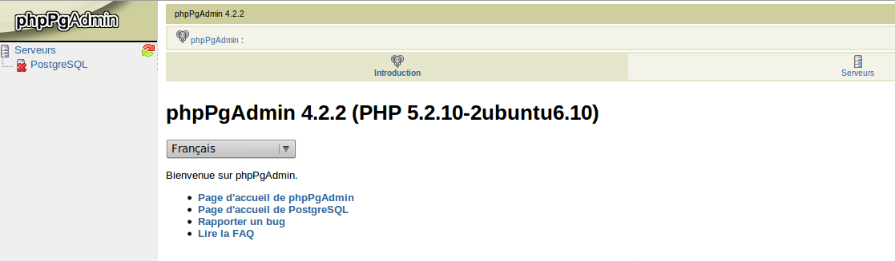
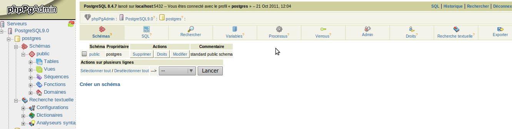

.fx: wide

---------------------------------------------------------------------
## PhpPgAdmin

En listant les fichiers installés depuis le package :

    dpkg -L phppgadmin

On trouve un fichier

    /etc/phppgadmin/config.inc.php

C'est dans ce fichier que l'on va pouvoir définir des connexions au serveur PostgreSQL en combinant des adresses de serveurs, des logins utilisateur et des mots de passe. Si vous voulez autoriser une connexion super-utilisateur via cette interface vous devrez changer la valeur d'une des options:

    $conf['extra_login_security'] = false;

En tant qu'administrateur principal de la base il est préférable d'utiliser un client lourd. Mais l'utilisation de ce logiciel pour donner des accès via le web à certains utilisateurs peut se justifier.

.fx: wide

---------------------------------------------------------------------
# 10. Créer une base de donnée
<small>Parce que travailler dans la base "postgres" n'est pas du tout conseillé.</small>

.fx: title1 title1-1

---------------------------------------------------------------------
## 10.1. Le cas d'exemple de la formation
<small>Your trombones belong to us!.</small>

.fx: title2

---------------------------------------------------------------------
## Le cas d'exemple de la formation

Pour avoir un cas d'espèce à étudier nous imaginerons que nous sommes dans un société.

Dans cette société un **service de Relation humaine** possède des données qui sont stockées dans une base PostgreSQL.

Une partie de ces données est **sensible** (comme les **salaires**) et seuls quelques utilisateurs devraient pouvoir y accéder.

Cette société fabrique des fournitures du types **trombones** et **punaises** et propose en interne à ses employés et employés de passage (des intérimaires) de passer des commandes de fournitures.

---------------------------------------------------------------------
## Le cas d'exemple de la formation

Dernièrement il a été décidé qu'un système de **points de fidélité** serait mis en place afin de récompenser les employés et intérimaires qui passent des commandes de fournitures en interne.

* un nombre **variable** de points seront attribués à **la personne** en fonction du montant de la commande
* un nombre **fixe** de points sera attribué au **service ou à l'agence d'intérim** de l'employé.

L'usage final de ces points n'est pas dans notre exemple.

La partie qui nous intéresse est que certains employés sont chargés de mettre en place une base de données PostgreSQL pour leur application, qui sera appelée sous le code projet **APP**.

Ces employés devront donc accéder aux données, mais pas aux données interdites, et ils devront mettre en place un système de d'enregistrement des commandes et d'attribution des points.

---------------------------------------------------------------------
## 10.2. Utilitaires en ligne de commande

<small>Très utile pour les scripts de déploiement.</small>

.fx: title2

---------------------------------------------------------------------

Pour créer des bases de données ou pour créer des utilisateurs dans les bases données il existe des utilitaires en ligne de commande installés avec PostgreSQL.

    createdb
    creatuser
    createlang

Ces lignes de commandes acceptent l'option `--help` ainsi que bien d'autres options.

Leur maniement est simple et nécessite soit d'être l'utilisateur root soit d'être l'utilisateur postgres.

Cependant pour cette formation nous utiliserons les outils graphiques mis à disposition par pgadmin. Ceux-ci présentent le même nombre d'options, avec cependant l'énorme avantage d'être graphiques.

Signalons que l'utilitaire `createlang` permet d'ajouter le support de langages différents dans une base de données; notamment pour ce qui concerne les triggers et les procédures stockées.

---------------------------------------------------------------------
## 10.3. Cluster, Encodage des caractères, Locales, langages et templates
<small>Il faut y penser dès le départ.</small>

.fx: title2

---------------------------------------------------------------------
### Cluster

Pour bien comprendre la création d'une base de données il faut revenir sur quelques concepts.

Tout d'abord le serveur de bases de données postgreSQL est **un cluster**.

Cela signifie que pour un même démon (ou service sous Windows) nous pouvons installer **plusieurs bases de données** différentes.

Ces bases seront très fortement séparées.

**Il n'existe pas à priori de moyens pour effectuer des requêtes utilisant des tables situées dans des bases séparées.** Cette distinction tend à disparaître depuis PostgreSQL 9 avec l'arrivée des connecteurs spéciaux de type dblink.

---------------------------------------------------------------------
### Locale

Avant PostgreSQL 9 toutes ces bases devaient partager une même locale (collation), qui était installée sur le cluster lui-même, il est dorénavant possible de spécifier des locales différentes pour chacune de ces bases.

La **locale** va indiquer des réglages dépendants d'une langue et d'une culture:

- l'ordre de **tri alphabétique**
- les **séparateurs** de milliers et de décimales
- le symbole **monétaire**
- l'ordre des éléments dans une **date**

Les locales se nomment par exemple **fr_FR.UTF_EUR** ou **fr_FR_ISO8859-1_EUR**, ou encore **C** (la locale de l'ASCII7) ou **en_US**.

---------------------------------------------------------------------
### Encodage
Enfin l'encodage des caractères va déterminer la taille minimale d'un caractère et l'encodage utilisé pour le transformer d'une série de bits à un caractère reconnu.

C'est ici que l'on indique si on utilise de l'**ASCII7** (pas d'accents), de l'**ISO8859-1** (latin1), ou de l'**UTF8**.
Ces paramètres sont propres à chacune des bases de données hébergées sur le cluster.

Rappel sur les encodages:

    +--------------+-------------+--------------+---------------------+----------+
    |  CARACTERE   |  ASCII 7    |  ISO 8859-1  |        UTF-8        |  BASE64  |
    +--------------+-------------+--------------+---------------------+----------+
    |    "e"       |  0110 0101  |   0110 0101  |           01100101  |  ZQ==    |
    |    "é"       |    --       |   1110 1001  |  11000011 10101001  |  w6k=    |
    +--------------+-------------+--------------+---------------------+----------+

    +------------------------------+--------------+----------+
    |   OCTETS                     |  ISO 8859-1  |  UTF-8   |
    +------------------------------+--------------+----------+
    |           11000011 10101001  |      "é"    |    "é"   |
    |  11100011 10100111 10100110  |     "㧦"    |    "㧦"  |
    +------------------------------+--------------+----------+

---------------------------------------------------------------------
### Langage

Enfin on trouvera aussi des langages.

PostgreSQL supporte le langage **SQL**, le **C** et le **pl/PgSQL** nativement
pour toutes les bases de données.

Avant la version 9 le **pl/pgSQL** devait être ajouté sur une base pour qu'il
soit supporté (d'où la présence de la commande « `createlang plpgsql` » dans de nombreuses documentations).

D'autres langages peuvent être ajoutés, comme le `pl/Perl`, ou le `pl/Python`.

---------------------------------------------------------------------
### Templates

Un cluster nouvellement instancié contient **3 bases**:

- **postgres**: la base qui contient toutes les informations système permettant de gérer et d'interroger le cluster. C'est ici que sont stockés les utilisateurs et groupes de connexion ainsi que les tables du catalogue
- **template1**: quand vous aller créer un base de données elle sera en fait une copie de cette base. Toutes les tables, tous les types, langages, et toutes les données déjà installés dans cette base seront donc recopiés dans la nouvelle.
- **template0**: est une copie de template1 faite à l'initialisation, il s'agit donc du modèle « propre et intact », ne modifiez jamais ce modèle, c'est une sauvegarde au cas où vous endommagez template1.

---------------------------------------------------------------------
## 10.4. Créer une connexion administrateur avec pgAdminIII
<small>Avec un code couleur.</small>

.fx: title2

---------------------------------------------------------------------

Au niveau théorique nous sommes quasi prêts.

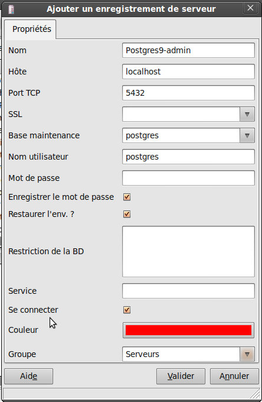

Nous allons créer une nouvelle base en utilisant **pgadmin**.

Pour cela il faut que nous commencions par nous créer une connexion super utilisateur dans cet outil.

Cela se fait depuis le menu « Fichier > Ajouter un serveur ». Nous allons entrer des paramètres jusqu'à ce que nous arrivions à nous connecter à PostgreSQL en tant qu'utilisateur postgres. Il peut être nécessaire de corriger le fichier `pg_hba.conf` si cette connexion nous est refusée.

Cette connexion est assez dangereuse, nous sommes super-utilisateur et nous pouvons tout casser.
On ajoute donc une couleur **rouge** à la connexion.

---------------------------------------------------------------------
## 10.5. Créer une base de données formation

.fx: title2

---------------------------------------------------------------------

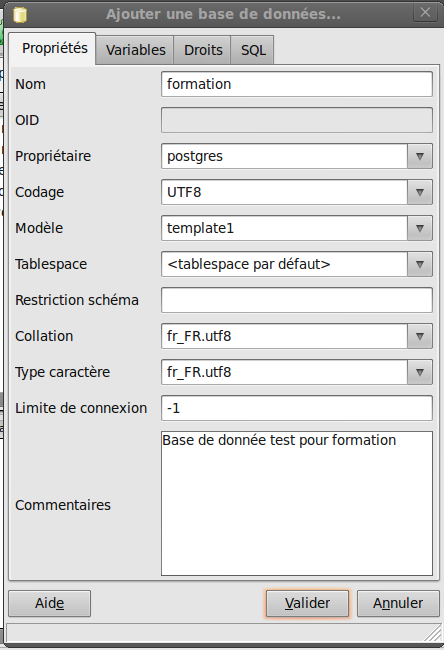

En double cliquant sur la connexion nous l'ouvrons. Dans l'arbre des menus qui apparaît nous avons quatre premiers menus, rôles de connexion, groupes de connexion, tablespaces et bases de données. Nous voulons créer une base de données donc:

clic droit base de données > Ajouter une base de données...

Ceci ouvre un assistant que nous remplissons en suivant la copie d'écran (nom formation, en UTF8, collation et type de caractère fr_FR.utf8).
Si vous naviguez parmi les onglets présents vous pourrez voir que le dernier onglet, comme sur presque tous les assistants, vous indique la commande SQL que l'assistant génère.

---------------------------------------------------------------------

    CREATE DATABASE formation
    WITH ENCODING='UTF8'
        OWNER=postgres
        TEMPLATE=template1
        LC_COLLATE='fr_FR.utf8'
        LC_CTYPE='fr_FR.utf8'
        CONNECTION LIMIT=-1;
    COMMENT ON DATABASE formation IS 'Base de données test pour formation';

Remarquez la case <strong>lecture seule</strong> sur l'assistant (absente sur pgAdmin 4), si vous décochez cette case vous pouvez alors ajouter vous-même du code SQL que pgAdmin <strong>ne saurait pas
intégrer à la requête</strong>. Les écrans de l'assistant ne peuvent du coup plus fonctionner. 
Ceci vous permet d'avoir un train d'avance sur pgadmin (une nouvelle option qui n'est pas encore intégrée dans l'outil), ne l'oubliez pas. 
En l'occurrence nous n'avons pas besoin de modifier ce code SQL.

---------------------------------------------------------------------

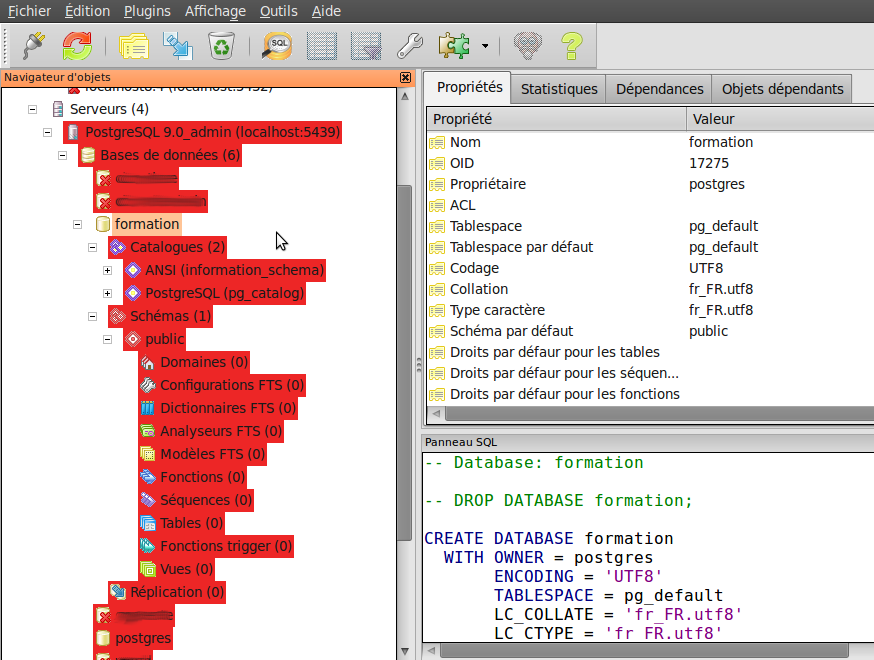

Une fois la base créée vous pouvez naviguer dans pgadmin et voir que de nombreux objets pourraient exister au sein de cette base :

- **des catalogues**: il y en a deux, le pg_catalog et le catalogue information_schema qui est une obligation de toutes les bases de données se conformant à la norme SQL ANSI. On y trfouveun grand nombre d'objets qui sont disponibles pour **tous**.
- **des schémas**: un seul au départ, nommé public. Dépliez le pour y retrouver les objets de la base
- **des domaines**: (il s'agit de définitions de types propres à cette base, avec des contraintes associées (comme une chaîne de caractère devant se conformer à une expression régulière)
- plusieurs objets comportant le mot **FTS**, signifiant Full Text Search. Il s'agit des différents éléments devant être mis en place pour ajouter des fonctionnalités de recherche plein texte

.fx: wide

---------------------------------------------------------------------

- **des fonctions**: si vous regardez l'équivalent dans le `pg_catalog` vous retrouverez toutes les fonctions que vous pouvez utiliser dans les requêtes (comme substring par exemple)
- **des séquences**: il s'agit d'objets permettant de générer des auto-incréments (pour faire simple)
- **des tables** bien sûr
- **des vues**, nous verrons ce que cela signifie
- **des fonctions trigger**, là encore nous verrons plus tard ce que cela recouvre.

---------------------------------------------------------------------
# 11. Tablespaces
<small>Liaison avec le disque.</small>

.fx: title1 title1-2

---------------------------------------------------------------------
## Tablespaces

Nous venons de créer une base. Nous aurions pu avant cela créer un tablespace.

Heureusement pour nous **un tablespace par défaut existe** et a été choisi pour nous.

Le tablespace est la **représentation interne pour le serveur d'un espace de stockage** sur le disque.

Le tablespace par défaut (`pg_default`) représente donc l'espace de stockage qui a été créé dans le « data dir ».

Nous voyons dès lors qu'il est en fait possible de créer plusieurs répertoires de données.

Sur un serveur qui ne possède qu'un seul contrôleur de disques cela n'est le plus souvent pas du tout utile.

Créer des tablespaces différents permet de forcer la répartition physique des données sur des **disques physiques différents**.

---------------------------------------------------------------------
## Tablespaces

Il est tout à fait possible de créer plusieurs tablespaces sur un même disque mais c'est en fait inutile.

Le vrai intérêt du tablespace est de forcer l'usage de disques différents. Tous les objets créés dans la base de données auront un tablespace affecté.

Une des techniques d'optimisation courante avec les tablespaces consiste par exemple à forcer le stockage des index d'une table sur un disque et les données de la table sur un autre (en utilisant deux tablespaces différents).

Lorsque le serveur fera des requêtes intensives sur cette table il pourra ainsi paralléliser les lectures d'index et les lectures de données, au niveau du système d'exploitation et de l'électronique des contrôleurs de disques les traitements seront parallélisés.

La gestion des tablespaces est donc un élément de tunning assez avancé que nous pouvons ignorer pour le moment (il est possible de modifier les tablespaces des objets après leur création, mais cette opération aura des impacts si les données sont importantes en taille).

-----------------------------------------------------------------
# 12. Définitions des rôles et droits
<small>gros sujet</small>

.fx: title1 title1-3

---------------------------------------------------------------------
## Définitions des rôles et droits

Pour le moment nous avons une nouvelle base mais elle appartient à l'utilisateur **postgres**.

Afin de nous placer dans un cas plus réaliste il nous commencer à créer des **logins**, des **rôles**.

Ceci pourrait se faire à l'aide de la commande `createuser`, mais là encore nous allons plutôt utiliser les assistants de pgadmin.

Dans le futur retenez que <strong>seul le super utilisateur est capable de gérer les utilisateurs dans pgadmin</strong>, avec des connexions de moindre niveau vous n'aurez plus la possibilité de créer ou modifier les utilisateurs et groupes.

-----------------------------------------------------------------
## 12.1. Les rôles de connexions
<small>logins et groupes</small>

.fx: title2

-----------------------------------------------------------------
## Des utilisateurs et des rôles

Classiquement les bases de données s'utilisent avec un seul login qui possède tous les droits sur la base. C'est le cas par exemple quand on déploie une application LAMP chez un hébergeur mutualisé.
Celui-ci met à disposition une base de données avec un login utilisateur unique pour l'application. Il est cependant **possible de gérer plusieurs logins par base de données**.

Une application qui **au minimum serait capable d'utiliser deux connexions**, une en **lecture-écriture** et une en **lecture** pourrait ainsi beaucoup plus facilement passer à une gestion distribuée sur plusieurs serveurs 'esclaves' des opérations de lecture tout en se concentrant sur le serveur maître pour les parties applicatives nécessitant des lectures et écritures (pour toutes les transactions par exemple).

-----------------------------------------------------------------
## Des utilisateurs et des rôles

Dans notre cas nous avons plusieurs utilisateurs :

 - **Ultrogothe**: DBA (Administrateur de base de données) responsable de cette application. Nous lui créons un rôle pour éviter d'utiliser l'utilisateur **postgres**. Nous pourrions aussi créer un rôle portant le nom de la base, histoire de bien séparer les droits d'administrations par base. **Ultrogothe à tous les droits**.
 - **Thibaut**, **Gondioque** et **Bertrude** sont des utilisateurs de la base de données. Ils sont responsable de la mise en place d'une application que nous nommerons **'app'**. Bertrude travaille au service DRH, elle a le droit de voir le contenu complet des tables de la DRH. Ce n'est pas le cas pour les autres, qui ne devraient voir qu'un sous ensemble des données de la partie DRH.
 - **Childeric** et **Nantilde** : deux personnes ayant le droit d'alimenter les données de la base, mais aussi de supprimer ces données. Childeric est de plus **DRH** et est le seul à pouvoir alimenter les données en rapport avec la gestion du personnel, par contre Nantilde n'a rien à voir avec l'application 'app'.

Créez les utilisateurs <b>ultrogothe</b>, <b>bertrude</b>, <b>thibaut</b>, <b>gondioque</b>, <b>childeric</b> et <b>nantilde</b>

.fx: wide

-----------------------------------------------------------------
## Des utilisateurs et des rôles

PostgreSQL peut même gérer un grand nombre d'identifiants de connexion, basés par exemple sur les utilisateurs du système d'exploitation ou les utilisateurs d'un annuaire.

En terme de gestion des droits associés il faut donc aussi gérer des profils que l'on retrouvera sous la notion de **groupes** dans PostgreSQL.

Depuis plusieurs versions de ce SGBD la distinction entre rôle de connexion et groupes de rôles de connexions est **abstraite**, car en fait tout rôle peut contenir d'autres rôles, dit autrement, tout rôle peut hériter d'un autre.

Nous créerons autant de rôles que d'utilisateurs et nous y associerons des « rôles groupes » qui marqueront **les différentes politiques de droits** que nous aurons à gérer ( ces politiques dépendent de choix fonctionnels, il n'y a aucune obligation à créer ces rôles à chaque fois que vous créez une base avec PostgreSQL)

-----------------------------------------------------------------

 - **formation_admin** : rôle des administrateurs de cette base de données au sein du serveur de base de données. Si vous gérer un seul login et un seul niveau de droit il vous faudra sans doute n'utiliser que ce rôle.
 - **formation_ecriture**: rôle permettant d'ajouter des données dans la base (childeric et nantilde)
 - **formation_lecture**: rôle permettant de requêter la base (bertrude, thibaut et gondioque)
 - **formation_app**: rôle des utilisateurs gérant l'application « app » (bertrude, thibaut,gondioque et nantilde)
 - **formation_drh**: rôle des utilisateurs du service DRH (childeric et bertrude)

Ce qui donne par rôle:

 - **ultrogothe**: formation_admin
 - **childeric**: formation_ecriture & formation_drh
 - **nantilde**: formation_ecriture & formation_app
 - **bertrude**: formation_lecture & formation_app & formation_drh
 - **thibaut**:  formation_lecture & formation_app
 - **gondioque**: formation_lecture & formation_app

.fx: wide

-----------------------------------------------------------------
## 12.2. Créer des connexions utilisateur avec PgAdminIII
<small>Avec plein de couleurs</small>

.fx: title2

-----------------------------------------------------------------

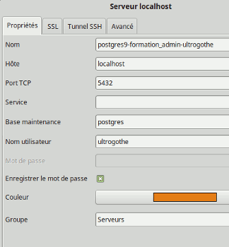

Nous allons créer cinq nouvelles connexions, une pour chaque groupe (**formation_admin**,
**formation_ecriture**, **formation_lecture** et **formation_drh**), en prenant à chaque fois
l'un des utilisateurs de ces groupes comme login de connexion, pour le dernier groupe
 nous créons deux connexions, une avec childeric, une avec bertrude.

En effet childeric appartient au groupes formation_ecriture et formation_drh
alors que bertrude appartient à formation_lecture, formation_app et
formation_drh; il est donc intéressant d'étudier la différence entre ces deux profils.

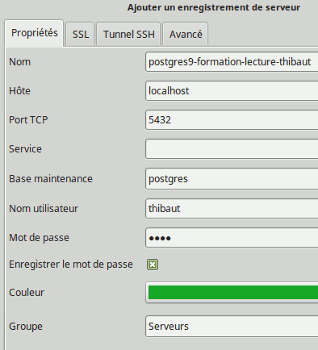

Plus tard nous appliquerons les droits afférants à chacun des groupes, nos cinq connexions
 (six en comptant celle de postgres) se font sur la même base de données
mais avec des utilisateurs différents, elles devraient donc posséder des limitations différentes.

.fx: wide

-----------------------------------------------------------------

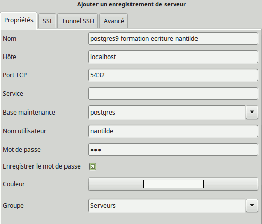

Nous choisirons des couleurs :

- **orange** pour la connexion avec les droits d'administration
de la base (**formation_admin**).
- **vert** pour la connexion limitée en lecture
- **aucune couleur** pour la connexion avec droits en écriture.

Ainsi nous visualiserons mieux dans pgadmin le niveau de **danger** de chacune des ces connexions.

-----------------------------------------------------------------

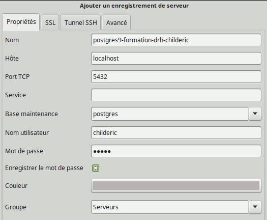

Pour les deux dernières nous choisissons **gris** pour **childeric** et encore **vert** pour **bertrude**.

-----------------------------------------------------------------

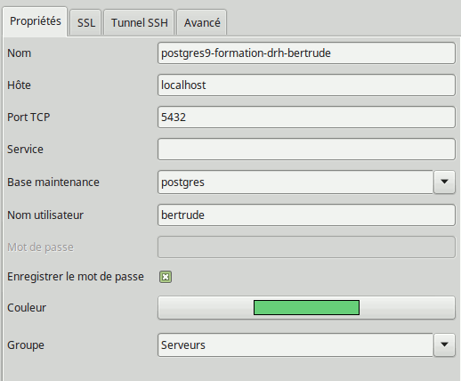

voilà, voilà.

-----------------------------------------------------------------

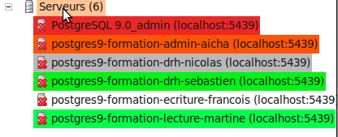

Ces connexions se nomment **Serveurs** dans pgadmin.

Il faut donc créer cinq 'serveurs', qui sont en fait à chaque fois
le même serveur PostgreSQL, sur le même port, mais avec
un utilisateur de connexion différent:

* **postges9-­formation­-admin**­: login *ultrogothe* : couleur orange
* **postges9­-formation­-ecriture**: login *nantilde* : pas de couleur
* **postges9­-formation­-lecture**: login *thibaut* : couleur verte
* **postges9­-formation­-drh-­childeric**: login *childeric* : couleur grise
* **postges9­-formation­-drh-­bertrude**: login *bertrude* : couleur verte

Attention: après avoir créé les connexions il est <strong>très fortement recommandé de quitter
pgadmin puis d'y revenir</strong>. Les connexions sont sauvegardées lors de la sortie du
programme, qui malheureusement est parfois instable et ne quitte pas toujours proprement.

-----------------------------------------------------------------
### Retour au pg_hba.conf

Maintenant que nous disposons de plusieurs connections sur la base formation,
les utilisateurs les plus en avance pourront aller modifier leur pg_hba.conf pour
appliquer des droits ou des restrictions en fonction des logins, ou pour autoriser
des connexions depuis des machines extérieures et observer les blocages
produits dans les connexions de pgAdmin.

-----------------------------------------------------------------
## 12.3. Les schémas
<small>Séparer la base.</small>

.fx: title2

-----------------------------------------------------------------
## Les schémas

[http://docs.postgresql.fr/9.5/ddl-schemas.html](http://docs.postgresql.fr/9.5/ddl-schemas.html)

On peut voir de façon simplifiée les schémas comme **des bases de données à
l'intérieur d'une base de données**.

Par défaut un seul schéma existe dans une base de données, le schéma **public**.

Mais une base peut contenir plusieurs schémas qui seront autant de sous-bases
dans la base.

Une des principales application des schémas est **l'application de politiques de droits par schémas**.
Mais ils permettent aussi de mieux scinder des aspects purement fonctionnels de la base.

L'avantage de l'utilisation des schémas par rapport à l'utilisation de plusieurs
bases est <strong>qu'il est possible d'effectuer des requêtes impactant plusieurs
schémas d'une base, ce n'est pas le cas entre plusieurs bases</strong>
(pas sans outils plus abstraits et moins performants comme dblink).

.fx: wide

-----------------------------------------------------------------
## 12.4. Les droits d'accès dans PostgreSQL et les schémas
<small>GRANT</small>

.fx: title2

-----------------------------------------------------------------

[http://www.postgresql.org/docs/9.5/static/sql-grant.html](http://www.postgresql.org/docs/9.5/static/sql-grant.html)

Plusieurs niveaux de droits existent dans PostgreSQL:

* les droits **d'accès à la base**, une couche qui peut faire redondance avec les restrictions situées dans ph_hba.conf (mais la redondance n'est pas un mal en terme de sécurité)
  * droits sur les **créations d'objets** dans la base (tables, tables temporaires)
  * droits par défaut sur des **éléments du langage SQL**. Ainsi le `SELECT` donne
   le droit de visualiser les données, mais pour les commandes permettant d'éditer
   les données on va retrouver un ensemble de droits distincts.
   Les classiques `INSERT`, `UPDATE`, `DELETE` et `TRUNCATE` (qui est une
   variation du `DELETE`). Mais aussi `REFERENCES` (le droit de créer des clefs
   étrangères) et `TRIGGER` (le droit de créer des triggers).

Au niveau des **schémas** on va pouvoir redéfinir les droits par défaut des
instructions SQL. Mais aussi directement un droit d'accès ou non aux objets de
ce schéma (`USAGE`)

-----------------------------------------------------------------

Ces droits du langage SQL (SELECT, etc) peuvent ensuite être modifiés au niveau
de chaque table. Voir aux colonnes des tables (et même aux lignes).

Il est donc possible de mettre en place des politiques **assez complexes**.

Dans la **pratique** les objets principaux sur lesquels vous devriez appliquer
des droits sont les **schémas**.

PostgreSQL ne permet pas les requêtes entre plusieurs bases, si vous voulez
utiliser plusieurs applications avec des droits très différents vous devriez donc,
plutôt que de mettre en place plusieurs bases de données dans le cluster,
mettre en place plusieurs schémas dans la base.

Vous pouvez voir un schéma comme des « sous-bases ». Ces sous-bases ayant la
possibilité d'être poreuses, vous allez pouvoir faire transiter ou pas des
informations entre les schémas.
Chose que vous ne pourrez pas faire entre les bases de données à moins d'utiliser des programmes externes ou des connecteurs particuliers (comme dblink).

-----------------------------------------------------------------

## 12.5. Création des schémas drh et app
<small>cas pratique</small>

.fx: title2

-----------------------------------------------------------------
### création de schéma

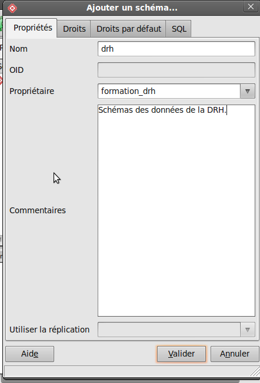

Nous allons utiliser la connexion **rouge** de `postgres`. Car c'est pour l'instant
le **propriétaire** de la base.

Dans pgadmin nous allons sur l'objet schémas dans l'arborescence et ajoutons un
nouveau schéma avec l'assistant de pgadmin. Nous allons créer le schéma « *drh* » avec « *formation_drh* » comme propriétaire.

On constate que le SQL généré est:

    CREATE SCHEMA drh
        AUTHORIZATION formation_admin;
    COMMENT ON SCHEMA drh
        IS 'Schémas des données de la DRH.';

PS: Si vous utilisez pgAdmin4 on ne retrouve pas le groupe formation_admin, pensez à vous déconnecter du serveur et à vous reconnecter.

-----------------------------------------------------------------

On peut donc utiliser une commande SQL pour générer le second schéma (app) sur lequel on garde formation_admin en propriétaire (remarquez la double apostrophe dans le commentaire):

    CREATE SCHEMA app
           AUTHORIZATION formation_admin;
    COMMENT ON SCHEMA app IS 'Schémas des données de l''application app.';

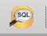
Pour taper du SQL utilisez le bouton SQL de pgadmin dans la barre d'outil, la connexion en cours sera utilisée.

Rafraichissez les données de pgadmin avec la touche **F5** ou le bouton rafraîchir (ou un clic droit).

Nous allons dans la partie suivante altérer les propriétaires du schéma public afin
qu'il s'agisse bien de **formation_admin** et non de **ultrogothe** ou **postgres**.

-----------------------------------------------------------------

## 12.6. Création des droits
<small>cas pratique</small>

.fx: title2

-----------------------------------------------------------------
### propriétaire de la base

Nous allons changer le **propriétaire** de la base formation.

La commande SQL qui nous permettrait d'effectuer cette opération est :

    ALTER DATABASE formation OWNER TO formation_admin;

Retrouvez le moyen de le faire graphiquement dans pgadmin. 
Est-il possible de modifier le nom d'une base de données après sa création?

-----------------------------------------------------------------
### Politique de droits

Nous allons maintenant appliquer **une politique de droits en deux étapes** qui
correspondent aux deux onglets de droits présentés par pgadmin sur les objets:

* les droits généraux **d'accès aux objets**
* les droits sur les éléments du langage **SQL**

L'écriture des droits d'accès se fait en choisissant propriétés sur un clic
droit sur la base formation.

L'ergonomie de cet écran n'est pas évidente au premier abord. Il faut choisir
un groupe en bas, cocher ses droits puis l'ajouter. 
Essayez d'obtenir exactement le même état que dans la copie d'écran de la page
suivante puis validez.

-----------------------------------------------------------------

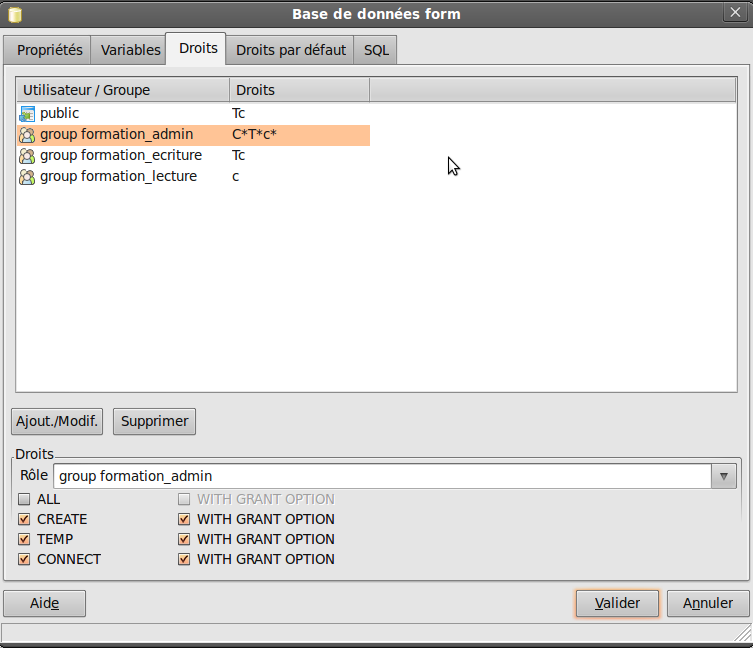

-----------------------------------------------------------------

Quand vous sélectionnez l'objet **'formation'** dans la liste des bases de données
vous pouvez remarquer que le panneau SQL (en bas à droite) dans pgadmin vous
liste les commandes SQL qui permettent de reconstruire cet objet dans l'état où
il se situe actuellement. Une fois que vous aurez appliqué les droits sur la base
vous devriez retrouver cette liste de commandes SQL sous la commande CREATE DATABASE:

    GRANT CONNECT, TEMPORARY ON DATABASE formation TO public;
    GRANT ALL ON DATABASE formation TO formation_admin WITH GRANT OPTION;
    GRANT CONNECT, TEMPORARY ON DATABASE formation TO formation_ecriture;
    GRANT CONNECT ON DATABASE formation TO formation_lecture;

Ré-ouvrez les propriétés de la base et allez dans l'onglet **Droits par défaut**.

<strong>Attention</strong>: cet onglet est constitué de trois sous onglets.
Essayez d'obtenir l'équivalent des <strong>3 copies d'écrans suivantes</strong>

-----------------------------------------------------------------

Onglet Tables des droits par défaut :

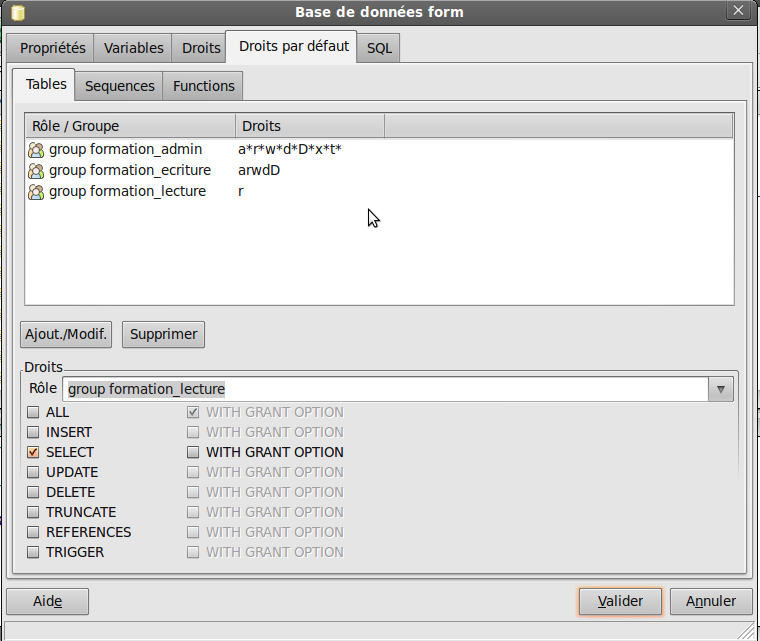

-----------------------------------------------------------------

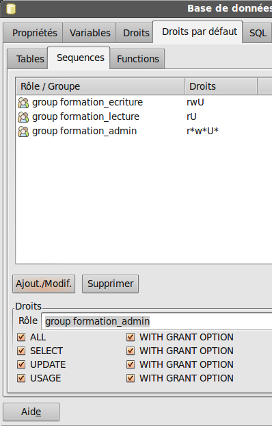

Onglets séquences et fonctions.

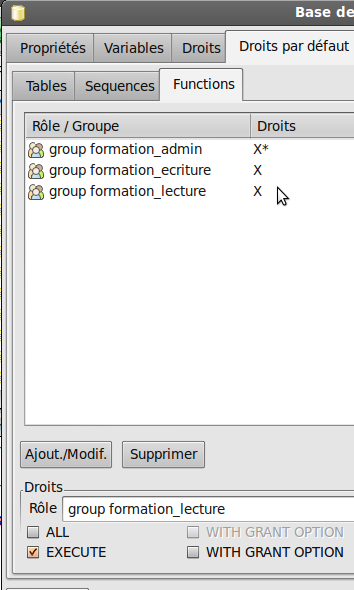

-----------------------------------------------------------------

Le résultat en terme de SQL devrait être:

<pre><code>
ALTER DEFAULT PRIVILEGES
    GRANT INSERT, SELECT, UPDATE, DELETE, TRUNCATE, REFERENCES, TRIGGER ON <b>TABLES</b>
    TO <b>postgres</b>;

ALTER DEFAULT PRIVILEGES
    GRANT INSERT, SELECT, UPDATE, DELETE, TRUNCATE ON <b>TABLES</b>
    TO <b>formation_ecriture</b>;

ALTER DEFAULT PRIVILEGES
    GRANT SELECT ON <b>TABLES</b>
    TO <b>formation_lecture</b>;

ALTER DEFAULT PRIVILEGES
    GRANT INSERT, SELECT, UPDATE, DELETE, TRUNCATE, REFERENCES, TRIGGER ON <b>TABLES</b>
    TO <b>formation_admin</b> WITH GRANT OPTION;

ALTER DEFAULT PRIVILEGES
    GRANT SELECT, UPDATE, USAGE ON <b>SEQUENCES</b>
    TO <b>postgres</b>;

ALTER DEFAULT PRIVILEGES
    GRANT SELECT, UPDATE, USAGE ON <b>SEQUENCES</b>
    TO <b>formation_ecriture</b>;
</code></pre>

-----------------------------------------------------------------

<pre><code>
ALTER DEFAULT PRIVILEGES
    GRANT SELECT, USAGE ON <b>SEQUENCES</b>
    TO <b>formation_lecture</b>;

ALTER DEFAULT PRIVILEGES
    GRANT SELECT, UPDATE, USAGE ON <b>SEQUENCES</b>
    TO <b>formation_admin</b> WITH GRANT OPTION;

ALTER DEFAULT PRIVILEGES
    GRANT EXECUTE ON <b>FUNCTIONS</b>
    TO <b>public</b>;

ALTER DEFAULT PRIVILEGES
    GRANT EXECUTE ON <b>FUNCTIONS</b>
    TO <b>postgres</b>;

ALTER DEFAULT PRIVILEGES
    GRANT EXECUTE ON <b>FUNCTIONS</b>
    TO <b>formation_ecriture</b>;

ALTER DEFAULT PRIVILEGES
    GRANT EXECUTE ON <b>FUNCTIONS</b>
    TO <b>formation_lecture</b>;

ALTER DEFAULT PRIVILEGES
    GRANT EXECUTE ON <b>FUNCTIONS</b>
    TO <b>formation_admin</b> WITH GRANT OPTION;
</code></pre>

-----------------------------------------------------------------
### droits sur les schémas

Il nous faut ensuite appliquer certains droits d'accès au niveau des schémas:
L'équivalent en SQL est:

<pre><code>
GRANT USAGE ON SCHEMA <b>drh</b> TO GROUP <b>formation_drh</b>;
GRANT USAGE ON SCHEMA <b>app</b> TO GROUP <b>formation_app</b>;
GRANT ALL ON SCHEMA <b>drh</b> TO GROUP <b>formation_admin</b>;
GRANT ALL ON SCHEMA <b>app</b> TO GROUP <b>formation_admin</b>;
</code></pre>

-----------------------------------------------------------------

## 12.7. La variable search_path
<small>le complément indispensable aux schémas</small>

.fx: title2

-----------------------------------------------------------------
### variables

Plusieurs variables sont associées à la session de connexion à la base.

Certaines sont définies lors de l'ouverture de la session (instruction
`SET mavariable='foo';`).

Certaines sont définies **au niveau du rôle**, ou **au niveau de la base**.

Une des variables les plus importantes à partir du moment où l'on travaille avec
les schémas est **search_path**. On peut voir cette variable comme un équivalent
des variables d'environnement **PATH** sur les divers système d'exploitation.

**La valeur par défaut de search_path est `"$user",public`**

Cela signifie que lorsque une instruction SQL recherchera un objet qui n'a pas
été préfixé par un nom de schéma il recherchera par défaut cet objet dans un
schéma portant le nom de l'utilisateur puis dans le schéma public.

-----------------------------------------------------------------
Ainsi si l'utilisateur **postgres** écrit:

    SELECT * FROM matable;

Le moteur SQL va tenter  de trouver une table matable dans le schéma postgres,
et si elle n'existe pas il recherchera cette table dans le schéma public.

**Toutes les bases de données ont au moins un schéma "public".**

Si cette même requête est lancée par l'utilisateur **bob** matable sera
recherchée dans le schéma bob puis dans le schéma public.

**Le fait que le schéma bob n'existe pas ne va pas générer d'alerte.**

Pour être certain de manipuler le bon objet, ou pour trouver un objet qui est
dans un schéma qui n'est pas listé dans `search_path` il faut préfixer le nom
de l'objet par le nom du schéma, comme dans cette requête:

    SELECT sylvie.calcul_differentiel(foo.field1,foo.field2)
    FROM marco.tablefoo foo;

Dans cet exemple on voit que l'objet recherché peut-être une table mais aussi une fonction ou tout autre objet appartenant à un schéma.

.fx: wide

-----------------------------------------------------------------

On peut aussi modifier la valeur de `search_path` afin que la recherche puisse
tester les bons schémas dans le bon ordre de priorité.

Un examen du code SQL généré par un `pg_dump` de type PLAIN montre par exemple
une utilisation intensive des instructions `SET search_path` pour fixer en fait
les schéma de travail en cours.

-----------------------------------------------------------------

## 12.8. Tester les droits et schémas

.fx: title2

-----------------------------------------------------------------

Muni de nos différentes connexions et de nos schémas nous allons pouvoir tester nos droits d'accès Il nous manque cependant encore deux éléments, **des tables et des données afin de vérifier que nous pouvons lire et/ou écrire dans ces tables.**

Dans un premier temps, avant d'importer des bases réelles nous allons
**apprendre à créer très vite des jeux de test**.

-----------------------------------------------------------------
### 12.8.1. Création table test1 en SQL dans le schéma public

Nous utiliserons la connexion rouge de postgres. Nous cliquons sur le schéma public puis sur le bouton SQL:

    CREATE TABLE test1 (
    id serial,
    val character varying,
    PRIMARY KEY(id)
    );

Nous obtenons quelques notices:

    NOTICE:  CREATE TABLE will create implicit sequence "test1_id_seq" for serial column "test1.id"
    NOTICE:  CREATE TABLE / PRIMARY KEY will create implicit index "test1_pkey" for table "test1"

La requête a été exécutée avec succès en 111 ms, mais ne renvoie aucun résultat.

Un F5 dans pgadmin nous montre cette table dans la liste des tables du schéma public.
Nous voyons aussi la séquence qui a été créée.

Le mot clef <b>serial</b> ici est en fait <b>une macro</b>. 
Il représente un type <b>integer</b> (ou <b>big</b> si on utilise <b>bigserial</b>).

.fx: wide

-----------------------------------------------------------------

<b>serial</b> impose la création automatique d'une <b>séquence</b>, que nous aurions pu créer
manuellement, et impose la valeur par défaut de notre integer à être <b>nextval(la-sequence)</b>. 
Une séquence est un objet que nous pouvons examiner dans pgadmin, son but est de fournir des incréments de façon transactionnelle (pas de doublon) et la fonction nextval() sur une séquence fournit cette nouvelle valeur. Serial et bigserial sont donc les mots clefs de PostgreSQL pour les auto incréments. 

Nous pourrions <b>définir nous-même notre auto-incrément en créant la séquence</b>,
un champ de type integer avec une valeur par défaut prenant `nextval()` de notre
séquence. Mais pourquoi se fatiguer? Ne faites cela vous-même que si vous voulez
<b>partager une séquence entre plusieurs tables</b>.

-----------------------------------------------------------------

Pour alimenter cette table test1 nous allons utiliser une requête de type `INSERT`.

Mais tout d'abord nous pouvons remarquer qu'il n'y a pas besoin d'une table pour faire une requête `SELECT`:

    SELECT 42;

Plus utile, regardons une fonction PostgreSQL nommée generate_series:

    SELECT generate_series(1,999);

Qui nous renvoie 999 lignes de résultat, avec une série de nombre allant de 1 à 999.
Si nous voulons générer 999 chaînes de caractères différentes nous pouvons utiliser
l'opérateur de concaténation de chaînes: « `||` »:

    SELECT 'test' || generate_series(1,999);

Voilà qui nous donne 999 valeurs intéressantes à insérer dans notre table de test.

-----------------------------------------------------------------

Nous venons de concaténer une chaîne et un nombre, PostgreSQL s'en est sortit
poliment sans nous réprimander. Ce ne sera pas toujours le cas, il faut souvent
**penser à faire des cast**, des conversion de types.

Si PostgreSQL nous avait demandé de manipuler des objets de même type nous
aurions pu forcer la valeur avec des fonctions de conversion ou avec le
raccourci « `::<nom du type` ».

Ce qui aurait donné :

    'test' || generate_series(1,999)::text

Il faudrait aussi créer les valeurs de la colonne « id » mais il s'agit d'un
**auto-incrément** qui va donc se remplir tout seul si nous ne mettons rien
(ou si nous mettons NULL):

    INSERT INTO test1(val) VALUES ('test' || generate_series(1,999));

-----------------------------------------------------------------

Vous pouvez vérifier avec `SELECT * from test1;` que les valeurs sont bien
saisies. Vous pouvez aussi utiliser un double clic ou l'icône de visualisation
des tables depuis la liste des tables.

Remarquez que depuis la fenêtre de visualisation des tables de pgadmin vous
pouvez effectuer des saisies/modifications de données <b>SI</b> la table contient
une clef primaire. La clef primaire permet en effet à pgadmin l'écriture de
requêtes de mises à jour ou d'insertions.

Ouvrir la fenêtre de visualisation des tables sur une table de plusieurs
millions de lignes risque de faire planter votre client pgadmin. 
Remarquez le bouton permettant ce même accès avec des filtres SQL.

-----------------------------------------------------------------
### 12.8.2. Vérification de l'application des droits par défaut

Si nous regardons le code SQL qui permet de recréer l'objet test1 dans l'écran
pgadmin nous voyons:

    -- DROP TABLE test1;

    CREATE TABLE test1
    (
    id serial NOT NULL,
    val character varying,
    CONSTRAINT test1_pkey PRIMARY KEY (id)
    )
    WITH (
    OIDS=FALSE
    );
    ALTER TABLE test1 OWNER TO postgres;
    GRANT ALL ON TABLE test1 TO postgres;
    GRANT SELECT, UPDATE, INSERT, DELETE ON TABLE test1 TO formation_ecriture;
    GRANT SELECT ON TABLE test1 TO formation_lecture;
    GRANT ALL ON TABLE test1 TO formation_admin WITH GRANT OPTION;

Nous pouvons remarquer que la première ligne est en vert, en effet « `--`  »
est la marque du **commentaire en SQL**.

-----------------------------------------------------------------

Nous voyons aussi que les privilèges par défaut définis au niveau de la base de
données ont été redescendus au niveau de la table nouvellement créée.

Si nous utilisons la connexion **orange** de **ultrogothe**, que nous
choisissons la base de données et que nous créons une deuxième table de test:

    CREATE TABLE public.test2 (
    id serial,
    val character varying,
    PRIMARY KEY(id)
    );

Nous pouvons aller regarder cette table sur pgadmin, nous voyons alors que
seule une ligne de GRANT a été ajoutée:

    ALTER TABLE test2 OWNER TO ultrogothe;

<b>Les privilèges par défaut n'ont pas été redescendus.</b> Si vous essayez d'aller sur cette table avec une autre connexion (comme celle de thibaut) vous ne pourrez pas y accéder.

-----------------------------------------------------------------

**Les privilèges par défaut sont en fait enregistrés sur le rôle postgres!**

Si vous relisez le code produit par pgadmin après l'écriture des droits par
défaut, <b>il ne s'agit pas de droits par défauts appliqués à la base mais de
droits par défaut appliqués à un rôle</b>, il y a une valeur par défaut
<b>FOR rôle xxx</b> qui n'est pas montrée, cette commande s'applique aux nouveaux
objets <b>créés par ce rôle</b> et <b>pas globalement à la base elle-même</b>.

    ALTER DEFAULT PRIVILEGES
        GRANT INSERT, SELECT, UPDATE, DELETE, TRUNCATE ON TABLES
        TO formation_ecriture;

Signifie en fait:

<pre><code>
ALTER DEFAULT PRIVILEGES <b>FOR ROLE postgres</b>
    GRANT INSERT, SELECT, UPDATE, DELETE, TRUNCATE ON TABLES
    TO formation_ecriture;
</code></pre>

-----------------------------------------------------------------

Pour que ces privilèges par défaut s'appliquent avec notre utilisateur
**ultrogothe**, qui est pourtant **dans le groupe propriétaire de la base**,
nous devrons corriger le SQL de définition de la base.

Pour cela nous utiliserons un script SQL, mais dans l'immédiat nous allons continuer à créer nos objets avec le compte postgres (rouge). Pour le moment nous allons donc supprimer cette table créé par ultrogothe. Soit avec un clic droit sur l'objet soit en tapant directement la commande SQL:

    DROP table test2;

-----------------------------------------------------------------
### 12.8.3. Création table test2 dans le schéma drh avec pgadmin

Toujours avec la connexion de l'utilisateur **postgres** nous allons créer une
deuxième table mais en utilisant l'assistant de création de table.

Choisissez le schéma drh, faites un *clic droit, Ajouter un objet > Ajouter une table...*

Il faut créer une table **test2**, avec :

* une colonne **id** en type **serial** (tout en bas dans la liste des types),
* une colonne **val** en type **character varying**
* une **primary key** sur la colonne **id**.

Vérifiez avec l'onglet SQL que vous obtenez:

    CREATE TABLE drh.test2
    (
        id serial,
        val character varying,
        CONSTRAINT "PRIMARY KEY" PRIMARY KEY (id)
    )
    WITH (
        OIDS = FALSE
    );

.fx: wide

-----------------------------------------------------------------

Le nom du schéma a été préfixé au nom de la table, ce qui n'était pas fait sur la table test1 puisqu'elle était dans le schéma par défaut (public).

Remplissons cette table avec 10000 valeurs, commençons par:

    INSERT INTO test2(val) VALUES ('foo' || generate_series(1,10000));

nous obtenons:

    ERROR: relation "test2" does not exist

La table **test2 n'est pas retrouvée** car le schéma drh n'appartient pas au
**search_path**, il nous faut donc le forcer:

    INSERT INTO drh.test2(val) VALUES ('foo' || generate_series(1,10000));

-----------------------------------------------------------------
## 12.8.4. Création table test1 dans le schéma app en SQL
<small>avec le search_path</small>

.fx: title2

-----------------------------------------------------------------

Revenons à l'éditeur de SQL et tapons:

    SET search_path=app,public,drh;
    CREATE TABLE test1 (id integer, val character varying, PRIMARY KEY (id));

On constate que la table **est créée dans le premier schéma défini dans
`search_path`**, donc dans le schéma « app ». Vérifiez que le propriétaire de la
table est bien `formation_admin` et pas un user.

Maintenant que la variable `search_path` contient notre schéma `app` et le
schéma `drh`, si nous tapons :

    INSERT INTO test2(val) VALUES ('bar' || generate_series(10001,20000));

Nous devrions réussir à ajouter 10 000 enregistrements supplémentaires dans la
table `test2` du schéma `drh`, elle n'a pas été trouvée dans `app` mais elle
existe bien dans le deuxième schéma listé.

-----------------------------------------------------------------

Essayons de remplir la table `test1` du schéma `app`. Si nous ne préfixons pas
la table nous devrions tomber sur la `test1` du schéma `app` qui est
**prioritaire** sur le schéma public dans notre search path:

    INSERT INTO test1(val) VALUES ('nii' || generate_series(1,10));

Si « tout va bien » nous obtenons alors une erreur: `ERROR: null value in
column "id" violates not-null constraint`

Si vous regardez bien la définition de la table `test1` du schéma app, nous
n'avons pas utilisé le type serial mais un simple integer pour la clef primaire.
Il n'y a donc **pas d'auto-incrément**. Il nous faut remplir la colonne id lors
des insertions. Essayons d'utiliser generate_series:

    SELECT generate_series(1,10), 'nii' || generate_series(1,10);

Nous donne 110 lignes de résultats avec postgreSQL 9.0
(apparemment PostgreSQL >= 9.1 supporte cette syntaxe par contre).

Ce n'est pas le bon chemin. Essayez d'utiliser la série de donnée automatique
comme une table sur laquelle on fait une requête...

.fx: wide

-----------------------------------------------------------------

    SELECT serie
    FROM generate_series(1,10) serie;

Cela fonctionne. On va donc faire une requête un petit peu plus complexe:

    SELECT serie, 'nii' || serie
    FROM generate_series(1,10) serie;

On obtient un résultat de deux colonnes qui ressemble à ce que l'on voudrait
insérer dans test1. Il est tout à fait possible d'utiliser le résultat d'une
requête comme valeurs à insérer avec `INSERT`, la syntaxe est `INSERT INTO table
 (col1,col2...) SELECT ….;` et non `INSERT INTO table (col1,col2...) VALUES ( SELECT ….);`

.fx: wide

    INSERT INTO test1(id,val)
      SELECT serie, 'nii' || serie
        FROM generate_series(1,10) serie;

Testons que cela a fonctionné:

    select count(*) from test1;
    => devrait renvoyer 10
    select count(*) from public.test1;
    => devrait renvoyer 9999 car public.test1 est la table test1
    dans le schéma public.

-----------------------------------------------------------------

## 12.8.5. Régler search_path, les variables

.fx: title2

-----------------------------------------------------------------
### variable search_path

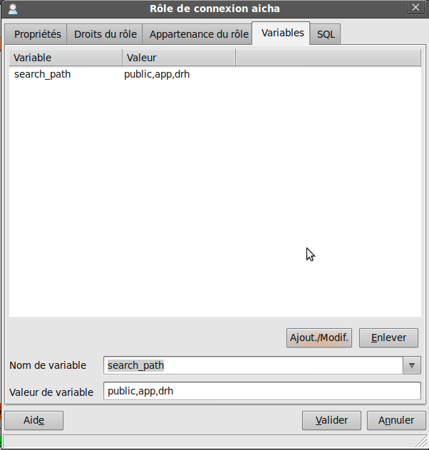

Les différents utilisateurs auront des besoins différents en terme d'accès aux
schémas. On va donc régler leur **search_path** au niveau des **«rôles»** de
cette façon:

- **ultrogothe** : search_path=**public,app,drh**
- **childeric** : search_path=**drh,public**
- **bertrude** : search_path=**app,drh,public**
- **thibaut** : search_path=**app,public**
- **gondioque** : search_path=**app,public**
- **nantilde** : search_path=**app,public**

Pour cela nous utiliserons pgadmin (pas pgadmin4, il ne sait pas le faire proprement, il ajoute des quotes et il ne faut pas) en cliquant (droit) sur les rôles et en
allant dans l'onglet variables:

On voit que le SQL généré est du type:

    ALTER ROLE gondioque SET search_path=app, public;

.fx: wide

-----------------------------------------------------------------

Pour vérifier la valeur de cette variable pour chacune des connexions on peut ouvrir une fenêtre SQL et y taper:

    SHOW search_path;

A noter: il n'est pas possible de définir cette valeur au niveau d'un
« groupe rôle », <strong>seuls les GRANT</strong> (droits) sont hérités d'un groupe,
<strong>pas les variables</strong>.

Remarquez aussi qu'il existe de nombreuses variables, comme celles définissant les types utilisables pour la saisie des dates (`date_style`).

Les variables peuvent se définir au niveau des rôles, mais elles peuvent aussi
être définies au niveau des connexions à la base de données, au sein de la
session SQL avec les commandes <b>SET variable=value</b>. 
On retrouvera ce type de commandes dans les programmes objet pour initialiser
la communication entre le serveur et l'application.

-----------------------------------------------------------------
### variable application_name

Depuis PostgreSQL 9 une variable nouvelle est apparue: **`application_name`**,
vous devriez utiliser cette variable dans votre application, ceci permet
d'identifier les connexions de votre application parmi les centaines de
connexions ouvertes, elle est par exemple utilisée par pgadmin, cliquez sur
`Outils>Etat du serveur` et regardez la liste des connexions ouvertes, certaines
ont un nom. On peut aussi s'en servir pour différencier des statistiques d'usage
de la base.

-----------------------------------------------------------------
## 12.8.6. Tests d'accès
<small>ça marche?</small>

.fx: title2

-----------------------------------------------------------------

Si vous aviez des connexions serveurs ouvertes dans pgAdmin il faut les fermer et les rouvrir pour que les variables sont bien initialisées (attention, pas simplement les replier et déplier, il faut choisir « se déconnecter »).

Parfois postgreSQL refus de dropper un base parce qu'il reste une connexion ouverte
sur cette base, pensez à déconnecter vos sessions pgadmin.

 Nous allons taper une série de requêtes simples sur les tables `test1` et `test2`
afin de vérifier pour chaque utilisateur:

- les accès en lecture et les priorités de schémas
- les accès en écritures

Pour tester les requêtes ouvrez une des connexions, choisissez la base formation puis le bouton `SQL`.

Essayez de deviner les raisons des comportements observés avant que le formateur
ne les expliquent:

-----------------------------------------------------------------

Un count de test1

    SELECT COUNT(*) FROM test1;
* ultrogothe : 999
* childeric: 999
* bertrude: 10
* nantilde: 10
* thibaut: 10

Un count de test2

    SELECT COUNT(*) FROM test2;

* ultrogothe : 20000
* childeric: 20000
* bertrude: 20000
* nantilde: `ERROR: permission denied for relation test2`
* thibaut: `ERROR: permission denied for relation test2`

.fx: wide

-----------------------------------------------------------------

Une insertion dans test1

    INSERT INTO test1 (val) VALUES ('ins1');

* ultrogothe : OK
* childeric: OK
* bertrude: `ERROR: permission denied for relation test1`
* nantilde: `ERROR: null value in column "id" violates not-null constraint`
* thibaut: `ERROR: permission denied for relation test1`

-----------------------------------------------------------------

**Nantilde** travaille sur `app.test1` qui n'a pas de clef primaire
`INSERT INTO test1 (id,val) VALUES (11,'ins1');` devrait fonctionner par contre.

Exécuter cette deuxième instruction deux fois devrait lever une nouvelle erreur:
`ERROR: duplicate key value violates unique constraint "test1_pkey"`

Certains utilisateurs comme **nantilde** et **childeric** ont donc le droit
d'insérer des données dans des tables. Vérifions cependant que seul childeric est
autorisé à insérer des données dans le schéma drh:

    INSERT INTO drh.test2 (val) VALUES ('ins2');
    nantilde :ERROR: permission denied for schema drh

Vous pouvez tester des instructions `DELETE`, `UPDATE`, `TRUNCATE`, les droits
sont normalement bien appliqués.
De même si nous tentons de modifier la structure d'une table:

    ALTER TABLE public.test1 ADD COLUMN foo integer;
    Tout le monde, en dehors d'ultrogothe, aura ce message d'erreur:
    ERROR: must be owner of relation test1

-----------------------------------------------------------------
### 12.8.7. SERIAL vs IDENTITY

Depuis PostgreSQL 11 il est possible de ne plus utiliser les mots **serial/bigserial** mais d'utiliser à la place l'expression **GENERATED AS IDENTITY** (et donc de définir le type smallint, int, bigint classiquement).

    CREATE TABLE test41 (
        id bigserial PRIMARY KEY,
        test_name VARCHAR NOT NULL
    );
    CREATE TABLE test42 (
        id BIGINT GENERATED ALWAYS AS IDENTITY PRIMARY KEY,
        test_name VARCHAR NOT NULL
    );
    INSERT INTO test41(test_name)
      VALUES ('test1'),('test2'),('testC')
      RETURNING *;
    INSERT INTO test42(test_name)
      VALUES ('test1'),('test2'),('testC')
      RETURNING *;

-----------------------------------------------------------------

* Le moteur retient mieux avec la deuxième forme que l'on a demandé un `serial`, en examinant la table dans pgAdmin on retrouve bien notre syntaxe et pas un un type bigint avec un default valant nextval() d'une série.
*on règle queqlues problèmes potentiels liés à la gestion séparée des séquences
* Plus de détails ici : https://www.2ndquadrant.com/en/blog/postgresql-10-identity-columns/
* vous pouvez garder l'ancien système, par exemple pour partager des séquences entre plusieurs tables ou pour une compatibilité avec les version précédant la version 11.

-----------------------------------------------------------------
## 12.9. DDL DML et DCL : et gestion avancée des droits
<small>langages de définitions, manipulation et contrôle de données</small>

.fx: title2

-----------------------------------------------------------------
## DDL DML et DCL : et gestion avancée des droits

Dans le language SQL on distingue en fait trois grandes familles de commandes. Quand vous pensez à régler les droits d'accès il s'agit le plus souvent de gérer qui à accès à ces grandes familles.

- **DDL Data Definition Language** : Tout ce qui permet de définir et de modifier
 (voir de supprimer) la structure des objets de votre base de donnée. Il s'agit
 clairement d'un niveau administrateur (`CREATE`,  `ALTER`, `DROP`,
 `TRUNCATE`, `COMMENT`, etc.)
- **DML : Data Manipulation Language** : les commandes de manipulation des
 données au sein de cette structure (`SELECT`, `INSERT`, `UPDATE`,
  `DELETE`, `MERGE`, `EXPLAIN`, `LOCK`, etc.).

**Attention** dans cette dernière famille il y a des commandes en **écriture** (beaucoup),
et **une seule** commande nécessaire pour un accès en **lecture** (`SELECT`)

Il existe en fait théoriquement d'autres familles comme:

 - **DCL** : **Data Control Language** : La gestion des droits (`GRANT`, `REVOKE`)
 - **TCL**: **Transaction Control** : les commandes de gestion des transaction(
 `BEGIN`, `COMMIT`, `ROLLBACK`, etc.)

.fx: wide

-----------------------------------------------------------------
### finesse des droits

Dans la réalité d'une politique de droits on retrouvera très souvent:

- **un niveau administrateur**, responsable des créations et de l'application des droits.
- **Un niveau avec tous les droits en écriture** (DML+TCL) mais aucun accès au DDL ou au DCL
- **un niveau en lecture seule** (uniquement SELECT dans le DML)

Mais on peut vouloir aller plus loin, la politique de droits disponibles dans postgreSQL permet d'aller assez loin dans le niveau de finesse.

Si vous ouvrez la définition d'un table dans pgadmin, que vous sélectionnez une colonne et cliquez sur  « Modifier » vous pouvez voir un onglet droits, dans lequel vous pouvez **restreindre les droits d'accès à cette colonne** (`INSERT`, `UPDATE`, `REFERENCES`,
`SELECT`) par rôle (ou groupe).

-----------------------------------------------------------------
### Droits niveau ligne

Il existe aussi un niveau de droit que l'on retrouve par exemple sous
l'appellation « Virtual Private Database » et qui consiste à avoir des
**politiques d'accès au niveau des lignes** des tables. Avant PostgreSQL 9.5 il
fallait utiliser le projet [Veil](http://veil.projects.postgresql.org/curdocs/main.html).

Depuis la version 9.5 on peut utiliser une **POLICY** pour cet accès par ligne:
[http://docs.postgresqlfr.org/9.5/ddl-rowsecurity.html](http://docs.postgresqlfr.org/9.5/ddl-rowsecurity.html).

Voir aussi au niveau du wiki pour des exemples utiles: [https://wiki.postgresql.org/wiki/What's_new_in_PostgreSQL_9.5#Row-Level_Security_Policies](https://wiki.postgresql.org/wiki/What's_new_in_PostgreSQL_9.5#Row-Level_Security_Policies)
