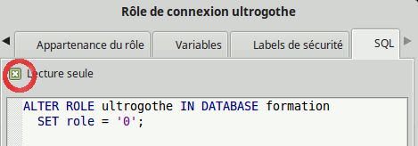
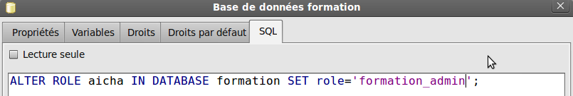
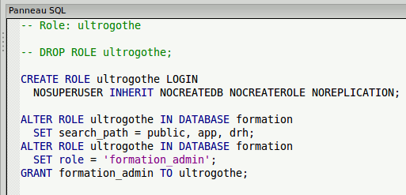

# Formation Pratique PostgreSQL - partie 2

--------------------------------------------------------------------------------

copyright (c) 2012-2021 : [Makina Corpus](http://www.makina-corpus.com) Creative Commons CC-BY-SA

.fx: alternate

--------------------------------------------------------------------------------

# 13. Premières sauvegardes et restaurations
<small>Pour avoir un peu de contenu</small>

.fx: title1 title1-3

--------------------------------------------------------------------------------

Nous avons pu constater que toutes les commandes effectuées dans PostgreSQL avec pgAdmin correspondaient à des commandes SQL. On peut donc à tout moment sauvegarder l'état actuel d'une base de données, autant au niveau de la structure que du contenu.

Les sauvegardes vont principalement avoir deux rôles:

* permettre de **récupérer l'état de la base en cas de problème** technique ou fonctionnel, la vision classique de la **sauvegarde** pour un administrateur
* permettre de **partager la base entre développeurs**, de créer des fichiers d'installation et de population de la base, vision plus utile au **développeur**.

Pour **l'administrateur** la vision que nous allons étudier dans un premier temps,
le **dump**, est une première solution, **ce n'est pas la seule** et nous y
reviendrons plus tard.

Pour le **développeur** le dump devrait devenir un élément **prioritaire**.

--------------------------------------------------------------------------------

## 13.1. pg_dump
<small>obtenir un script SQL de recréation de la base</small>

.fx: title2

--------------------------------------------------------------------------------
Un dump de base de données est un script SQL qui permet de reconstruire une base
 et d'y réinsérer toutes les données.

La commande utilisée pour effectuer un dump sous PostgreSQL est `pg_dump`.

Il s'agit d'une ligne de commande qui accepte un très grand nombre d'options.

**PgAdmin** propose un **assistant** de sauvegarde utilisant `pg_dump` et
`pg_restore` qui va nous permettre d'effectuer très simplement un grand nombre
de **types de dumps différents**.

Nous allons travailler avec l'utilisateur **postgres (rouge)**, qui n'aura aucun
problèmes de droits pour sauvegarder la base.

Si nous effectuons un clic droit sur la base de données formation nous voyons un
 assistant **« sauvegarder »**. Le but de cet assistant est de lancer une
 commande `pg_dump` avec les options que vous cochez. Cet assistant n'est pas
 parfait en terme d'ergonomie, **certaines options sont incompatibles** sans que
 vous ne puissiez le deviner et la forme finale du dump dépends **très fortement**
 des options. Nous allons tester quelques combinaisons.

--------------------------------------------------------------------------------

Nous commençons par ne travailler que sur les formats **« PLAIN »**.

Ce format génère du **SQL**.

Nous donnons donc l'extension **« .sql »** au fichier de sortie.

* **formation_test1.sql** : PLAIN + codage UTF8 + **inclure l'instruction CREATE DATABASE**:
 `pg_dump --host localhost --port 5432 --username "postgres" --format plain --create --encoding UTF8 --verbose –file "(...)/formation_test1.sql" "formation"`

* **formation_test2.sql** : PLAIN + codage UTF8 + **inclure l'instruction DROP Database + utiliser les colonnes pour les INSERT +  utiliser des commandes INSERT**: `pg_dump --host localhost --port 5432 --username "postgres" --format plain --clean --encoding UTF8 --inserts --column-inserts --verbose --file "(...)/formation_test2.sql" "formation"`

* **formation_test3.sql**: PLAIN + codage UTF8 + **inclure l'instruction DROP Database + schéma uniquement** : `pg_dump --host localhost --port 5432 --username "postgres" --format plain --schema-only --clean --encoding UTF8 --verbose --file "(...)/formation_test3.sql" "formation"`

* **formation_test4.sql**: PLAIN + codage UTF8 + **schéma uniquement** : `pg_dump --host localhost --port 5432 --username "postgres" --format plain --schema-only --encoding UTF8 --verbose --file "(...)/formation_tests_4.sql" "formation"`

.fx: wide

--------------------------------------------------------------------------------

Si nous comparons le contenu des ces fichiers avec un éditeur de texte on peut
remarquer plusieurs choses:

* **formation_test1.sql** :il s'agit d'un script destiné à être lu par la ligne
  de commande psql, il comporte des instructions spécifiques propres à psql
  comme toutes celles qui commencent par **« \ »**. L'insertion des données se
  fait en utilisant l'option **-f** dans **psql** plutôt que par des instructions
  `SQL` (commande `COPY test1 (id, val) FROM stdin`). Ce script **présuppose que
  la base de données formation n'existe pas**, il faut donc supprimer une éventuelle
   base avant de l'exécuter.

Nous pourrions l'exécuter très simplement ainsi:

    psql -U postgres -h localhost -d formation -f /path/to/formation_test1.sql

--------------------------------------------------------------------------------

* **formation_test2.sql** ne contient aucune commande destinées à psql, c'est le
   format idéal pour être rejoué dans pgadmin (fenêtre SQL). Il ne contient pas
   de commande de création de base de données mais supprime tous les objets et
   droits puis les recrée dans l'ordre. **Notez que l'ordre de suppression et
   création des objets est très complexe**, il est quasi impossible d'effectuer
   à la main un script qui saurait organiser les suppressions et recréation en
   tenant compte de toutes les dépendances entre objets *(remarquez au passage
   l'onglet dépendances sur tous les objets dans pgAdmin)*. Notez que des
   insertions sous forme de requêtes `INSERT` sont plus lentes qu'avec le premier
   fichier (`COPY`).

Remarquez aussi que l'instruction <b>"inclure DROP DATABASE"</b>
dans l'assistant aurait du être nommée <b>"inclure DROP des objets de la base"</b>
(il n'y a pas de <b>DROP DATABASE</b>!!).

--------------------------------------------------------------------------------

* **formation_test3.sql** est quasi équivalent au deuxième fichier sauf qu'il ne
  contient pas les données. Notez que l'instruction **"ne sauvegardez que le schéma"**
  aurait du être traduite par **"ne sauvegardez que la structure"** car cela
  n'est pas en rapport avec les objets de type schéma. Si vous voulez ne
  sauvegarder qu'un schéma, voir un ensemble de tables vous pouvez voir qu'un
  des onglets de l'assistant permet de choisir ces objets.

* **formation_test4.sql** n'avait ni '`DROP DATABASE`' ni '`CREATE DATABASE`'
  en options, nous obtenons un script d'initialisation qui peut tourner sur une
  base vierge et qui créé tous les objets, ici sans les données. C'est une
  bonne alternative au *formation_test2.sql*.

Vous pouvez facilement imaginer un `formation_test5.sql` ne contenant que les
données ou bien une sauvegarde ne contenant qu'un seul schéma ou une seule table.

--------------------------------------------------------------------------------

Si vous avez créé des objets supplémentaires dans vos bases depuis le dump ils
ne sont pas pris en compte dans des dumps de suppression/recréation.
Ce qui empêchera au passage le dump de se rejouer car les schémas ne seront pas
vides. 
Changez alors les instructions <b>DROP SCHEMA &lt;nom du schéma&gt;</b>
par <b>DROP SCHEMA &lt;nom du schema&gt; CASCADE</b> dans le script SQL, tous les objets
supplémentaires inclus dans le schéma seront supprimés. 
Ou bien utilisez un dump comme le quatrième, sans les suppressions, et supprimez
votre base avant import (cf partie suivante sur les droits pour les GRANT d'accès)

N'oubliez pas qu'il n'y a pas que le <b>format PLAIN</b>, nous étudierons dans
les parties administration les autres formats de backup, y compris ceux de
<b>pg_dump</b>

--------------------------------------------------------------------------------

Les assistants de restauration de pgAdmin sont prévus pour les autres formats
(pas le <b>PLAIN</b>), car les formats PLAIN se rejouent simplement dans les écrans SQL.

Une fois ces fichiers créés rien ne vous interdit de les modifier pour y ajouter
quelques commandes SQL. Ainsi nous pourrions ajouter nos trois commandes de
remplissage de tables à la fin de `formation_test3.sql` ou `formation_test4.sql`.

--------------------------------------------------------------------------------

## 13.2. Problèmes avec la gestion des droits, élévation de privilèges
<small>retour sur le "GRANT FOR ROLE"</small>

.fx: title2

--------------------------------------------------------------------------------
### gérer les droits d'accès

Si vous recherchez toutes les instructions GRANT dans ces fichiers de dump vous
verrez que certaines sont **absentes** :

    GRANT CONNECT, TEMPORARY ON DATABASE formation TO public;
    GRANT ALL ON DATABASE formation TO formation_admin WITH GRANT OPTION;
    GRANT CONNECT, TEMPORARY ON DATABASE formation TO formation_ecriture;
    GRANT CONNECT ON DATABASE formation TO formation_lecture;

Il s'agit du contenu du premier onglet Droits sur la base de données elle-même
(les droits sur les schémas font eux partie du dump).

Ceci est du au fait que ces droits qui gère **un premier niveau d'accès à la base**
(globalement le droit de s'y connecter) ne sont pas gérés au sein de la base
elle-même mais **au sein de la base postgres.**

--------------------------------------------------------------------------------
### gérer les droits d'accès

A l'usage il est plutôt conseillé de faire **un fichier SQL dédié aux droits
d'accès** et d'y ajouter quelques lignes de `GRANT`. La gestion des droits
d'accès à la base n'étant pas supposée changer trop souvent.

Ce fichier servant aussi de base pour remettre à zéro les droits et/ou vues dans
une base partagée entre développeurs, par exemple.

L'autre solution est l'utilisation de `pg_dumpall --globals-only` qui comme son
nom l'indique se contente de sauvegarder les **« globales »** du cluster parmi
lesquelles on retrouve **les rôles et les droits primaires**.

`pg_dumpall` est un deuxième utilitaire qui sauve l'intégralité du cluster
de base de données, ces droits inclus.

--------------------------------------------------------------------------------

Si vous regardez à la fin de ces fichiers vous y verrez toute une série de
`ALTER DEFAULT PRIVILEGES` effectués sur le rôle postgres:

    ALTER DEFAULT PRIVILEGES FOR ROLE postgres REVOKE ALL ON SEQUENCES  FROM PUBLIC;
    ALTER DEFAULT PRIVILEGES FOR ROLE postgres REVOKE ALL ON SEQUENCES  FROM postgres;
    ALTER DEFAULT PRIVILEGES FOR ROLE postgres GRANT ALL ON SEQUENCES  TO postgres;
    ALTER DEFAULT PRIVILEGES FOR ROLE postgres GRANT ALL ON SEQUENCES  TO formation_ecriture;
    ALTER DEFAULT PRIVILEGES FOR ROLE postgres GRANT SELECT,USAGE ON SEQUENCES  TO formation_lecture;
    ALTER DEFAULT PRIVILEGES FOR ROLE postgres GRANT ALL ON SEQUENCES  TO formation_app WITH GRANT OPTION;
    ALTER DEFAULT PRIVILEGES FOR ROLE postgres REVOKE ALL ON FUNCTIONS  FROM PUBLIC;
    ALTER DEFAULT PRIVILEGES FOR ROLE postgres REVOKE ALL ON FUNCTIONS  FROM postgres;
    ALTER DEFAULT PRIVILEGES FOR ROLE postgres GRANT ALL ON FUNCTIONS  TO postgres;
    (etc.)

Si nous avions défini des droits par défaut dans le schéma app nous aurions eu des lignes supplémentaires du type :

    ALTER DEFAULT PRIVILEGES FOR ROLE postgres IN SCHEMA app REVOKE ALL ON TABLES  FROM PUBLIC;
    ALTER DEFAULT PRIVILEGES FOR ROLE postgres IN SCHEMA app REVOKE ALL ON TABLES  FROM postgres;
    ALTER DEFAULT PRIVILEGES FOR ROLE postgres IN SCHEMA app GRANT SELECT,INSERT,DELETE,TRUNCATE,UPDATE ON TABLES  TO formation_ecriture;
    (etc.)

Il s'agit de **la définition des Droits par défaut dans pgAdmin**.

.fx: wide

--------------------------------------------------------------------------------

Quand nous avons créé ces privilèges par défaut pgadmin a décidé de ne les créer
que pour l'utilisateur postgres.

Quand pgadmin nous montre une ligne de droits ainsi:

    ALTER DEFAULT PRIVILEGES
        GRANT INSERT, SELECT, UPDATE, DELETE, TRUNCATE ON TABLES
        TO formation_ecriture;

Cela signifie en fait:

    ALTER DEFAULT PRIVILEGES FOR ROLE postgres
        GRANT INSERT, SELECT, UPDATE, DELETE, TRUNCATE ON TABLES
        TO formation_ecriture;

C'est pourquoi quand nous créons un objet avec l'utilisateur **ultrogothe**
celui-ci n'hérite pas des droits par défaut.

Si vous voulez que l'utilisateur **ultrogothe** créé des objets avec les droits
par défaut il faut donc faire une copie de toutes ces lignes
`ALTER DEFAULT PRIVILEGES`, y remplacer le mot 'postgres' par 'ultrogothe'
(ou formation_admin), et ajouter ces lignes soit dans le fichier de dump,
soit dans un fichier à part (par exemple un dump dédié à la gestion des droits).

.fx: wide

--------------------------------------------------------------------------------

Essayons avec formation_admin :

    ALTER DEFAULT PRIVILEGES FOR ROLE formation_admin REVOKE ALL ON SEQUENCES  FROM PUBLIC;
    ALTER DEFAULT PRIVILEGES FOR ROLE formation_admin REVOKE ALL ON SEQUENCES  FROM formation_admin;
    ALTER DEFAULT PRIVILEGES FOR ROLE formation_admin GRANT ALL ON SEQUENCES  TO postgres;
    ALTER DEFAULT PRIVILEGES FOR ROLE formation_admin GRANT ALL ON SEQUENCES  TO formation_ecriture;
    ALTER DEFAULT PRIVILEGES FOR ROLE formation_admin GRANT SELECT,USAGE ON SEQUENCES  TO formation_lecture;
    ALTER DEFAULT PRIVILEGES FOR ROLE formation_admin GRANT ALL ON SEQUENCES  TO formation_admin WITH GRANT OPTION;

    ALTER DEFAULT PRIVILEGES FOR ROLE formation_admin REVOKE ALL ON FUNCTIONS  FROM PUBLIC;
    ALTER DEFAULT PRIVILEGES FOR ROLE formation_admin REVOKE ALL ON FUNCTIONS  FROM formation_admin;
    ALTER DEFAULT PRIVILEGES FOR ROLE formation_admin GRANT ALL ON FUNCTIONS  TO PUBLIC;
    ALTER DEFAULT PRIVILEGES FOR ROLE formation_admin GRANT ALL ON FUNCTIONS  TO postgres;
    ALTER DEFAULT PRIVILEGES FOR ROLE formation_admin GRANT ALL ON FUNCTIONS  TO formation_ecriture;
    ALTER DEFAULT PRIVILEGES FOR ROLE formation_admin GRANT ALL ON FUNCTIONS  TO formation_lecture;
    ALTER DEFAULT PRIVILEGES FOR ROLE formation_admin GRANT ALL ON FUNCTIONS  TO formation_admin WITH GRANT OPTION;

    ALTER DEFAULT PRIVILEGES FOR ROLE formation_admin REVOKE ALL ON TABLES  FROM PUBLIC;
    ALTER DEFAULT PRIVILEGES FOR ROLE formation_admin REVOKE ALL ON TABLES  FROM formation_admin;
    ALTER DEFAULT PRIVILEGES FOR ROLE formation_admin GRANT ALL ON TABLES  TO postgres;
    ALTER DEFAULT PRIVILEGES FOR ROLE formation_admin GRANT SELECT,INSERT,DELETE,TRUNCATE,UPDATE ON TABLES  TO formation_ecriture;
    ALTER DEFAULT PRIVILEGES FOR ROLE formation_admin GRANT SELECT ON TABLES  TO formation_lecture;
    ALTER DEFAULT PRIVILEGES FOR ROLE formation_admin GRANT ALL ON TABLES  TO formation_admin WITH GRANT OPTION;

Si nous tapons cette série de commandes sur la base et que nous testons la création d'une table avec ultrogothe **cela ne fonctionne toujours pas.**

--------------------------------------------------------------------------------

Il faut en fait qu'**au moment de la création de la table avec l'utilisateur ultrogothe
celle-ci indique qu'elle va effectuer cette commande en tant que rôle formation_admin**
en tapant au préalable:

    SET ROLE formation_admin;

Nous pourrions donc aussi ajouter des altérations de droits par défaut pour le
rôle **ultrogothe** lui-même. Afin d'éviter d'avoir à taper cette **élévation de
privilèges**.

Retenez donc que les droits par défaut <b>ne sont pas associés à la base mais à
un rôle</b>, et que par défaut ce <b>FOR rôle xxx est attribué à l'utilisateur
de la session qui lance ces commandes</b> – donc souvent le rôle super-utilisateur.

Retenez aussi que pour le rôle super-utilisateur sur la base il vaut mieux
utiliser un <b>rôle de connexion</b> plutôt qu'un <b>groupe</b>. Sans quoi les
rôles administrateurs devront avoir leurs commandes d'altération de droits par
défaut <b>individuelles</b> ou utiliser des <b>SET ROLE</b> pour changer de
niveau de session.

.fx: wide

--------------------------------------------------------------------------------

Mais si demain nous ajoutons 5 utilisateurs dans le groupe **formation_admin**
nous ne voudrions certainement pas avoir à retaper les altérations de privilèges
par défaut pour chacun de ces rôles.

Dans notre cas la meilleure solution est de **forcer la session ouverte avec
l'utilisateur ultrogothe à faire une élévation de rôle.**

Nous avons vu que cela se fait par une commande `SET`. Cela veut dire que **le
rôle est une variable comme les autres**.

Nous pouvons donc forcer la valeur de la variable rôle soit au niveau de la
session, soit dans les **variables de l'utilisateur**, soit dans les variables de l'utilisateur pour une base.

Nous avons déjà vu les deux premières méthodes, testons la troisième.

Pgadmin ne gère pas très bien les altérations de la variable role dans les
onglets de variables.

Nous utiliserons donc pgadmin pour nous montrer le début de la commande puis
nous modifierons la requête pour l'adapter à nos besoins.

--------------------------------------------------------------------------------

On commence par aller sur l'onglet <b>Variables</b> sur l'écran de propriétés de la base (avec l'utilisateur postgres).<b>Sur cet écran il faut créer une variable bidon avec une valeur bidon</b> 
Ou bien sur l'écran de gestion des utilisateurs, pour éditer l'utilisateur <b>ultrogothe</b>,
sur cet écran <b>la variable role existe mais  ne prends qu'une valeur numérique</b>.

--------------------------------------------------------------------------------

On utilise ensuite l'onglet <b>SQL</b> pour voir la requête générée et on décoche
<b>« Lecture seule »</b> afin de pouvoir modifier la requête. Qui comporte soit
une valeur bidon pour la variable role (si vous venez de l'édition utilisateur),
soit une variable bidon avec une valeurbidon (si vous êtes sur les propriétés de
 la base).

--------------------------------------------------------------------------------
On obtient cette requête qui va normalement se situer avec les requêtes de `GRANT`
de haut niveau dans le panneau SQL lorsque l'on sélectionne la base.

    ALTER ROLE ultrogothe IN DATABASE formation SET role='formation_admin';

Pour tester que cette altération de rôle fonctionne on peut se déconnecter puis
se reconnecter avec ultrogothe et taper cette commande SQL:

    SHOW ROLE;

Cette commande <b>ALTER ROLE</b> fait partie des <b>GRANT</b> qui ne feront pas partie
d'un simple pg_dump de la table et qui devraient être sauvegardées en effectuant
un pg_dumpall --globals-only.

--------------------------------------------------------------------------------

Une fois le script corrigé en ajoutant une copie de toutes ces lignes pour
l'utilisateur <b>formation_admin</b> nous allons le rejouer dans pgadmin :
<ul>
 <li>on ouvre une connexion de l'utilisateur <b>postgres</b></li>
 <li>on se met sur la base <b>formation</b></li>
 <li>on ouvre l'éditeur SQL, Fichier, Ouvrir</li>
 <li>on choisit notre dump corrigé puis on l'exécute.</li>
</ul>

Rassurez-vous à la prochaine sauvegarde les privilèges par défaut que nous avons
ajoutés au rôle formation_admin n'auront pas disparu. 
Mais si les privilèges par défaut changent il ne faudra pas oublier de corriger
le dump pour mettre formation_admin en correspondance avec postgres.

--------------------------------------------------------------------------------

## 13.3. Importation de la base de formation
<small>Rhââaaa</small>

.fx: title2

--------------------------------------------------------------------------------
Notre base formation avec ses **trois schémas** et ses **trois tables** est un
peu **légère**.

Nous allons la supprimer puis importer plusieurs fichiers de dumps qui
contiennent une base **plus avancée** dans le développement de l'application.

Nous aurions pu travailler avec un fichier unique de sauvegarde/import mais il
est plus **réaliste** de commencer à travailler avec des fichiers multiples,
tels qu'ils pourraient être gérés dans un vrai projet.

Les fichiers à disposition sont:

* **formation_creation.sql**: Ce fichier a été fait à la main et contient la
 commande de création de la base et les **GRANT initiaux** minimums, ceux qui ne
 peuvent être dumpés (recopiés depuis pgAdmin):

<pre><code>
-- Adding default database creation and Database Grants
<b>CREATE DATABASE</b> formation
  WITH OWNER = formation_admin
       ENCODING = 'UTF8'
       TABLESPACE = pg_default
       LC_COLLATE = 'fr_FR.utf8'
       LC_CTYPE = 'fr_FR.utf8'
       CONNECTION LIMIT = -1;
<b>ALTER ROLE</b> ultrogothe IN DATABASE formation SET role='formation_admin';
<b>GRANT</b> CONNECT, TEMPORARY ON DATABASE formation TO public;
<b>GRANT</b> ALL ON DATABASE formation TO formation_admin WITH GRANT OPTION;
<b>GRANT</b> CONNECT, TEMPORARY ON DATABASE formation TO formation_ecriture;
<b>GRANT</b> CONNECT ON DATABASE formation TO formation_lecture;
</pre></code>

.fx: wide

--------------------------------------------------------------------------------

* **formation_initialisation.sql**: création des droits d'accès minimaux et des
 schémas. Créé en faisant un dump en **UTF8 + PLAIN + avec « Schéma uniquement
  »**, sans décocher aucun objet. Le dump obtenu a ensuite été vidé de 90% de
 son contenu, pour ne garder que les créations de schémas, et les grants sur ces
 schémas ainsi que les grants sur les rôles (les pg_dump partiels ne sont pas
 toujours capable de créer les schémas et de sauver les GRANTS par défaut)
* **formation_drh_public.sql** : tout le contenu du schéma drh, avec les données
 DRH et le schéma public (qui ne contient qu'une fonction). Créé avec un dump en
**UTF8 + PLAIN + colonnes et commandes INSERT + le schéma app décoché**.
* **formation_schema_app_dev1.backup**: une première version de l'application,
 pour le schéma **app**, que nous installerons **plus tard**.
* **formation_schema_app_dev2.backup**: une deuxième version de l'application,
 pour le schéma **app** avec des **fonctions** et **triggers**, que nous
 étudieront plus tard aussi

--------------------------------------------------------------------------------

Dans un premier temps nous n'allons étudier que le schéma **drh**. Il nous faut
donc:

Utiliser une connexion administrateur, pas <b>ultrogothe</b> (qui pourrait avoir des
problèmes de droit à la création de la base, au départ) ou <b>postgres</b>

Supprimer notre base formation actuelle (clic droit dans pgAdmin pour faire un DROP DATABASE)

Ouvrir la fenêtre SQL en cliquant d'abord sur la base Postgres (assurez-vous que la base formation est <b>déconnectée</b>).

Importer le contenu du fichier <b>formation_creation.sql</b> dans cette fenêtre. Si on tente de l'executer on obtient: <b>ERROR:  CREATE
 DATABASE cannot be executed from a function or multi-command string</b>, pour
 exécuter de telles commandes dans l'interpréteur SQL il y a une petite subtilité,
 il faut cliquer sur le Menu <b>Requêtes>Exécuter pgScript</b>. Remarquez aussi
 que si vous voulez changer le nom de la base il n'y aura qu'à le modifier à
 chaque ligne de ce fichier. 
 Avec pgAdmin4 par contre vous ne pouvez créer la base qu'avec l'assitant graphique...

.fx: wide

--------------------------------------------------------------------------------

Passons à l'initialisation des schémas et droits par défaut, sélectionnez la base
<b>formation</b> qui a du être recréée (F5) puis ouvrez <b>un interpréteur SQL</b>.

Ouvrez le fichier <b>formation_initialisation.sql</b> et exécutez le (normalement celui là).
Vous verrez que ultrogothe pourrait avoir des problèmes de droits sur ce fichier là aussi.

Nous pouvons alors passer au contenu du schéma drh. Ouvrez le fichier <b>formation_drh_public.sql</b> et exécutez-le. Vous devriez obtenir une erreur <b>ERROR:  schema "drh" already exists</b> commentez cette ligne  
<b>CREATE SCHEMA drh;</b> avec deux tirets en début de ligne.

--------------------------------------------------------------------------------
## 13.4. Examen la base drh

<small>Il y a pleins de choses dedans.</small>

.fx: title2

--------------------------------------------------------------------------------

Cette base est assez complexe.

Il y a de nombreuses choses à observer dans le fichier `formation_drh_public.sql`
ou depuis l'interface de pgAdmin.

--------------------------------------------------------------------------------
### 13.4.1. Types de données

Pour commencer vous pouvez observer les types utilisés sur les colonnes.

De nombreux types sont disponibles [http://docs.postgresqlfr.org/9.5/datatype.html](http://docs.postgresqlfr.org/9.5/datatype.html)
et une base de données bien conçue devrait toujours utiliser le bon type pour la
bonne donnée.

Parcourez les différents types de données proposés par postgreSQL

Pour les <b>montants</b> utilisez les types <b>numeric</b> et pas les <b>float</b>. 
Ou alors utilisez des <b>entiers</b>, et géréez des centimes. 
Le type <b>money</b> existe aussi, mais il est assez pauvres en <b>conversions de
 types</b> et vous devriez éviter de l'utiliser.

Dans les types textes, remarquez en plus du <b>character varying</b> le type <b>text</b>.

.fx: wide

--------------------------------------------------------------------------------

Pour les types binaires utilisez <b>binary</b>. La gestion des binaires de taille
importante sera faite automatiquement avec les <b>TOAST </b> <a href="http://docs.postgresqlfr.org/9.5/storage-toast.html">http://docs.postgresqlfr.org/9.5/storage-toast.html</a>. The <b>Oversized-Attribute Storage Technique</b>. 
Les binaires de taille importante (>8Ko s on simplifie) seront stockés dans un
espace physique secondaire de la table. Ceci permet à un champ sur une ligne de
table, d'atteindre une taille de 1Go.

Attention avec les <b>booléens</b>, si vous ne mettez pas <b>NON NULL</b> ceux-ci
pourront prendre <b>3 valeurs</b>, true, false ou Null. 
<b>N'utilisez JAMAIS une chaîne de caractère pour stocker un booléen!</b>
(réfléchissez à la taille en bit d'un caractère UTF8, un chaton meurt sur terre
à chaque fois qu'on stocke une chaîne de caractère à la place d'un booléen).

Remarquez le type <b>ENUM</b> 

.fx: wide

--------------------------------------------------------------------------------

Remarquez qu'il est possible de créer <b>ses propre types</b>, d'y associer des
contraintes (<b>DOMAINES</b>), de créer des types composés (comme les structures
en C), de gérer des <b>arrays</b>.

--------------------------------------------------------------------------------
### 13.4.2. Héritage de tables

La table personnel sert de table modèle à la table `employes` et la table
`interimaires`.

Il y a de **l'héritage de tables**. Cela veut dire que les tables `employes` et
`interimaires` **héritent des toutes les colonnes de `personnel`**.
Testez ces commandes SQL:

    SELECT * from drh.personnel;
    SELECT * from ONLY drh.personnel ;

On voit que deux personnes ont été créées qui ne sont ni des employés ni des
intérimaires (peut-être des stagiaires).

L'héritage de table est utile pour modéliser des relations d'héritage ou pour
optimiser le stockage de grosses tables de données, le partitionnement (en
utilisant des tablespaces différents pour les tables héritées).

Le principal défaut de l'héritage de table est <b>la gestion des index</b>, les
index sont <b>propres à chaque table</b>, la définition de contraintes
<b>d'unicité</b> ou de <b>clef étrangère</b> est complexifiée.

.fx: wide

--------------------------------------------------------------------------------
### 13.4.3. Clefs étrangères

Dans cette base schéma on trouve des relations de clef étrangère entre tables:

* classiquement entre employés et services ou entre intérimaires et agences
* mais aussi en passant par une table d'association n-aire comme pour la relation entre employés et projets

Les **valeurs par défaut pour les cascades sont RESTRICT** qui empêchent les
modifications si celles-ci pourraient avoir des impacts. Remarquez qu'il existe
d'autres possibilités:

<code><pre>
ALTER TABLE ONLY employes
  ADD CONSTRAINT "EMPLOYE_POUR_UN_SERVICE_FK" FOREIGN KEY (ser_id)
    REFERENCES services(ser_id)
    <b>ON UPDATE CASCADE ON DELETE SET DEFAULT</b>
    DEFERRABLE INITIALLY DEFERRED;

ALTER TABLE ONLY services
  ADD CONSTRAINT "SERVICE_RELATION_PARENT" FOREIGN KEY (ser_parent)
    REFERENCES services(ser_id)
    <b>ON UPDATE CASCADE ON DELETE SET DEFAULT</b>
    DEFERRABLE INITIALLY DEFERRED;

ALTER TABLE ONLY employes_projet
    ADD CONSTRAINT "employes_projet_EMPLOYES_FK" FOREIGN KEY (emp_id)
        REFERENCES employes(per_id)
       <b>ON UPDATE CASCADE ON DELETE CASCADE;</b>
</code></pre>

.fx: wide

--------------------------------------------------------------------------------
### 13.4.4. Triggers

Sur le schéma **drh** des **triggers** existent, nous verrons plus en détail
l'écriture et le fonctionnement des triggers, mais sachez que ce schéma se sert
des ces triggers pour **mettre à jour la date de modification** de certaines
tables, ou pour **calculer le code d'un employé**.

--------------------------------------------------------------------------------
### 13.4.5. Contraintes

Plus important **des contraintes supplémentaires ont été ajoutées**.

Examinez par exemple toutes les contraintes exprimées sur la table `employes`.

Ces contraintes que l'on nomme des **CHECKS** sont importants pour
l'administrateur de données. **Elles permettent de s'assurer qu'une base de
données alimentée par plusieurs programmes possède ses propres règles de
validation des données et que ces règles seront toujours respectées**, quelque
soit le niveau de qualité des programmes utilisant la base.

Ceci fait partie de la définition de **la cohérence des données** qui est un
élément **très important** des bases de données.

Les contraintes d'**unicité** ne sont pas les seules à pouvoir être exprimées
au niveau de la base.

--------------------------------------------------------------------------------
### 13.4.6. Vues

Les **vues** peuvent servir à de nombreuses choses:

* assurer la **compatibilité des anciens programmes** connaissant un ancien modèle
  de tables en leur proposant des « *fausses* » tables qui portent les anciens
  noms de colonnes
* Ajouter des **vues simplifiées** sur des objets répartis dans différentes
 tables (c'est le cas dans le modèle drh), ou avec des conversions de types (en
 version plus lisible), il y a de nombreux exemples de telles vues dans le
 **pg_catalog** aussi, les vues du pg_catalog sont plus lisibles que les tables.
* Appliquer **des politiques de droits** en autorisant l'accès à une vue tout
  en interdisant l'accès aux tables qui composent cette vue.

Une vue est en fait **une requête déjà écrite** et qui se présente comme une
table pour tous les utilisateurs.

--------------------------------------------------------------------------------

Si vous regardez en détail dans pgAdmin comment une vue est construite vous
verrez qu'elle utilise le système des règles (**RULES**).

Le système des règles est un système qui permet de **détourner** toute sortes de
requêtes sur un objet pour les **réécrire**. Ici toutes les requêtes en lecture
touchant la vue seront réécrites pour intégrer les éléments de la vraie
requête sous-jacente.

--------------------------------------------------------------------------------

Pour bien voir ce système tapez:

    SELECT * FROM drh.vue_tableau_personnel;

Exécutez la requête. 
Ensuite cherchez le bouton <b>EXPLAIN</b> situé à droite des boutons d'exécution
de requêtes. 
 Cliquez dessus et observez la vraie requête que votre requête toute simple demande.

--------------------------------------------------------------------------------
### 13.4.7. Jouons avec les triggers et les cascades

<b>Q1:</b> Modifiez l'identifiant du service Finances actuel de 2 à 200. 
Que s'est-il passé sur la table des employés? Que s'est-il passé sur la table services? 
Pourquoi?

<b>Q2:</b> Modifiez maintenant le code du service Finance qui a l'identifiant 200 en « FXXX1 ».  Que s'est-il passé sur la table des employés (faites des rafraichissements si vous affichiez déjà la table)?

<b>Q3:</b> Supprimez le service Finance avec identifiant 200 et rafraîchissez la table. Que s'est-il passé sur la table service et dans la table « employes ». 
Pour rétablir la situation indiquez l'identifiant du service Finance nouvellement créé aux utilisateurs qui étaient dans ce service sur la table « employes ». Puis indiquez cet identifiant aux services dépendants du service Finance (Comptabilité et Trading).

.fx: wide

--------------------------------------------------------------------------------
### Solutions:

* **Q1:** La modification de l'identifiant du service de 2 à 200 a été répercutée
 dans la table des employés, ceux qui avaient un `ser_id` à 2 on maintenant un
 `ser_id` à 200.
 Il y a aussi une clef étrangère définissant la relation de parenté des services
 entre eux, quand le code du service Financier à changé la CASCADE a répercuté
 le changement sur ses fils (Comptabilité et Trading)
* **Q2:** Lorsque le code est modifié un trigger est exécuté
 (`ser_update_alter_emp_code`), dans ce trigger on voit que si le code a changé
 une requête update est effectuée sur la table employés pour recalculer le code
 employé de tous les employés de ce service.
* **Q3:** La clef étrangère définit le comportement en cas de `DELETE` à
 `SET DEFAULT`, la valeur par défaut de la colonne `ser_id` pour les employés
 est **1**, ils sont donc passés au service d'identifiant 1. Un trigger est
 déclenché sur la table employes en cas de création d'employé ou en cas de
 modification d'identifiant employé ou de code employé. Nous sommes dans cette
 troisième situation, le trigger se lance donc et recalcule le code employé.
 Il y a aussi une clef étrangère définissant la relation parent sur la table
 services, lorsque le parent « **Financier** » a disparu les deux services fils
 sont passés à la valeur par défaut (**service inconnu**).

.fx: wide

--------------------------------------------------------------------------------

## 14. Requêtes
<small>Nous allons faire des requêtes sur le schéma drh et essayer de faire un tour d'horizon de l'étendue des possibilités offertes par la commande SELECT.</small>

.fx: title1 title1-5

--------------------------------------------------------------------------------

## 14.1. Sélection de colonnes, SELECT *, Distinct

.fx: title2

--------------------------------------------------------------------------------

L'étoile dans le SELECT est un caractère spécial qui signifie **« toutes les
colonnes de toutes les tables de mon SELECT »**.

Testez les résultats obtenus avec ces différentes requêtes:

    SELECT * FROM drh.EMPLOYES;
    SELECT per_nom FROM drh.employes;
    SELECT distinct(per_nom) FROM drh.employes;

--------------------------------------------------------------------------------

## 14.2. ORDER BY

Pour trier les résultats d'une requête on doit utiliser **ORDER BY**.

Partant d'une requête de base :

    SELECT per_nom,per_prenom,emp_code_pays FROM drh.employes;

En vous appuyant sur la [documentation](https://www.postgresql.org/docs/9.6/queries-order.html),
essayez de trouver **deux** syntaxes différentes qui permettent de trier ces résultats :

* par **code pays**
* puis par **nom**
* puis par **prénom**.

--------------------------------------------------------------------------------

## 14.2. ORDER BY

Solutions

    SELECT per_nom,per_prenom,emp_code_pays FROM drh.employes
    ORDER BY 
      emp_code_pays,
      per_nom,
      per_prenom
    ;

    SELECT per_nom,per_prenom,emp_code_pays FROM drh.employes
    ORDER BY
      3,
      1,
      2
    ;

Pouvez-vous aller plus loin, inverser certains ordres ou choisir comment les **NULLS**
sont gérés.

--------------------------------------------------------------------------------

## 14.2. ORDER BY

    SELECT per_nom,per_prenom,emp_code_pays FROM drh.employes
    ORDER BY
        emp_code_pays DESC,
        per_nom DESC,
        per_prenom ASC
    ;

    SELECT per_nom,per_prenom,emp_code_pays FROM drh.employes
    ORDER BY
        emp_code_pays DESC NULLS LAST,
        per_nom DESC,
        per_prenom ASC
    ;

Notez dès à présent que la gestion de ces ordres ascendants/descendants et des
nulls peut avoir des impacts non négligeables sur le temps d'éxecution d'une
requête mal indexée (on retrouve ces mêmes précisions dans les indexs).

--------------------------------------------------------------------------------

## 14.3. dédoublonner: distinct on + order by
<small>un index, un order by, un distinct, et hop!</small>

.fx: title2

--------------------------------------------------------------------------------

Comparez ces deux requêtes. L'une affiche tous les résultats, l'autre a supprimé
les lignes en doublons, sachant que nous indiquons sur quels éléments nous
estimons que ce rapprochement est valide (avec le `distinct on`):

    SELECT
    emp_code_pays, per_actif, per_nom, emp_naissance
    FROM drh.employes
    ORDER BY emp_code_pays DESC NULLS LAST, per_actif, emp_naissance DESC;

et avec ce `distinct on`:

    SELECT  distinct ON(emp_code_pays, per_actif)
    emp_code_pays, per_actif, per_nom, emp_naissance
    FROM drh.employes
    ORDER BY emp_code_pays DESC NULLS LAST, per_actif, emp_naissance DESC;

Essayez d'expliquer ce que recherche cette requête, le débat est ouvert.

--------------------------------------------------------------------------------

## 14.4. Le problème du NULL
<small>Le cauchemar qui fera planter vos innocentes requêtes</small>

.fx: title2

--------------------------------------------------------------------------------

**NULL** est une valeur à laquelle vous devrez **TOUJOURS** penser.

**Partout**, dans les **tris**, les fonctions, les regroupements, nous allons le
recroiser partout et il aura parfois des effets **dévastateurs**.

Prenez dès à présent l'habitude de **penser aux valeurs nulles**, un peu comme
le « `si x!=0` » en mathématique quand vous passiez votre Bac.

**NULL n'est pas la chaîne vide**, il n'est **pas zéro**, il est l'absence
d'information, le **vide**. Et si par exemple vous appliquez un opérateur de
concaténation de chaîne ou d'addition vous allez avoir des surprises:

    SELECT 42 + NULL;
    SELECT 'toto' || NULL;

--------------------------------------------------------------------------------

Un complément, trouvé sur
[un article de Haki Benita](https://medium.com/statuscode/the-many-faces-of-distinct-in-postgresql-c52490de5954),
avec une syntaxe SQL un peu avancée, si vous ne comprenez pas encore la
syntaxe avancée de la requête ne regardez que le résultat:

    WITH t AS (
        SELECT 1 AS a, 1 AS b UNION ALL
        SELECT 1, 2 UNION ALL
        SELECT NULL, 1 UNION ALL
        SELECT NULL, NULL
    )
    SELECT
        a,
       b,
       a = b as equal
    FROM
       t;

     a   |  b   | equal 
    ------+------+-------
       1 |    1 | t
       1 |    2 | f
    NULL |    1 | NULL
    NULL | NULL | NULL

--------------------------------------------------------------------------------

Et notez, surtout pour les utilisateurs avancés, l'usage de **"IS DISTINCT FROM"**
qui va vous permettre d'éviter ces problèmes de NULL dans les comparaisons:

    WITH t AS (
        SELECT 1 AS a, 1 AS b UNION ALL
        SELECT 1, 2 UNION ALL
        SELECT NULL, 1 UNION ALL
        SELECT NULL, NULL
    )
    SELECT
      a,
      b,
      a = b as equal,
      a IS DISTINCT FROM b AS is_distinct_from
    FROM
      t;

      a   |  b   | equal | is_distinct_from 
    ------+------+-------+------------------
        1 |    1 | t     | f
        1 |    2 | f     | t
     NULL |    1 | NULL  | t
     NULL | NULL | NULL  | f

--------------------------------------------------------------------------------

## 14.5. Fonctions et opérateurs utiles
<small>une sélection forcément arbitraire et limitée</small>

.fx: title2

--------------------------------------------------------------------------------

Il existe énormément de fonctions qui peuvent vous être utiles dans les requêtes.

Vous pouvez en voir la liste dans le **pg_catalog Catalogue > PostgreSQL > Fonctions**
en liste plus de deux mille éléments...

La documentation en ligne est plus utile, les fonctions y sont classées:

* [http://docs.postgresqlfr.org/9.5/functions.html](http://docs.postgresqlfr.org/9.5/functions.html)

Nous allons regarder un tout petit sous-ensemble des ces fonctions utiles.

--------------------------------------------------------------------------------
## 14.5.1. Travailler sur les chaînes de caractères

Nous avons vu l'opérateur de concaténation **||** .

Il existe aussi à partir de postgresql 9.1 des fonctions **concat** et
**concat_ws**. Ces fonction concatènent plusieurs chaînes, **en ignorant les
NULL** et en ajoutant un séparateur pour la deuxième.

Les autres fonctions les plus utiles sont:

* **character_length(chaîne)** : longueur de la chaîne
* **lower(chaîne)** : passage en minuscules (upper() pour l'inverse)
* **substring(chaine,début,fin)** : extraction d'une sous chaîne
* **trim(chaîne)** : suppression des espaces inutiles, mais elle peut faire
  beaucoup plus (regardez la documentation en ligne)

Pour rechercher une sous-chaîne dans une chaîne il existe l'opérateur **LIKE** ou
**ILIKE** (insensible à la casse), qui prend en argument une chaîne de caractère
où `_` est remplacé par **un seul** caractère et `%` par **0 ou n** caractères.

    SELECT per_nom,per_prenom FROM drh.employes
    WHERE per_nom LIKE 'D%'
    AND per_prenom LIKE 'Jo__'

.fx: wide

--------------------------------------------------------------------------------
## 14.5.1. Travailler sur les chaînes de caractères

Les **noms de tables** ou d'alias de colonnes sont séparés par des **guillemets
doubles `"`** (quote anglaise sous MySQL **`**).

Les **chaînes de caractères** sont séparées par des guillemets simples **'**
(guillemets doubles pour MySQL).

Mais comment gérer une chaîne avec des guillemets?

    SELECT 'Demain dès l'aube';

Problème...

--------------------------------------------------------------------------------

On peut **doubler le guillemet** (donc **`''`**, deux fois le caractère guillemet
simple et pas **`"`** le guillemet double)

    select 'Demain dès l''aube';

Mais il y a une autre solution on peut utiliser un caractère d'**échappement \\**.
Pourtant on dirait que ce n'est pas suffisant:

    select 'Demain dès l\'aube';

La requête ne marche pas...

--------------------------------------------------------------------------------

Une chaîne qui contient un caractère échappé **doit** être préfixée avec un **E** :

    select E'Demain dès l\'aube';

    select E'\tDemain dès l\'aube \n\tà l\'heure où blanchit la campagne.\n\n';

--------------------------------------------------------------------------------

### 14.5.2. Travailler avec les nombres

Il y a de très nombreux opérateurs mathématiques et beaucoup de fonctions aussi,
notons:

* **round()** : arrondi mathématique (52.65 donne 53)
* **ceil()** : arrondi à l'entier supérieur (52.65 donne 53), voir floor() pour le contraire.
* **random()** : un nombre réel aléatoire entre 0 et 1 (non compris)

--------------------------------------------------------------------------------

### 14.5.3. Somme, Moyenne, Minimum, Maximum

De nombreuses fonctions peuvent travailler simplement sur une table **sans** nécessiter
d'opérations d'agrégation (`GROUP BY`, que nous verrons plus loin).

Retenez donc que ces fonctions peuvent fonctionner **sans GROUP BY**:

* **sum()** : somme
* **max()** : maximum
* **min()** : minimum
* **avg()** : moyenne

----------------------------------------------------------------------------------

### 14.5.4. Count

* **count()** : compteur

Tentez d'expliquer ces différents résultats:

    SELECT count(*)
    from drh.employes;
    => 24

    SELECT count(emp_code_pays)
    from drh.employes;
    => 22

    SELECT count(distinct(emp_code_pays))
    from drh.employes;
    => 10

----------------------------------------------------------------------------------

### 14.5.4. Count

<b>count(*)</b> compte les lignes de résultat. 
<b>count(champ)</b> compte les occurrences <b>non nulles</b> du champ,
<b>count(distinct champ)</b> compte les valeurs distinctes du champ.

    SELECT count(*)
    from drh.employes;
    => 24

    SELECT count(emp_code_pays)
    from drh.employes;
    => 22

    SELECT count(distinct(emp_code_pays))
    from drh.employes;
    => 10

--------------------------------------------------------------------------------

### 14.5.5. Travailler avec les dates

Je ne saurais trop vous conseiller la lecture complète de [http://docs.postgresqlfr.org/9.5/functions-datetime.html](http://docs.postgresqlfr.org/9.5/functions-datetime.html) où vous trouverez de
nombreuses fonctions très utiles comme **age()**, ainsi que des opérateurs
miraculeux comme `OVERLAP`.

Signalons ici quelques fonctions de base pour le travail avec les dates, et plus
qu'un long discours utilisons de bons exemples:

    SELECT current_timestamp, now(),current_date,current_time;

    SELECT date_part('hour',current_timestamp),
    date_trunc('hour',current_timestamp),
    extract(hour from current_timestamp);

    SELECT current_timestamp + INTERVAL '2 months 3 days 3 hours';

    SELECT current_timestamp - '2001-10-19',
    justify_interval(current_timestamp - '2001-10-19');

--------------------------------------------------------------------------------
### dates et timezones

Notez que si vous stockez la date sous forme de "timestamp sans timezone" vous aurez
des problèmes d'indexation, sauf à créer des index spécifiques qui forcent la
timezone.

**Préférez un stockage avec la timezone**.

Quand vous travaillez avec les dates et que vous avez besoin d'indexation (donc, quasiment toujours),
pensez à utiliser les fonctions sur les indexs (que nous verrons plus loin).
Mais je le redis ici, par exemple si vous faites des stats par jour, créez un index qui extraie à l'avance
le jour de la date. Si vous faites des sélections, des deletes ou des aggrégations par mois, faites
un index sur le mois de la date, etc.

--------------------------------------------------------------------------------
### 14.5.6. Autres fonctions utiles

Il y a un grand nombres de fonctions utiles. Nous avons déjà vu `generate_series()`,
en voici quelques autres:

* **string_agg()** : l'équivalent de group_concat sous MySQL
* **coalesce(a;b;c;d)** : renvoie la première valeur non Nulle de la liste.

Renvoyer la première valeur non nulle d'un liste cela peut aussi s'exprimer d'une autre
façon :

--------------------------------------------------------------------------------

Fournir une valeur par défaut :

    SELECT coalesce(emp_code_pays, 'CODE PAYS MANQUANT!!!')
    from drh.employes;

--------------------------------------------------------------------------------
### 14.4.7. Exercices

Reliez les requêtes et les questions (**attention** plusieurs pages et une requête en trop):

<table>
<tr>
<th>Questions</th>
<th>Requêtes</th>
</tr>
<tr><td>

<b>Q1:</b> Quel est le salaire annuel minimum des employés?

</td><td>
<pre><code>-- R1 [Q&nbsp;&nbsp;&nbsp;]
SELECT MAX(emp_date_entree)
FROM drh.employes;</code></pre>
</td></tr>
<tr><td>

<b>Q2:</b> Quel est l'âge du plus jeune employé?

</td><td>
<pre><code>-- R2 [Q&nbsp;&nbsp;&nbsp;]
SELECT count(*)
FROM drh.employes;</code></pre>
</td></tr>
<tr><td>

<b>Q3:</b> Quelle est la date d'embauche de l'employé le plus récemment embauché?

</td><td>
<pre><code>-- R3 [Q&nbsp;&nbsp;&nbsp;]
SELECT MIN(emp_salaire_annuel)
FROM drh.employes;</code></pre>
</td></tr>
</table>

.fx: wide

--------------------------------------------------------------------------------
<table>
<tr>
<th>Questions</th>
<th>Requêtes</th>
</tr>
<tr><td>

<b>Q4:</b> Quel est le salaire moyen des employés?

</td><td>
<pre><code>-- R4 [Q&nbsp;&nbsp;&nbsp;]
SELECT MIN(age(emp_naissance))
FROM drh.employes;</code></pre>
</td></tr>
<tr><td>

<b>Q5:</b> Combien d'employés?

</td><td>
<pre><code>-- R5 [Q&nbsp;&nbsp;&nbsp;]
SELECT ROUND(AVG(emp_salaire_annuel),2)
FROM drh.employes;</code></pre>
</td></tr>
<tr><td>

<b>Q6:</b> Combien d'employés avec un code pays?

</td><td>
<pre><code>-- R6 [Q&nbsp;&nbsp;&nbsp;]
SELECT count(emp_code_pays)
FROM drh.employes
WHERE emp_code_pays IS NOT NULL;</code></pre>
</td></tr>
<tr><td>
</td><td>
<pre><code>-- R7 [Q&nbsp;&nbsp;&nbsp;]
SELECT count(distinct emp_code_pays)
FROM drh.employes;</code></pre>
</td></tr>
</table>

.fx: wide

--------------------------------------------------------------------------------
<table>
<tr>
<th>Questions</th>
<th>Requêtes</th>
</tr>
<tr><td>

<b>Q7:</b> Combien de code pays différents?

</td><td>
<pre><code>-- R8 [Q&nbsp;&nbsp;&nbsp;]
SELECT COUNT(per_prenom)
FROM drh.employes
WHERE per_prenom ILIKE '%im%';</code></pre>
</td></tr>
<tr><td>

<b>Q8:</b> Combien d'employés ont la chaîne 'im' dans leur prénom (majuscules ou minuscules)?

</td><td>
<pre><code>-- R9 [Q&nbsp;&nbsp;&nbsp;]
SELECT COUNT(per_prenom)
FROM drh.employes
WHERE per_prenom LIKE '%im%';</code></pre>
</td></tr>
<tr><td>

<b>Q9:</b> Combien d'employés ont la chaîne 'im' dans leur prénom?

</td><td>
<pre><code>-- R10 [Q&nbsp;&nbsp;&nbsp;]
SELECT count(emp_code_pays)
FROM drh.employes;</code></pre>
</td></tr>
</table>

--------------------------------------------------------------------------------
### 14.4.7. Solutions

* Q1:**R3**
* Q2:**R4**
* Q3:**R1**
* Q4:**R5**
* Q5:**R2**
* Q6:**R10**
* Q7:**R7**
* Q8:**R8**
* Q9:**R9**
* **R6** : **non utilisée**, Pas besoin de spécifier un filtre « IS NOT NULL », le count ne compte pas les valeurs nulles, donc R10 suffit.

.fx: wide

--------------------------------------------------------------------------------

## 14.6. Filtrage avec WHERE

.fx: title2

--------------------------------------------------------------------------------

La dernière question introduisait le filtrage des requêtes avec L'opérateur
`WHERE`.

La seule difficulté avec l'opérateur **WHERE** est qu'il n'accepte qu'une seule
condition, si celle-ci doit contenir de nombreux filtres ils doivent être
combinés avec des `AND` et des `OR`, au besoin en ajoutant des parenthèses pour
bien spécifier les groupes et les priorités.

Le **NULL** se gère de façon **spéciale** dans les filtres : `WHERE foo<>null` ou
`WHERE foo=null` ne fonctionneront pas et doivent s'écrire
`WHERE foo IS NOT NULL` ou `WHERE foo IS NULL`. On voit donc souvent des
expressions du type `(WHERE foo < 12 OR foo IS NULL)`.

Que fait cette requête?

    SELECT per_nom,per_prenom,emp_code_pays, extract(year from age(emp_naissance)) as age
    FROM drh.employes
    WHERE
    (emp_code_pays IN ('US','CA')
    AND age(emp_naissance) >= '50 year'::interval )
    OR (emp_code_pays IN ('FR','UK')
    AND age(emp_naissance) >= '40 year'::interval );

--------------------------------------------------------------------------------
### Réponse:

Elle liste les noms,prénoms et ages des employés qui sont aux états-unis ou au
canada et qui ont plus de 50 ans, ou bien qui sont en France ou au Royaume Unis
et qui ont plus de 40 ans. Remarquez qu'on utilise pas `extract` dans les clauses
WHERE, ce traitement n'est utile que pour l'affichage final.

--------------------------------------------------------------------------------
## 14.7. LIMIT et OFFSET

[http://docs.postgresqlfr.org/9.5/queries-limit.html](http://docs.postgresqlfr.org/9.5/queries-limit.html)

Le dernier mot clef d'une requête SQL peut être **LIMIT**.

Cette instruction permet de limiter le nombre de résultats renvoyés par la requête.

Si votre requête ne nécessite pas trop d'instructions complexes (comme un tri
non prévu par un index) le fait de limiter le nombre de résultats va très
fortement réduire le temps d'exécution de la requête.

Cela va aussi permettre de limiter le transfert d'informations vers
l'application au nombre de lignes réellement utiles (ne pas par exemple
rapatrier les 45 256 dernières news pour afficher uniquement les 10 dernières!).

--------------------------------------------------------------------------------

Les mots clefs LIMIT et OFFSET vont en fait être la base de la pagination d'une
requête. Ainsi pour afficher les 25 premiers résultats on peut écrire:

    SELECT *
    FROM matable
    LIMIT 25

ou encore:

    SELECT *
    FROM matable
    LIMIT 25 OFFSET 0

Et pour afficher les résultats de la troisième page :

    SELECT *
    FROM matable
    LIMIT 25 OFFSET 50

OFFSET 50 signifie que la première ligne de résultat sera la 51ème.

--------------------------------------------------------------------------------

## 14.8. Sous Requêtes

<small>Une sous-requête est une requête à l'intérieur de notre requête principale.</small>

.fx: title2

--------------------------------------------------------------------------------

### 14.8.1. ANY, ALL et EXISTS

Nous avons vu dans une requête précédente l'opérateur **IN** (`... emp_code_pays
 IN ('FR','UK')`), l'opérateur inverse **NOT IN** existe aussi.

 Il existe d'autres opérateurs du même type (ensemblistes):

* **ANY** : renverra vrai si au moins un élément est concordant
  (**IN** est équivalent à  `=ANY`)
* **ALL** : ne renverra vrai que si tous les éléments concordent
  (**NOT IN** est équivalent à  `<>ALL`)
* **EXISTS** : est un équivalent de ANY

Avec ces opérateurs il n'y a pas de garantie que la sous-requête sera
complètement exécutée, **dès qu'une ligne est bonne la sous-requête peut s'arrêter**.

<b>N'oubliez jamais qu'EXISTS existe</b>. 
 Si vous voulez vérifier qu'un article appartient à une catégorie avez vous
 réellement besoin de rapatrier l'ensemble des catégories liées à l'article
 pour les compter et vérifier que ce comptage est supérieur à zéro? 
 <b>EXISTS</b> est une <b>optimisation de requête simple</b> et peu coûteuse
 qu'un développeur SQL ne devrait jamais oublier.

.fx: wide

--------------------------------------------------------------------------------
### questions

Exécutez ces requêtes et essayez de comprendre le résultat :

    -- R1
    SELECT 42 IN (42,43,44, NULL);
    -- R2
    SELECT 'US' = ANY (SELECT emp_code_pays FROM drh.employes);
    -- R3
    SELECT 'ZZ' = ANY (SELECT emp_code_pays FROM drh.employes);
    -- R4
    SELECT 'ZZ' = ANY (
    SELECT emp_code_pays FROM drh.employes WHERE emp_code_pays IS NOT NULL
    );
    -- R5
    SELECT 'US' = ANY (
    SELECT emp_code_pays FROM drh.employes WHERE emp_code_pays IS NULL);

<b>Q1:</b> R3 et la R5 renvoient NULL et non FAUX. Pourquoi?

--------------------------------------------------------------------------------

Q2: Que fait cette requête?

    SELECT per_nom,per_prenom, emp_code_pays,emp_salaire_annuel
      FROM drh.employes
      WHERE emp_salaire_annuel >= ALL
          ( SELECT emp_salaire_annuel
              FROM drh.employes
              WHERE emp_code_pays IN ('US','UK')
          );

Q3: Que se passerait-il si on ajoute la fonction max(emp_salaire_annuel)
dans la sous-requête?

Q4: Que fait cette version?

    SELECT per_nom,per_prenom, emp_code_pays,emp_salaire_annuel
      FROM drh.employes
      WHERE emp_salaire_annuel >= ALL
      ( SELECT max(emp_salaire_annuel)
          FROM drh.employes
          WHERE emp_code_pays NOT IN ('FR')
            OR emp_code_pays IS NULL
      );

.fx: wide

--------------------------------------------------------------------------------

Q5: Pourquoi cette requête renvoie NULL?

    SELECT per_nom,per_prenom, emp_code_pays,emp_salaire_annuel
      FROM drh.employes
      WHERE emp_salaire_annuel >= ALL
        ( SELECT emp_salaire_annuel
            FROM drh.employes
            WHERE emp_code_pays NOT IN ('FR') OR emp_code_pays IS NULL
        );

Q6: Que se passerait-il si nous changions ALL en ANY comme dans la requête ci dessous?

    SELECT per_nom,per_prenom, emp_code_pays,emp_salaire_annuel
      FROM drh.employes
      WHERE emp_salaire_annuel >= ANY
        ( SELECT emp_salaire_annuel
            FROM drh.employes
            WHERE emp_code_pays NOT IN ('FR')
              OR emp_code_pays IS NULL
              AND emp_salaire_annuel IS NOT NULL
        );

.fx: wide

--------------------------------------------------------------------------------
### solutions

* **Q1:** : ANY renvoi NULL si il rencontre un NULL dans la liste des valeurs
comparées, il ne renvoit plus faux. La requête correcte est donc **R4**.

* **Q2:** : Cette requête renvoie les noms, prénoms, codes pays et salaires des
   employés ayant un salaire annuel supérieur ou égal au salaire maximum des
   employés des USA ou du Royaume Unis.
   **Par chance aucun salaire dans ces pays n'est à NULL**.
   Sans cela la requête serait en échec.

* **Q3** : le résultat serait le même. Le risque de rencontrer un NULL serait
   diminué (mais pas absent, si tous les salaires sont vides). Par contre la
   sous-requête ne renvoie qu'une seule ligne (et une seule colonne), on peut
   alors écrire la requête sans le ALL:

donc :

    SELECT per_nom,per_prenom, emp_code_pays,emp_salaire_annuel
      FROM drh.employes
      WHERE emp_salaire_annuel >=
        ( SELECT max(emp_salaire_annuel)
            FROM drh.employes
            WHERE emp_code_pays NOT IN ('FR')
              OR emp_code_pays IS NULL
        );

.fx: wide

--------------------------------------------------------------------------------

* **Q4** : Cette version renvoie la liste des personnes qui ont un salaire
  supérieur ou égal au salaire maximum des gens qui ne sont pas en France.

* **Q5** : nous avons enlevé le max, et une des lignes au moins de la sous-requête
  à un salaire NULL, ALL renvoie NULL s'il trouve un NULL. La vraie solution
  serait d'ajouter un AND emp_salaire_annuel IS NOT NULL dans la sous-requête
  mais aussi dans toutes les précédentes.

* **Q6** : si nous changeons pour ANY nous obtenons beaucoup plus de résultats,
  puisqu'il suffit alors d'avoir un salaire supérieur à n'importe quel salaire
  d'un employé ne travaillant pas en France.

--------------------------------------------------------------------------------
### 14.8.2. Emplacement d'une sous-requête

Une sous-requête peut se situer **dans la liste des champs sélectionnés**:

    SELECT per_nom,
           per_prenom,
           emp_code_pays,
           emp_salaire_annuel,
           ( SELECT COALESCE(max(emp_salaire_annuel),0.0)
               FROM drh.employes
               WHERE emp_code_pays='FR'
           )  as "salaire max FR"
      FROM drh.employes;

Ou **dans la clause FROM** (elle devient alors une des tables sources, ce qui
est assez dangereux, on en reparlera):

    SELECT per_nom,
           per_prenom,
           emp_code_pays,
           emp_salaire_annuel,
           ssrq1."maxi fr"
      FROM drh.employes,
       ( SELECT COALESCE(max(emp_salaire_annuel),0.0) as "maxi fr"
           FROM drh.employes e2
           WHERE e2.emp_code_pays='FR'
       ) ssrq1;

.fx: wide

--------------------------------------------------------------------------------

Elle peut enfin, et c'est là qu'on les trouve le plus souvent, se situer **dans
les clauses de filtrage** comme dans les exercices précédents.

Le plus souvent ces requêtes ne seront exécutés qu'**une seule fois** par le
moteur SQL, ce fait combiné à une clause **EXISTS** peut rendre les
sous-requêtes très utiles.

<b>Attention,</b> les sous-requêtes sont malheureusement très souvent utilisée
<b>à la place des jointures</b>, notamment en tant que <b>sous-requête corrélées,</b>
elles deviennent alors beaucoup plus coûteuses et sont très souvent la marque
d'une méconnaissance du langage SQL. /
<b>Si vous débutez essayez de penser d'abord aux jointures, puis aux
sous-requêtes en dernier recours, et non l'inverse.</b>

--------------------------------------------------------------------------------
### 14.7.3. Sous requêtes Corrélées

Une sous-requête corrélée est une sous-requête qui comporte **une référence à
une des tables de sa requête parente**. Schématiquement:

    Select a.*
      FROM tableA a
      WHERE a.foo = (
        SELECT foo
          FROM tableB b
          WHERE b.bar =a.bar  – ici la corrélation avec la requête parente
        );

A partir du moment où une requête est corrélée le résultat de son exécution
**dépends d'une valeur de la ligne de la table parente qui est en train d'être
évaluée**.

On passe d'un mode où le résultat de la sous-requête était calculé une fois et
une seule puis comparé à chaque ligne de la requête parente à un mode ou **à
chaque ligne parente on va devoir recalculer la sous-requête**.

Cela peut avoir un impact **non négligeable** en terme de performances de la
requête.

--------------------------------------------------------------------------------

Vous devrez apprendre à reconnaître ces requêtes, **la marque principale est
donc qu'il y est fait référence à une table qui ne figure pas dans la clause
FROM de la sous-requête.**

Ces sous-requêtes ont leur utilité, mais il s'agit très souvent de modes de
requêtes avancés (comme les requêtes récursives).

On retrouvera cette problématique du calcul pour chaque ligne ou du calcul
effectué une fois pour toute la requête dans de nombreuses optimisations du SQL.
Ainsi observez les différences entre ces deux requêtes:

    -- pas bien
    SELECT * FROM drh.employes
      WHERE extract(year from age(current_date,emp_naissance))>=40;
    -- bien
    SELECT * FROM drh.employes
      WHERE emp_naissance < current_date-INTERVAL '40 years';

Retenez une règle, dans les filtrages de requêtes **les fonctions sont mieux à
droite**. Ou encore, préférez les **calculs sur des invariants** plutôt que sur les
lignes de la table.

--------------------------------------------------------------------------------
## 14.9 Les Jointures
<small>à droite, à gauche, tout ça.</small>

.fx: title2

--------------------------------------------------------------------------------
### 14.9.1. Produit Cartésien

Un produit cartésien est **l'ensemble des combinaisons entre deux tables**.

Vous pouvez en obtenir un très simplement en ajoutant plusieurs tables dans la
clause from.

    SELECT *
    FROM drh.employes, drh.services

**Le produit cartésien de deux tables est souvent inintéressant**.

Pour ne pas dire pire, c'est même le plus souvent **une erreur**. Avec une table
de 500 lignes d'un côté et une table de 2000 lignes de l'autre, le **produit
cartésien** nous donne `500*2000 = 1000000`. Donc un million de lignes combinant
chacune des lignes d'une table avec une ligne de l'autre.

Nous allons **filtrer** le croisement de deux tables (où nous avons pour chaque
ligne de la première l'ensemble des lignes de la seconde), pour ne retenir que
quelques lignes de la seconde – souvent une seule-- pour chaque ligne de la
première. C'est ce qu'on appelle **une jointure**.

--------------------------------------------------------------------------------
Une des façons de l'exprimer est d'ajouter des clauses de filtrage mettant en
relation les deux tables:

    SELECT *
      FROM drh.employes, drh.services
      WHERE employes.ser_id=services.ser_id

Si nous utilisons des **alias de nom** pour les tables:

    SELECT *
      FROM drh.employes em, drh.services se
      WHERE em.ser_id=se.ser_id

On imagine alors que la requête représente le produit cartésien des deux tables,
sur lequel un filtrage est appliqué. **Heureusement l'analyseur de requêtes est
sans doute beaucoup plus fin que cela** et aura repéré que nous voulions une
jointure à partir d'une colonne indexée, une clef étrangère. Vous pouvez regarder
le **EXPLAIN** de la requête pour vous en assurer.

--------------------------------------------------------------------------------

Il faut retenir cependant qu'exprimer les jointures de cette façon **n'est pas
une très bonne idée**, surtout si la requête commence à travailler avec un
nombre important de tables.

* On prends le risque d'oublier les conditions de jointures (une liste de
  10 tables et seulement 9 conditions de jointure?)
* On écrit une requête qui demande un filtrage de produit cartésien tout en
  espérant que l'analyseur de requête soit plus intelligent que nous
* Si on veut ajouter des vrais filtrages du résultat, ils seront mélangés avec
  nos conditions de jointure

Bref c'est assez peu maintenable.

--------------------------------------------------------------------------------
### 14.8.2. Jointure Complète, Droite, Gauche, Naturelle

Les jointures s'expriment normalement avec des vraies conditions de jointure,
qui peuvent être assez complexes. Voici un exemple théorique complet:

    SELECT f.id,f.name,a.i, b.name, b2.name, c.foo, c.bar.d.amount, g.*
    FROM tableA a,
      NATURAL JOIN tableC c,
      INNER JOIN tableB b ON a.bid=b.id,
        LEFT JOIN tableB b2 ON b.parent=b2.id,
        LEFT JOIN tableD d ON b.did=d.id,
      LEFT JOIN tableE e ON (d.eid=e.id AND e.active),
      RIGHT JOIN tableF f ON a.fid = f.id,
        LEFT JOIN tableG g ON f.code>g.code
    WHERE f.name LIKE 'toto%'
    AND f.id NOT IN (12,42,34)

C'est un type de requête qui est assez réaliste. Une librairie d'un gestionnaire
de persistance comme Hibernate pourrait très bien générer ce type de requête,
on peut imaginer un écran qui permet à l'utilisateur de filtrer sur un nom de
la tableF, tout en excluant certaines lignes. Les jointures sont construites
d'après des relations connues entre les objets.

**Nous détaillons ces jointures dans les slides suivantes...**

.fx: wide

--------------------------------------------------------------------------------
#### jointures inutiles

Depuis PostgreSQL9 le moteur d'analyse est assez intelligent pour repérer où la
ligne de jointure avec la **tableE** ne sert à rien (aucun champ utilisé dans le
filtrage de la requête, pas de champ affiché), **il ne la fera donc pas**.

#### conditions de jointure

La jointure sur cette tableE était pourtant intéressante car on y voit qu'un
filtrage basé sur plusieurs champs est autorisé dès la jointure (ici on ajoute
le fait que le booléen active est à true sur la table tableE).

    LEFT JOIN tableE e ON (d.eid=e.id AND e.active),

On pourra remarquer aussi dans la jointure de la table G qu'une jointure ne se fait pas forcément sur une égalité, on risque sur cette requête d'obtenir beaucoup de lignes de la table G pour chaque ligne de la table F.

    LEFT JOIN tableG g ON f.code>g.code

--------------------------------------------------------------------------------
#### natural join

Le premier JOIN, avec la table C est un **NATURAL JOIN**, ils sont assez
**dangereux** à utiliser et **durs à maintenir**, ils signifient « **fait la
jointure entre la table A et la table C en te servant des champs qui ont le même nom dans les deux tables** ».

    FROM tableA a,
        NATURAL JOIN tableC c,

Si vous avez utilisé une nomenclature de champs comme celle utilisé dans les
bases d'exemple cela peut fonctionner, mais on voit que **la requête elle-même
n'exprime pas clairement la relation de jointure**. Ce n'est pas explicite à la
lecture.

C'est dangereux si l'on reprend un des principes de programmation qui est
**« Makes Wrong Code Looks Wrong »**. Le code de la requête ici est dur à
comprendre sans disposer du schéma des tables, ce qui n'est pas le cas pour les
autres jointures.

--------------------------------------------------------------------------------
#### inner join

La seconde jointure est un **INNER JOIN**, il signifie qu'**il ne faut garder
que les lignes qui ont un enregistrement en commun entre la table A et la table
B**.

Si des lignes de B n'ont pas de correspondant dans A elles disparaissent, si
des lignes de A n'ont pas de lien vers B elles disparaissent aussi.

C'est la **jointure la plus utilisée, parfois simplement nommée JOIN, sans le INNER**.

#### left/right join

Viennent ensuite des **LEFT JOIN** (très courants aussi) et des **RIGHT JOIN**
(beaucoup moins). Nous allons les expliquer ci-dessous.

Mais pour faire simple on utilise souvent les LEFT JOIN pour deux tâches:

* aller chercher de **l'information optionelle**, sans exclure les enregistrements
  qui  n'ont pas ces infos optionelles
* rechercher une absence dans la jointure (et filter ensuite sur `tableB.id IS
  NULL`).

.fx: wide

--------------------------------------------------------------------------------
#### nommages

Si vous voulez vraiment un produit cartésien vous pouvez l'exprimer comme une
jointure avec **CROSS JOIN**. C'est là aussi plus explicite que simplement
lister les deux tables dans le FROM.

Les noms des jointures sont parfois exprimés différemment:

* **JOIN: INNER JOIN** : Jointure interne (on aura les champs des deux tables
 qui concordent, ceux qui n'ont pas de concordance, quelque soit le côté ne
 seront plus là)
* **Auto-jointure** : une jointure de la table vers elle-même (le cas des
 relations parent souvent), peut être exprimé sous forme de inner joint,
 left join, etc. autojointure est un terme fonctionnel et non technique
* **LEFT JOIN: LEFT OUTER JOIN**: jointure externe gauche (les champs de la
  nouvelle table, donc celle de gauche, seront affichés avec des valeurs NULL
   si un champ de la table d'origine n'a pas de concordance dans cette table)
* **RIGHT JOIN: RIGHT OUTER JOIN**: jointure externe droite (toutes les valeurs
   de la nouvelle table seront gardées, les champs de la table d'origine qui
   n'ont pas de concordance avec cette nouvelle table seront affichés avec des
   valeurs NULL)
* **FULL JOIN: FULL OUTER JOIN**: jointure externe **bilatérale*, il s'agit
  d'un `LEFT JOIN` plus un `RIGHT JOIN` (contrairement au INNER JOIN où on a
  aucun NULL on a donc aussi les champs NULL à droite et à gauche). Jamais vu
  un cas d'utilisation :-)

.fx: wide

--------------------------------------------------------------------------------
### 14.8.3. Quelques exercices

Q1: Affichez tous les employés avec éventuellement le nom de leur service

Q2: Affichez tous les employés avec éventuellement la liste des projets auxquels ils ont participé

Q3: Affichez tous les employés ayant participé au projet « Séminaire 2010 »

Q4: Affichez tous les employés ayant participé à un séminaire, donnez aussi le nom du séminaire, quitte à avoir plusieurs lignes par employé, triez par nom de projet

Q5: que se passe-t-il si on utilise que des LEFT JOIN pour la requête précédente?

.fx: wide

--------------------------------------------------------------------------------
### Solutions

Q1:

    SELECT per_nom,per_prenom,emp_code, ser_nom
    FROM drh.employes em
      LEFT JOIN drh.services se ON em.ser_id = se.ser_id
    ORDER BY ser_nom ASC;

Q2:

    SELECT per_nom,per_prenom,emp_code,pro_nom
    FROM drh.employes em
      LEFT JOIN drh.employes_projet empr ON em.per_id = empr.emp_id
        LEFT JOIN drh.projet pr ON empr.pro_id = pr.pro_id
    ORDER BY 1,2,4;

Q3:

    SELECT pro_nom,per_nom,per_prenom,emp_code
    FROM drh.projet pr
      INNER JOIN drh.employes_projet empr ON empr.pro_id = pr.pro_id
        INNER JOIN drh.employes em ON em.per_id = empr.emp_id
    WHERE pr.pro_nom='Séminaire 2010';

.fx: wide

--------------------------------------------------------------------------------
Q4:

    SELECT pro_nom,per_nom,per_prenom,emp_code
    FROM drh.projet pr
      INNER JOIN drh.employes_projet empr ON empr.pro_id = pr.pro_id
        INNER JOIN drh.employes em ON em.per_id = empr.emp_id
    WHERE pr.pro_nom LIKE 'Séminaire %'
    ORDER BY 1,2,4;

Q5:

    SELECT pro_nom,per_nom,per_prenom,emp_code
    FROM drh.projet pr
      LEFT JOIN drh.employes_projet empr ON empr.pro_id = pr.pro_id
        LEFT JOIN drh.employes em ON em.per_id = empr.emp_id
    WHERE pr.pro_nom LIKE 'Séminaire %'
    ORDER BY 1,2,4;

Sous cette forme le projet Séminaire 2011 apparaît dans la liste, avec des NULL
pour les champs de `employes`

.fx: wide

--------------------------------------------------------------------------------
## 14.10. Requêtes avancées
<small>explorons une petite partie des requêtes plus complexes que permet PostgreSQL</small>

.fx: title2

--------------------------------------------------------------------------------
### 14.10.1 GROUP BY

Notre requête se compose pour l'instant :

* d'une ligne de sélection des champs à afficher,
* d'une liste de tables sources,
* avec éventuellement des jointures,
* des conditions de filtrages, qui pourraient contenir des sous-requêtes.
* En bas de la requête nous connaissons les lignes d'ordre,
* et les conditions de limitation du nombre de lignes.

Après les conditions de filtrage et avant les conditions d'ordre et de limite
un nouvel élément peut s'insérer, **le GROUP BY, les conditions d'agrégation**.

L'idée de l'agrégation est en fait assez simple.

* La requête n'est pas encore ordonnée,
* elle n'est pas encore non plus limitée en nombre de lignes de résultats.
* Les conditions d'agrégation vont **regrouper les lignes sur des critères
 communs**, dans les parties qui ne seront pas gardées (car sur des critères
 non listés) des opérations d'agrégation vont pouvoir être effectuées (des
 **sommes, moyennes, min, max**).

Cela permet d'obtenir des `min()`, `max()`, `avg()`, `sum()`, `count()` qui
renverront **plusieurs lignes de résultats** (sinon on a pas besoin du GROUp BY**).

Voyons un exemple:

.fx: wide

--------------------------------------------------------------------------------

Nous avions un comptage des employés

    SELECT count(distinct(per_nom))
      FROM drh.employes;

Nous allons maintenant pouvoir faire ce comptage **par pays** :

    SELECT coalesce(emp_code_pays,'inconnu'), count(distinct(per_nom))
      FROM drh.employes
    GROUP BY emp_code_pays;

La règle la plus importante est que la ligne d'agrégation devrait contenir
<b>AU MOINS</b> tous les champs affichés dans la ligne <b>SELECT</b> qui <b>ne
sont PAS des opérations d'agrégation.</b>

--------------------------------------------------------------------------------

Prenons là encore un exemple, je veux afficher **à la fois** le nombre d'employés
et le salaire moyen, pour chaque pays, et dans chacun de ces pays les services
concernés, cette requête sera invalidée:

<pre><code>
SELECT
    <b>coalesce(emp_code_pays,'inconnu')</b>,
    <b>substring(upper(coalesce(ser_nom,'inc')),1,4)</b>,
    count(distinct(per_nom)) as nb,
    round(avg(emp_salaire_annuel),2) as "moyenne salaire"
  FROM drh.employes em
    LEFT JOIN drh.services se ON em.ser_id=se.ser_id
GROUP BY <b>emp_code_pays</b>;
</code></pre>

la ligne d'agrégation devrait contenir **AU MOINS** tous les **champs** affichés
dans la ligne **SELECT** qui **ne sont PAS des opérations d'agrégation.**

--------------------------------------------------------------------------------

Ceci fonctionnera:

<pre><code>
SELECT
    <b>coalesce(emp_code_pays,'inconnu')</b>,
    <b>substring(upper(coalesce(ser_nom,'inc')),1,4)</b>,
    count(distinct(per_nom)) as nb,
    round(avg(emp_salaire_annuel),2) as "moyenne salaire"
  FROM drh.employes em
    LEFT JOIN drh.services se ON em.ser_id=se.ser_id
GROUP BY <b>emp_code_pays</b>, <b>ser_nom</b>
ORDER BY emp_code_pays, ser_nom, nb;
</code></pre>

Ma ligne d'agrégation **GROUP BY emp_code_pays, ser_nom** se doit de contenir
au moins tous les champs qui ne sont pas des agrégats.

Les agrégats sont le **count(nom)** et le **avg(salaire)**.

Remarquez que le **GROUP BY** n'est pas obligé d'appliquer toutes les
**transformations** qui sont effectuées en sortie, **s'il les utilisaient cela
aurait un sens au moment du regroupement** (deux services qui auraient les 4
mêmes premières lettres seraient regroupés).

--------------------------------------------------------------------------------

Nous avions parlé de la fonction **string_agg**, c'est ici avec les agrégations
qu'elle prend tout son sens, testez cette requête:

    SELECT emp_code_pays, string_agg(distinct(per_nom),', ')
      FROM drh.employes
    GROUP BY emp_code_pays;

--------------------------------------------------------------------------------
### 14.10.2. HAVING

**HAVING** est un **filtrage**, comme le **WHERE** mais qui est effectué
**après les opérations d'agrégation**, vous remarquerez que le SQL est assez
logique et que l'ordre des commandes correspond à un vrai ordre d'exécution de
la requête en interne.

HAVING se place donc après les GROUP BY.

Cela permet d'appliquer des filtrages sur les résultats de l'opération
d'agrégation. Reprenons un exemple précédent:

    SELECT
        coalesce(emp_code_pays,'inconnu'),
        substring(upper(coalesce(ser_nom,'inc')), 1, 4),
        count(distinct(per_nom)) as nb,
        round(avg(emp_salaire_annuel), 2) as "moyenne salaire"
      FROM drh.employes em
        LEFT JOIN drh.services se ON em.ser_id=se.ser_id
    GROUP BY emp_code_pays, ser_nom
      HAVING avg(emp_salaire_annuel) >= 28000.0
        AND count(distinct(per_nom)) >= 2
    ORDER BY emp_code_pays, ser_nom, "moyenne salaire", nb;

.fx: wide

--------------------------------------------------------------------------------
### 14.10.3. UNION et autres ensembles

**UNION** permet de **regrouper le résultat de deux requêtes** qui comportent
le même nombre de colonnes (et des types compatibles pour chaque colonne).

**UNION** supprime les **doublons** du résultat, utilisez **UNION ALL** pour
garder les doublons.

La vue présentée dans le schéma drh est une requête UNION vous pouvez l'examiner.

Il existe d'autres opérateurs ensemblistes, **INTERSECT** pour l'intersection
des deux résultats, **EXCEPT** pour la soustraction d'ensembles...

--------------------------------------------------------------------------------
### 14.10.4. Quelques exercices

Q1: Affichez la moyenne des salaires par service.

Q2: Affichez la moyenne des salaires mensuels des intérimaires (en basant un mois à 20 jours), par agence d'intérim, ajoutez le nombre d'intérimaires recensés pour ces agences

Q3: Affichez le nom, prénom et code employé du ou des employés ayant le salaire minimum

--------------------------------------------------------------------------------
### Solutions:

Q1:

    SELECT ser_nom,
           round(coalesce(avg(emp_salaire_annuel),0),2) as "moyenne salaires"
      FROM drh.services ser
        LEFT JOIN drh.employes emp ON ser.ser_id=emp.ser_id
    GROUP BY ser_nom
    ORDER BY 2 DESC;

Q2:

    SELECT
        age_nom,
        round(20*coalesce(avg(int_salaire_quotidien),0),2) as "moyenne salaire mensuel",
        count(int.int_id) as "nb intérimaires"
    FROM drh.agences ag
      LEFT JOIN drh.interimaires int ON ag.age_id = int.age_id
    GROUP BY age_nom
    ORDER BY 2 DESC;

--------------------------------------------------------------------------------

Q3:

    SELECT per_prenom, per_nom, emp_code
      FROM drh.employes emp
      WHERE emp_salaire_annuel = (
        SELECT MIN(emp_salaire_annuel)
          FROM drh.employes em2
      );

Effectivement, **il y a un piège**, il n'y a pas de GROUP BY.
Remarquez que nous obtenons **deux personnes**.

--------------------------------------------------------------------------------
### 14.10.5. Curseurs et Table temporaires

* [http://docs.postgresql.fr/9.5/plpgsql-cursors.html](http://docs.postgresql.fr/9.5/plpgsql-cursors.html)
* [http://docs.postgresql.fr/9.5/sql-createtable.html](http://docs.postgresql.fr/9.5/sql-createtable.html)

Les **tables temporaires** et les **curseurs** sont des objets qui sont
utilisées par les programmes utilisant la base.

Ces objets permettent de **stocker temporairement le résultat d'une requête pour
travailler avec**.

On utilisera les curseurs pour par exemple paginer la lecture des résultats
d'une requête importante. Le curseur sera détruit à la fin de la transaction
(que nous verrons un peu plus tard).

La table temporaire est par contre **une table**, visible uniquement depuis la
session qui créé cette table, et qui disparaîtra avec la session ou la transaction.

Si elle porte le même nom qu'une vraie table elle **masquera** cette vraie table.

L'avantage d'une table temporaire est que l'on peut s'en servir pour y ajouter
**des index** (qui seront eux aussi temporaires), ou pour faire tourner
**l'analyseur de table dessus** (`vacuum analyze`) afin d'optimiser les futures
requêtes sur cette table. On peut par exemple utiliser une table temporaire
pour créer une table et la manipuler puis la destiner à un export CSV [http://www.postgresql.org/docs/9.5/static/sql-copy.html](http://www.postgresql.org/docs/9.5/static/sql-copy.html).

.fx: wide

--------------------------------------------------------------------------------
### 14.10.6. WINDOW

Les **fonctions window** sont des opérations avancées sur les agrégats.

La documentation en ligne fournis de bonnes explications
[http://docs.postgresqlfr.org/9.5/tutorial-window.html](http://docs.postgresqlfr.org/9.5/tutorial-window.html), en la matière un bon
exemple vaut de très longues explications :

    SELECT per_nom,
           per_prenom,
           emp_code,
           emp_code_pays,
           emp_salaire_annuel,
           avg(emp_salaire_annuel)
             OVER (PARTITION BY emp_code_pays) as "moyenne salaire du pays"
      FROM drh.employes em
    ORDER BY 4;

Ici la fonction window est sur la 6ème colonne affichée: `avg(emp_salaire_annuel) OVER (PARTITION BY emp_code_pays) as "moyenne salaire du pays"`

Elle va nous permettre d'afficher **pour chaque ligne** de la table `employes` la
**moyenne des salaires correspondant au code pays de cette ligne**.

.fx: wide

--------------------------------------------------------------------------------

N'hésitez pas à consulter la documentation en ligne, de nombreuses choses sont
possibles avec les fonctions window, mais demandent des tests rigoureux.

    SELECT per_nom,
           per_prenom,
           emp_code,
           emp_code_pays,
           emp_salaire_annuel,
           rank() OVER (
               PARTITION BY emp_code_pays
                 ORDER BY emp_salaire_annuel DESC
           )  as "ordre dans le pays"
      FROM drh.employes em
    ORDER BY 4;

--------------------------------------------------------------------------------
### 14.10.7. Requêtes récursives

Si vous avez déjà essayé de gérer dans une application le chargement de données
d'un **arbre** (une arborescence de fichiers, une arborescence de taxonomie,
de catégories), surtout en partant d'un ensemble de cet arbre, vous aurez pu
mesurer une certaine complexité algorithmique. Hors le moteur de base de données
est capable de vous fournir les données arborescentes. En tous cas les moteurs
de base de données puissants (PostgreSQL v>8.4, Oracle –CONNECT BY--, mais pas MySQL).

A titre personnel je pense qu'essayer de comprendre puis d'améliorer une requête
récursive est un très bon moyen d'appréhender les possibilités offertes par le
SQL dans PostgreSQL. L'algorithme de la requête se présente ainsi

    WITH RECURSIVE t(n) AS (
        -- first term
        SELECT 1
        UNION ALL
        -- recursive term
            SELECT n+1 FROM t
        )
    SELECT n FROM t LIMIT 100;

Nous avons une table récursive sous la main, la table des services, avec une
relation parent en auto-jointure. Essayons de lister les services sous forme
arborescente. Je donne ici une requête qui fonctionne, l'exercice consiste à
la comprendre.

.fx: wide

--------------------------------------------------------------------------------

<pre><code>
WITH RECURSIVE rectable( ser_id,
                         ser_nom,
                         ser_code,
                         ser_parent,
                         rlevel,
                         rpath,
                         rflatpath,
                         rcycle
) AS ( SELECT ser_id,
              ser_nom,
              ser_code,
              ser_parent,
              1 as rlevel,
              ARRAY[ser_id],
              ser_nom::character varying(255) as rflatpath,
              false
    FROM drh.services
    WHERE ser_parent=1 AND ser_id<>1
  UNION ALL
    SELECT orig.ser_id,
           orig.ser_nom,
           orig.ser_code,
           orig.ser_parent,
           rec.rlevel+1 as rlevel,
           rec.rpath||orig.ser_id,
           (rec.rflatpath||'/' ||orig.ser_nom)::character varying(255) as rflapath,
           orig.ser_id=ANY(rec.rpath)
    FROM drh.services orig,rectable rec
    WHERE orig.ser_parent=rec.ser_id
)
SELECT * FROM rectable
ORDER BY rectable.rflatpath LIMIT 100;
</code></pre>

.fx: wide

--------------------------------------------------------------------------------

* Que se passe-t-il si on enlève le **AND ser_id<>1**?
* Que se passe-t-il si on inverse **WHERE orig.ser_parent=rec.ser_id en WHERE orig.ser_id=rec.ser_parent?**

N'enlevez jamais le LIMIT 100 tant que vous êtes en test sur une requête
récursive.

* Essayez de faire partir la requête depuis un sous arbre
* Essayez de créer **un cycle**, que peut on faire pour arrêter la requête en cas de détection de cycle?

Regardez le <b>EXPLAIN</b> de la requête. 
Une requête récursive peut être coûteuse à l'exécution. 
Si votre arborescence est simple il est peut-être possible de stocker une
version 'à plat' de l'arborescence dans la base, peut-être grâce à des triggers,
ou bien utilisez les modèles documentés sur Internet <b>« Adjacency List Model »</b>
 ou <b>« Nested Set Model »</b>.
 

--------------------------------------------------------------------------------
