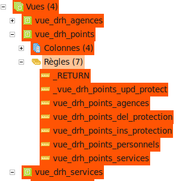
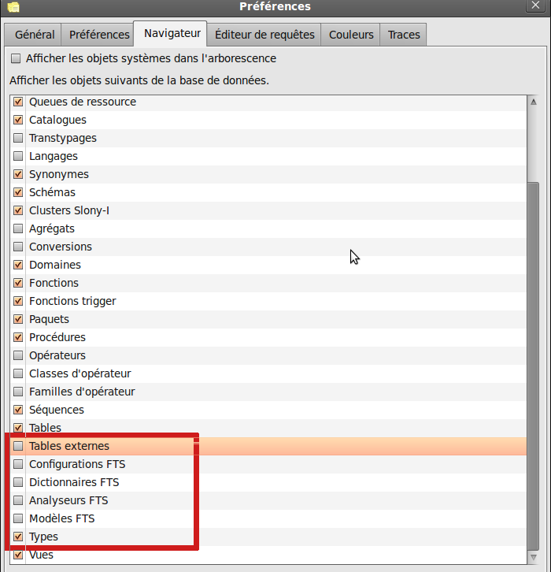
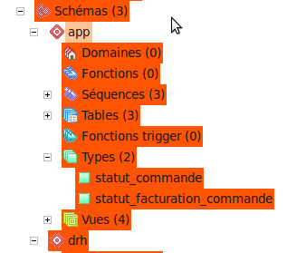
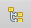
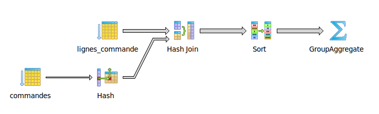
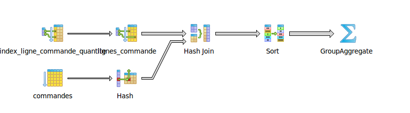

# Formation Pratique PostgreSQL - partie 3

--------------------------------------------------------------------------------

copyright (c) 2012-2021 : [Makina Corpus](http://www.makina-corpus.com)

.fx: alternate

--------------------------------------------------------------------------------

# 15. Opérations en écriture
<small>Pour avoir un peu de contenu</small>

.fx: title1 title1-3

--------------------------------------------------------------------------------
## 15.1. Importation de la base de développement app

<small>Pour avoir plus de volumes, et de fonctions</small>

.fx: title2

--------------------------------------------------------------------------------
L'équipe de développement a créé une première version de l'application app, dans le schéma **app**.

Une sauvegarde a été faite en utilisant l'option **COMPRESS** sur l'assistant de sauvegarde.

Le fichier `formation_schema_app_dev1.backup` contient cette sauvegarde.
Si vous essayez de l'ouvrir avec un éditeur de texte vous pouvez voir que ce
fichier ne peut être lu.
**C'est un format de sauvegarde interne à pg_dump et pg_restore**.

Nous allons donc importer cette sauvegarde avec **pg_restore**, en utilisant
l'assistant de pgAdmin. Cliquez (droit) sur le schéma `app`, **Restaurer**,
puis aller chercher le fichier. On voit que la commande tapée est:

    pg_restore --host localhost --port 5432 --username « ultrogothe » --dbname « formation2 » \
     --schema app --verbose « (...)/formation_schema_app_dev1.backup

Si vous lancez cette restauration une deuxième fois elle sera en échec sauf si vous cliquez l'option **Nettoyer avant la restauration**:

    pg_restore --host localhost --port 5432 --username « ultrogothe » --dbname « formation2 » \
      --clean --schema app --verbose « (..)/formation_schema_app_dev1.backup

.fx: wide

--------------------------------------------------------------------------------

Une technique efficace pour la restauration du schéma `app`:

- supprimer le schéma, avec l'option **cascade**
- restaurez le fichier `formation_schema_app_dev1.backup`

Technique qui peut s'avérer très utile en développement, par exemple, et qui renforce
la nécessité de bien scinder la base en schémas.

--------------------------------------------------------------------------------

Faites un rafraîchissement du schéma `app`, on y voit maintenant:

* **3 tables et séquences**
* **4 vues**

Les 4 vues permettent un accès aux données du schéma drh, en tous cas celles que
les créateurs des vues nous autorisent à voir. Les tables sont là pour gérer les
commandes de produits qui vont produire des points qu'il faudra impacter sur les
tables du schéma drh.

--------------------------------------------------------------------------------
## 15.2. Règles avancées sur les vues

<small>Vues éditables</small>

.fx: title2

--------------------------------------------------------------------------------

Parmi les quatre vues 3 ont **une règle simple** qui redéfinit l'opération de lecture.

Leur but est **d'autoriser l'accès à certaines données du schéma drh** aux
 utilisateurs du schéma **app**.

La vue **vue_drh_points** possède par contre **7 règles**.

Le but de cette vue est double:

* donner un aperçu global du nombre de points affecté à chaque employé et
   service ou agence à travers une requête d'UNION (ces points sont enregistrés
   dans le schéma drh)
* **autoriser la modification de la colonne points** depuis le schéma app pour
   répercuter ces points sur la bonne table dans le schéma drh.

Examinons chacune des ces règles...

--------------------------------------------------------------------------------

* **vue_drh_points_agences** : si le nombre de points à changé dans une règle update et que l'entité est une agence alors mettre à jour le nombre de points dans la table agences du schéma drh. Les autres colonnes modifiées sont ignorées puisque non répercutées.
* **vue_drh_points_services**: même chose que la précédente mais pour les services
* **vue_drh_points_personnels** : toujours la même chose mais pour les personnels, heureusement la colonne de points est bien sur la table personnels et pas sur employes ou interimaires.
* **_vue_drh_points_upd_protect** : empêche l'exécution de toute requête UPDATE, cette règle commence par un underscore, en ordre alphabétique elle est donc exécutée après toutes les autres, c'est un « catch-all » pour rejeter toutes les autres conditions d'update.
* **vue_drh_points_ins_protection** : empêche toute requête d'insertion (règle optionnelle)
* **vue_drh_points_del_protection** : empêche toute suppression de ligne (règle optionnelle)

--------------------------------------------------------------------------------

La manipulation des <b>règles</b> n'est pas toujours aisée, beaucoup de développeurs
 préfèrent l'utilisation de <b>triggers</b>.

Observez ce qui se passe quand vous tapez

      UPDATE app.vue_drh_points
        SET points=0
      WHERE entity='agences';

Essayez avec des utilisateurs différents, en faisant varier le nombre de points
ou les lignes impactées. Essayez de mettre à jour d'autres colonnes.

Essayez (en tant qu'utilisateur ultrogothe) d'ajouter dans la vue <b>vue_drh_service</b>
 la colonne <b>ser_code avant la colonne ser_parent</b> en utilisant la commande
 <b>CREATE OR REPLACE VIEW</b> qui est listée dans le Panneau SQL. 
 Essayez ensuite d'ajouter cette colonne <b>après la colonne ser_parent</b>.

Lancez un explain graphique dans pgadmin sur <b>SELECT * from app.vue_drh_points;</b>
et admirez le résultat.

.fx: wide

--------------------------------------------------------------------------------

## 15.3. Modifier les objets affichés par pgadmin

<small>Pour les types</small>

.fx: title2

--------------------------------------------------------------------------------

Le schéma app contient des objets particuliers qui sont des types personnalisés
(**ENUM** en l'occurence) mais pgadmin **ne nous les montre pas**.

Par contre nous n'utilisons pas du tout la recherche plein texte mais les écrans
de pgadmin nous montrent les objets **FTS**.

Nous allons donc **modifier les affichages de pgadmin** en allant dans le menu
**Fichier > Préférences**.

.fx: wide

--------------------------------------------------------------------------------
## 15.4. Les Transactions
<small>Où l'on remarquera que beaucoup de biblothèques d'accès aux bases de données sont tout simplement nulles.</small>

.fx: title2

--------------------------------------------------------------------------------
### 15.4.1. Opérations d'écriture en SQL

Les requêtes qui permettent de modifier la base en SQL sont assez peu nombreuses.
[http://docs.postgresqlfr.org/9.5/dml.html](http://docs.postgresqlfr.org/9.5/dml.html)

Il y a :

* **INSERT** : [http://docs.postgresqlfr.org/9.5/sql-insert.html](http://docs.postgresqlfr.org/9.5/sql-insert.html),
  insertion d'une ligne dans une table.
  Notez que le mots clef **RETURNING** permet de spécifier que vous voulez avoir
  en retour de la commande **l'identifiant créé** ou tout autre information. Remarquez aussi le **INSERT INTO ... SELECT ...**;
* **UPDATE** : [http://docs.postgresqlfr.org/9.5/dml-update.html](http://docs.postgresqlfr.org/9.5/dml-update.html),
  mise à jour d'une ou plusieurs lignes, notez que cette commande aussi supporte
  le mot clef RETURNING.
* **DELETE** : [http://docs.postgresqlfr.org/9.5/dml-delete.html](http://docs.postgresqlfr.org/9.5/dml-delete.html),
  suppression d'une ou plusieurs lignes.
* **TRUNCATE** :  [http://docs.postgresqlfr.org/9.5/sql-truncate.html](http://docs.postgresqlfr.org/9.5/sql-truncate.html),
  un delete « amélioré » qui vide toute la table en une seule opération

--------------------------------------------------------------------------------
#### AUTO-COMMIT

Par défaut toutes ces opérations se font en mode **AUTO-COMMIT**, ce qui veut dire
qu'elles sont **des transactions qui ne contiennent qu'une seule commande**.

Vous n'avez tapé qu'une seule commande, mais des règles ou des triggers
pourraient aussi générer des commandes en arrière plan comme nous avons pu
l'apercevoir précédemment. Ces commandes sont alors dans votre transaction,
c'est pourquoi il est important de voir que <b>toute opération d'écriture est une
transaction</b>

--------------------------------------------------------------------------------
#### MERGE, UPSERT

* [https://wiki.postgresql.org/wiki/UPSERT](https://wiki.postgresql.org/wiki/UPSERT)

Depuis PostgreSQL 9.5 on trouve une fonctionnalité d'upsert dans la méthode
**INSERT**.

Il s'agit de faire un **INSERT OR UPDATE**, suivant que la ligne identifiée
existe déjà ou pas. ce type de fonction est très pratique pour les développeurs.

La syntaxe utilise **ON CONFLICT DO UPDATE|NOTHING**, qui se rapproche plus de
ce qu'on trouve souvent documenté comme un *merge*.

En l'occurence un exemple vaut plus qu'un long discours :

* [Exemples sur le wiki de PostgreSQL](https://wiki.postgresql.org/wiki/What's_new_in_PostgreSQL_9.5#INSERT_..._ON_CONFLICT_DO_NOTHING.2FUPDATE_.28.22UPSERT.22.29)

--------------------------------------------------------------------------------
### 15.4.2. FillFactor, Vacuum, HOT

Au niveau du stockage physique des tables, certains concepts peuvent nous aider
à mieux comprendre ce qu'il se passe lors des opérations d'écriture.

Chaque ligne enregistrée dans la table peut être vue comme une ligne dans un tableau Excel.

Quand vous modifiez une ligne une copie de cette ligne est ajoutée, par défaut
en bas de la table.

Quand votre modification sera terminée l'ancienne sera invalidée et la nouvelle
deviendra la ligne officielle. Nous verrons qu'avec les transactions **il est
possible que plusieurs versions de la ligne existent pour différentes
transactions en cours.**

Ceci entraîne une répartition des lignes dans la table physique qui peut devenir
très éloignée de leur ordre d'insertion initial.

Après chaque mise à jour la ligne se retrouve en bas.

La conséquence de ceci pourrait se faire sentir si vous effectuez des requêtes
pour lesquelles **plusieurs pages mémoire différentes de la table devront être
chargées** alors qu'avec un ordre plus proche de l'ordre d'insertion une seule
page mémoire aurait suffit.

.fx: wide

--------------------------------------------------------------------------------
#### FILLFACTOR

C'est ici qu'intervient le **FillFactor** (**facteur de remplissage**).

**Donner un FillFactor à 100% pour un index ou une table signifie que vous ne laissez aucune ligne vide entre chaque ligne.**

Si vous diminuez ce fillfactor (facteur de remplissage) à 50% vous indiquez à
PostgreSQL de laisser 50% d'espace vide dans la page mémoire (des lignes vides
dans le tableau). Lors des mises à jour les lignes vides de la page mémoire de
la ligne originale seront utilisées en priorité, plutôt que d'ajouter ces
nouvelles lignes à la fin de la table.

Le Fillfactor est par défaut à 100% (pas de perte d'espace).

Si vous savez qu'une table subira **un grand nombre de mises à jour** n'hésitez pas
à modifier son fillfactor ainsi que celui de ses **index** (s'ils sont impactés
par les mises à jour).

--------------------------------------------------------------------------------
#### HOT

Le système **HOT** (**Heap Overflow Tuple**) intervient lui pour **chaîner
l'historique des lignes qui ont été annulées**.

Quand vous accédez à une ligne vous accédez en fait à la ligne originale,
vous êtes ensuite entraîné jusqu'à la bonne ligne par **rebonds successifs**
car chaque version garde l'adresse de la version qui a invalidée la ligne.

Cela **permet d'éviter de toucher aux index** (que nous étudierons bientôt)
quand on modifie une ligne. **Sans cela toute opération d'écriture devrait
mettre à jour les index** qui pointaient vers l'adresse de la ligne (Ce qui
ralentit fortement les écritures).

--------------------------------------------------------------------------------
#### VACUUM

Enfin les opérations de **VACUUM** sont des opérations **de maintenance**, qui
aujourd'hui sont gérées par un processus de PostgreSQL (l'**auto-vacuum**).

Lors de ces opérations plusieurs choses peuvent intervenir :

* Les données sont réorganisées dans la table,
* les index mis à jour,
* les espaces libres remis en ordre,
* etc.

Des statistiques sur **l'organisation des données dans la table** seront peut-être
aussi remis à jour. Dans un premier temps retenez qu'**il est important que le
 Vacuum s'exécute régulièrement**, et **plus votre table subit de mises à jour
 et suppressions plus le vacuum devient important**.

--------------------------------------------------------------------------------
#### CLUSTER

Signalons aussi l'existence de la commande SQL **CLUSTER**

[http://docs.postgresqlfr.org/9.5/sql-cluster.html](http://docs.postgresqlfr.org/9.5/sql-cluster.html)
qui **réordonne les données d'une table sur un index de cette table**.

Ceci peut éviter des opérations de pages sur des grosses tables souvent
utilisées sur un même index.

Attention rapellez-vous qu'une requête **sans ORDER BY** renvoie les lignes dans
un **ordre non déterminé**, utiliser CLUSTER pour forcer cet ordre **par défaut**
n'est **pas une garantie d'ordre**.

Certaines requêtes sur des tables importantes peuvent par contre bénéficier de
gains de temps non négligeables si une opération de CLUSTER sur l'index qui va
être utilisé sont passées juste avant (utile sur des batchs, avec des tables
peu accédées, car le Cluster pose quelques problèmes de locks).

--------------------------------------------------------------------------------
### 15.4.3 ACID, MVCC et les transactions

Une Transaction **peut contenir plusieurs commandes**.

Pour effectuer plusieurs commandes dans une même transaction on utilise les mots
 clefs **BEGIN**, **COMMIT** et **ROLLBACK**.

Peut-être connaissez vous le raccourci mnémotechnique **ACID**, il représente
 tout ce qu'une transaction gère:

* **Atomicité** : tout ce qui est compris entre **BEGIN** et **COMMIT** aura
  lieu ou n'aura pas lieu (**ROLLBACK** au lieu de **COMMIT**), il n'y aura pas
   d'exécution partielle, ce n'est pas découpable, c'est donc **atomique**.
* **Cohérence** : La base de données était dans un état cohérent **avant**,
   elle le sera aussi **après**. Pensez par exemple au contraintes d'intégrité,
   au cours de la transaction elle peuvent être suspendues, à la fin de la
   transaction elles devront être vérifiées.
* **Isolation** : nous y reviendrons, c'est là **le vrai problème**.
  L'isolation de la transaction par rapport aux autres transactions concurrentes
* **Durabilité** : Une fois le **COMMIT** effectué et validé par la base de
  données vos opérations d'écritures sont **réputées validées**, elles ne peuvent
  plus être annulées, le **SGBD** doit assurer leur pérennité.

.fx: wide

--------------------------------------------------------------------------------
#### Durabilité

Si vous vous amusez à modifier des bits dans les fichiers binaires de stockage
de la base, vous pourrez modifier une donnée enregistrée par PostgreSQL. 
Une fois les données stockées sur disque PostgreSQL <b>ne vérifie plus l'intégrité de ces données physiques</b> comme pourrait le faire un , <b>DBCC CHECKDB sur SQL Server</b>.

* [https://wiki.postgresql.org/wiki/Corruption_detection](https://wiki.postgresql.org/wiki/Corruption_detection)

--------------------------------------------------------------------------------
#### Isolation

Le **principal problème est donc l'isolation des transactions**.

La référence en la matière est la page de documentation du modèle MVCC de PostgreSQL: [http://docs.postgresqlfr.org/9.5/mvcc.html](http://docs.postgresqlfr.org/9.5/mvcc.html),
 **MVCC** signifie **MutliVersion Concurrency Control**.

Cette page explique bien le problème et les différentes « *anomalies* » que l'on
 peut rencontrer. Nous ajouterons donc simplement quelques compléments.

Le problème de l'isolation concerne **les transactions concurrentes**, il s'agit
de transactions qui **tournent en parallèle**, en même temps. La première
transaction n'est pas du tout obligée d'être la première à se terminer.

--------------------------------------------------------------------------------

Représentons par exemple quelques transactions sur une frise chronologique :

       +----------------------------------------------------------------> temps
    t1 |  B----C
    t2 |         B------------------------------------------------C
    t3 |              B---------C
    t4 |            B-------------------------R
    t5 |                                                     B---------C
    X  |                               X

**B** signifie **Begin**, **R** **Rollback** et **C** **Commit**.

**X** représente un moment dans le temps à partir desquels des problèmes
d'isolation peuvent survenir pour les transactions qui tournent encore (pour les niveaux d'isolations supérieurs à *Uncommited Read* qui n'existe pas dans PostgreSQL).

* La transaction **t1** n'a pas de problème d'isolation, elle est seule.
* Au moment ou **t3** se termine **t2** et **t4** pourraient avoir des problèmes.
* Au moment ou **t4** fait un Rollback cela ne pose de problèmes à personne.
* Au moment où **t2** se termine **t5** qui a déjà commencée pourrait avoir un problème.

.fx: wide

--------------------------------------------------------------------------------
### Niveaux d'isolation

Par défaut nous sommes dans le deuxième niveau parmi les 4 définis sur la page [http://docs.postgresqlfr.org/9.5/transaction-iso.html](http://docs.postgresqlfr.org/9.5/transaction-iso.html),
ce niveau **Commited Read** autorise, après les X indiqués sur le schémas,
deux types de problèmes:

* les lectures **non reproductibles**
* les lectures **fantômes**.

A partir du moment ou on tape **BEGIN** on fait « sauter » le mode auto-commit.

Il faudra donc à un moment ou un autre taper **ROLLBACK** ou **COMMIT** dans
ces sessions, ou atteindre un ROLLBACK par un **timeout** de la transaction, ou
un ROLLBACK automatique généré par le moteur ou bien encore la **fermeture** de
la session.

--------------------------------------------------------------------------------

 <b>Règle #1</> : </b>refaites toutes vos opérations de lecture</b> après le début
 de la transaction, tout ce que votre programme a pu lire dans la base <b>AVANT
 le BEGIN a peut-être déjà été modifié</b>.

 <b>Règle #2</b> : Une transaction <b>sans locks</b> est quasi assurée de provoquer
 des erreurs fonctionnelles. C'est une règle beaucoup trop ignorée (Au point que
 depuis MySQL 5.1, par exemple, les locks sont automatiques sur les sélections dans les
 transactions MySQL-- ne cherchez pas ce qui se passe dans MySQL 5.0, c'est
 instable).

 <b>Règles #3</b>: Attendez vous à ce qu'une transaction puisse <b>être annulée
 par le moteur</b>. Pour des problèmes d'isolation ou de deadlock. Votre
 programme devrait peut-être <b>essayer de jouer les transactions plusieurs fois.</b>

 <b>Règles #4</b>: Même avec le niveau d'isolation maximum des problèmes peuvent
 survenir, réfléchissez bien à ces problèmes, faites des tests.

.fx: wide

--------------------------------------------------------------------------------
### Verrous

Pour régler les problèmes d'isolation le principal outil est la pose de verrous
(**LOCKS**).

Les transactions concurrentes se retrouvent alors **mises en attente** quand elles
demandent l'accès à des ressources qui sont utilisées par d'autres transactions.

La pose de verrous pose quelques problèmes, le principal est le **DEADLOCK**.

Si nos deux transactions posent chacune de leur côté des verrous, puis qu'ensuite
elles tentent de poser des verrous sur les lignes précédemment verrouillées par
la transaction concurrente, elles se retrouvent chacune à attendre la libération
de verrous de l'autre. Dans ce cas le SGBD devrait annuler une des transactions
(rollback) en émettant un message. Au niveau des langages de programmation on
retrouvera des **Deadlock Exception** par exemple.

Notez qu'il existe en interne de nombreux niveaux de verrouillages correspondants
à diverses opérations, il est par exemple impossible de modifier une table
qu'une opération de maintenance est en train de réorganiser sur le disque.

La référence complète en la matière est ici: [http://docs.postgresqlfr.org/9.5/explicit-locking.html](http://docs.postgresqlfr.org/9.5/explicit-locking.html).

Remarquez le **pg_advisory_lock(id)** qui permet de poser **un verrou applicatif**.
PostgreSQL devient alors un moyen de stockage de **sémaphores** pour votre application.

.fx: wide

--------------------------------------------------------------------------------

Pour en revenir aux transactions nous pouvons aussi **changer le niveau
d'isolation** en passant au niveau le plus élevé, **Serializable**.

Schématiquement si nous reprenons la frise de départ le SGBD va tenter d'**émuler
une sérialisation dans le temps des transactions**:

       +-------------------------------------------> temps
    t1 |  B----C
    t2 |         B----C
    t3 |                B---------C
    t4 |                            B---------C

Il ne le fait pas aussi schématiquement en repoussant les transactions mais plutôt en détectant une opération au sein d'une des transactions qui rendrait ce schéma
impossible...

--------------------------------------------------------------------------------

       +----------------------------------------------------------------> temps
    T1 |  B----C
    t2 |         B------------------------------------------------C
    t3 |              B---------C
    t4 |            B-------------------------R
    t5 |                                                     B-----R
     X |                                                          X

Ici par exemple **t3** et **t4** n'ont pas touchées à des données impactant **t2**,
le moteur n'a rien dit.

**t4** avait peut être touchée des éléments impactant **t2** mais elle a été
annulée par l'utilisateur.

Par contre au **commit de t2** le moteur a repéré que des éléments touchés par
**t5** étaient impactés, **t5 a donc été automatiquement annulée par le moteur**.

Essayons de visualiser réellement ces problèmes, ouvrez deux fenêtres SQL sur
pgAdmin, cela représente deux sessions différentes, si vous tapez **BEGIN** dans
les deux vous avez deux transactions concurrentes...

--------------------------------------------------------------------------------
### lectures fantômes

Nous listons ici les commandes dans l'ordre chronologique

<table style="font-size: 16px; width=100%;"><tr>
<td style="width:50%;"><!-- col1 -->
<b>Fenêtre 1</b>
<pre><code>
BEGIN;
</code></pre>
la transaction est démarrée.
Videz le texte (ou commentez le)
et écrivez maintenant:
<pre><code>
SELECT com_id,per_id,com_points
    FROM app.commandes
    WHERE com_statut='expédiée'
    AND com_statut_facturation='non facturée'
    AND com_points=100
    ORDER BY com_id LIMIT 3;
</code></pre>
Ici on sélectionne 3 factures, sans doute
pour les traiter, j'obtiens les numéros
3082 et 3089 et 3099 avec 100 points.
</td>

<td style="width:50%;"> <!-- col2 -->
<b>Fenêtre 2</b>

<pre><code>
BEGIN;
</code></pre>
Deuxième transaction démarrée. Videz le texte.
on tape la même commande:
<pre><code>
SELECT com_id,per_id,com_points
  FROM app.commandes
  WHERE com_statut='expédiée'
  AND com_statut_facturation='non facturée'
  AND com_points=100
ORDER BY com_id LIMIT 3;
</code></pre>
et on obtient les mêmes résultats.
</td></tr><tr>

<td><!-- col1 -->
<pre><code>
UPDATE app.commandes
    SET com_points = com_points+1
    WHERE com_id=3089;
UPDATE app.commandes
    SET com_points = com_points-1
    WHERE com_id = 3082;
</code></pre>
</td>

<td><!-- col2 -->

Ici on ne fait rien, pendant que les 2 requêtes update se font à côté ce programme de haut niveau ayant commencé une transaction est peut-être en attente dans les cycles cpu.

(...)

</td></tr>
</table>

.fx: wide

--------------------------------------------------------------------------------

<table style="font-size: 16px; width=100%;">
<tr>
<td style="width:50%;"><!-- col1 -->
Retapons le select original
<pre><code>
SELECT com_id,per_id,com_points
FROM app.commandes
WHERE com_statut='expédiée'
AND com_statut_facturation='non facturée'
AND com_points=100
ORDER BY com_id LIMIT 3;
</code></pre>

on obtient des nouvelles lignes (3102
et 3112) en plus de la 3099,
3082 et 3089 n'y sont plus.

</td>

<td style="width:50%;"> <!-- col2 -->

Ici aussi on refais le select original
<pre><code>
SELECT com_id,per_id,com_points
  FROM app.commandes
  WHERE com_statut='expédiée'
  AND com_statut_facturation='non facturée'
  AND com_points=100
ORDER BY com_id LIMIT 3;
</code></pre>

On a toujours les lignes 3082,3089 et 3099. Normal on est isolé.

</td></tr><tr>

<td> <!-- col1 -->

Et là on termine:

<pre><code>
COMMIT;
</code></pre>
</td>

<td> <!-- col2 -->
(...)
</td>
</tr><tr>
<td> <!-- col1 -->
</td>
<td> <!-- col2 -->

<b>----- A partir de maintenant tout change:</b> 
<b>Lecture fantôme</b> : Si on refais la sélection on voit les 3099,3082
et 3089 : une même requête donne un résultat différent 
<b>Lecture de données validées!</b> Si je fais une requête :

<pre><code>
SELECT com_points
  FROM app.commandes
  WHERE com_id in (3082,3089)
</code></pre>

on voit les scores à <b>99</b> alors qu'ils étaient à <b>100</b> au début de
cette transaction et que je n'ai fais aucun update!

<pre><code>
COMMIT; -- ou ROLLBACK;
</code></pre>
</td></tr></table>

.fx: wide

--------------------------------------------------------------------------------
### utilisation de locks (for update)

Testons la mise en places de LOCKS avec le mot clef FOR UPDATE ([http://docs.postgresqlfr.org/9.5/sql-select.html#sql-for-update-share](http://docs.postgresqlfr.org/9.5/sql-select.html#sql-for-update-share)):

<table style="font-size: 16px; width=100%;"><tr>
<td style="width:50%;"><!-- col1 -->
<b>Fenêtre 1</b>
<pre><code>
BEGIN;
</code></pre>
la transaction est démarrée.
Videz le texte (ou commentez le)
et écrivez maintenant:
<pre><code>
SELECT com_id,per_id,com_points
    FROM app.commandes
    WHERE com_statut='expédiée'
    AND com_statut_facturation='non facturée'
    AND com_points=100
    ORDER BY com_id LIMIT 3
    <b>FOR UPDATE</b>;
</code></pre>
</td>

<td style="width:50%;"> <!-- col2 -->
<b>Fenêtre 2</b>

<pre><code>
BEGIN;
</code></pre>
Deuxième transaction démarrée. Videz le texte.

on tape la même commande:
</td></tr>

<tr><td> <!-- col1 -->
ici on sélectionne 3 factures, sans doute
pour les traiter, j'obtiens les numéros
3082 et 3089 et 3099 avec 100 points.
</td>
<td> <!-- col2 -->
<pre><code>
SELECT com_id,per_id,com_points
  FROM app.commandes
  WHERE com_statut='expédiée'
  AND com_statut_facturation='non facturée'
  AND com_points=100
ORDER BY com_id LIMIT 3
<b>FOR UPDATE</b>;
</code></pre>
et on obtient...
</td></tr><tr>

<td><!-- col1 -->
</td>

<td><!-- col2 -->

une longue attente. Cette requête est en attente de la libération du verrou sur
ces lignes qui vient d'être posé par la requête de gauche.

(...)

</td></tr>
</table>

.fx: wide

--------------------------------------------------------------------------------

<table style="font-size: 16px; width=100%;">
<tr>
<td style="width:50%;"><!-- col1 -->

<pre><code>
UPDATE app.commandes
    SET com_points = com_points+1
    WHERE com_id=3115;
</code></pre>
</td>

<td style="width:50%;"> <!-- col2 -->
pas mieux...
</td></tr><tr>

<td> <!-- col1 -->

Et là on termine:

<pre><code>
COMMIT;
</code></pre>
</td>

<td> <!-- col2 -->
</td></tr>
<tr>
<td><!-- col1 -->
</td>
<td> <!-- col2 -->
Et là enfin j'ai le résultat de ma requête.
Je peux continuer sans problèmes de lectures fantômes,
je lirai les données validées, j'ai attendu pour ça.

<pre><code>

--
-- ici du code, des UPDATE
-- des INSERT
-- etc,

COMMIT; -- ou ROLLBACK;
</code></pre>

</td></tr></table>

.fx: wide

--------------------------------------------------------------------------------
### Serializable, un niveau d'isolation restrictif

<table style="font-size: 16px; width=100%;"><tr>
<td style="width:50%;"><!-- col1 -->
<b>Fenêtre 1</b>
<pre><code>
BEGIN;
<b>SET TRANSACTION ISOLATION LEVEL SERIALIZABLE;</b>
</code></pre>
Et ensuite :
<pre><code>
SELECT com_id,per_id,com_points
FROM app.commandes
WHERE com_statut='expédiée'
AND com_statut_facturation='non facturée'
AND com_points=100
ORDER BY com_id LIMIT 3 ;
</code></pre>
</td>

<td style="width:50%;"> <!-- col2 -->
<b>Fenêtre 2</b>

<pre><code>
BEGIN;
<b>SET TRANSACTION ISOLATION LEVEL SERIALIZABLE;</b>
</code></pre>
Deuxième transaction démarrée. Videz le texte.

<pre><code>
SELECT com_id,per_id,com_points
FROM app.commandes
WHERE com_statut='expédiée'
AND com_statut_facturation='non facturée'
AND com_points=100
ORDER BY com_id LIMIT 3
</code></pre>
</td></tr>

<tr><td> <!-- col1 -->
j'obtiens les numéros 3099, 3102 et 3112 avec 100 points.
Je traite et je termine.
<pre><code>
UPDATE app.commandes
 SET com_points = com_points+1
 WHERE com_id=3112;
COMMIT;
</code></pre>
</td>
<td> <!-- col2 -->
On attends, par exemple on fait des calculs. 
Puis on tape la même commande:
</td></tr><tr>

<td><!-- col1 -->
<small><bold>Attention, suivant la version de PostgreSQL vous pourriez ne pas avoir d'erreur mais simplement un lock d'attente.</bold></small>
</td>

<td><!-- col2 -->
<pre><code>
UPDATE app.commandes
 SET com_points = com_points+1
 WHERE com_id=3112;
</code></pre>

On obtient un <b>ERROR:  could not serialize access due to concurrent update</b>
Ce qui nous fait un <b>Rollback automatique.</b>
</td></tr>
</table>

.fx: wide

--------------------------------------------------------------------------------

Vous pouvez remarquer l'absence de <b>FOR UPDATE</b> dans les requêtes de sélection.

Cependant si vous re-testez le scénario précédent **sans faire de requête
SELECT** vous remarquerez que la transaction n'échoue plus.

Utilisez des requêtes en lecture sur les éléments qui devraient rester intacts pour forcer la pose de verrous par PostgreSQL sur les lignes impactées.

--------------------------------------------------------------------------------

Toutes les librairies d'abstraction d'accès aux bases de données qui proposent de faire passer <b>toutes les lectures hors transaction</b> et les écritures dans des transactions sont fonctionnellement <b>fausses</b>.

Une exception de verrous (deadlock par exemple), n'est pas forcément un bug. 
C'est un comportement normal, que le développeur devrait intégrer dans la conception.

* [ACIDRAIN, attaques de sites ecommerce](http://www.bailis.org/papers/acidrain-sigmod2017.pdf)
* [Retrouvez d'autres détails sur les niveaux d'isolation et les transactions sur ce blog](https://makina-corpus.com/blog/metier/2015/bien-debuter-avec-les-transactions-sql)

--------------------------------------------------------------------------------

# 16. Fonctions et Déclencheurs (triggers)

.fx: title1 title1-4

--------------------------------------------------------------------------------

Bertrude Nantilde et Thibaut on bien travaillé sur leur base **app**, mais ils
se rendent compte qu'il y a beaucoup de requêtes de **mises à jour** à faire dès
qu'ils insèrent une ligne de commande.

Il faut recalculer le total de la commande, attribuer des points en fonction de
ce total (on leur a fourni le calcul de points, il se fait par tranches de
montants de commande, et on doit ajouter un nombre fixe de points aux services
et agences en fonction du nombre de commandes), il faut aussi faire des
requêtes de mise à jour de nombre de points sur la vue **vue_drh_points**.

Bertrude ayant déjà aperçu le détail du schéma **drh** elle a pu y observer des
mises à jour automatiques grâces à des **triggers**. Il y a par exemple une
fonction dans le schéma public qui met à jour les dates de modification :

    CREATE OR REPLACE FUNCTION public.update_datemodif_column()
      RETURNS trigger AS
    $BODY$
      BEGIN
        NEW.date_modification = NOW();
        RETURN NEW;
      END;
    $BODY$
      LANGUAGE plpgsql VOLATILE
      COST 100;

.fx: wide

--------------------------------------------------------------------------------

Sachant que pour les dates de création la **valeur par défaut du champ à now()**
suffit, il n'y a pas besoin d'un déclencheur pour cela.

Ce **déclencheur** de modification de date de modification est branché sur la
table `employes` de cette façon:

    CREATE TRIGGER emp_update_date_modification
      BEFORE UPDATE
      ON drh.employes
      FOR EACH ROW
      EXECUTE PROCEDURE public.update_datemodif_column();

On voit que les fonctions utilisées par les déclencheurs sont définis dans un
**langage** (ici **plpgsql**) et doivent renvoyer un **'trigger'**.

Ici la fonction manipule un objet spécial nommé **NEW** et qui contient la ligne
**en cours de modification**.

--------------------------------------------------------------------------------

Il y a deux autres branchements de triggers sur la table `employes` :

    CREATE TRIGGER emp_insert_code
      BEFORE INSERT
      ON drh.employes
      FOR EACH ROW
      EXECUTE PROCEDURE drh.handle_employe_code();
    CREATE TRIGGER emp_update_code
      BEFORE UPDATE
      ON drh.employes
      FOR EACH ROW
      WHEN (new.per_id <> old.per_id) OR (new.ser_id <> old.ser_id)
      EXECUTE PROCEDURE drh.handle_employe_code();

Ces deux déclencheurs sont branchés sur **la même fonction**.

La fonction est donc un peu plus complexe, elle doit prendre en compte le fait
qu'elle peut être **lancée à des moments différents**:

--------------------------------------------------------------------------------

    CREATE OR REPLACE FUNCTION drh.handle_employe_code()
      RETURNS trigger AS
    $BODY$
      DECLARE
        service_code  character varying;
      BEGIN
        RAISE NOTICE E'\n    Operation: %\n    Schema: %\n    Table: %',
            TG_OP,
            TG_TABLE_SCHEMA,
            TG_TABLE_NAME;
        -- this function can be called from services in UPDATE (only if id or ser_id altered)
        -- or INSERT mode
        -- or from an updated ser_code on services
        -- deleted service will be handled by CASCADE SET ser_id=1 launching an employes update
        -- updated service id will be handled by CASCADE UPDATE launching an employes update
        IF (TG_OP = 'UPDATE') THEN
          IF (TG_TABLE_NAME = 'employes') THEN
              SELECT ser_code INTO service_code FROM drh.services WHERE ser_id=NEW.ser_id;
              NEW.emp_code := service_code || '-' || trim(to_char(NEW.per_id,'0000'));
              RETURN NEW;
          ELSIF (TG_TABLE_NAME = 'services') THEN
              service_code = NEW.ser_code;
              UPDATE drh.employes
                SET emp_code=service_code || '-' || trim(to_char(per_id,'0000'))
                WHERE ser_id=NEW.ser_id;
              RETURN NEW;
          END IF;
    (...)

--------------------------------------------------------------------------------

    (...)

        ELSIF (TG_OP = 'INSERT') THEN
          IF (TG_TABLE_NAME = 'employes') THEN
              SELECT ser_code INTO service_code FROM drh.services WHERE ser_id=NEW.ser_id;
              NEW.emp_code := service_code || '-' || trim(to_char(NEW.per_id,'0000'));
              RETURN NEW;
          END IF;
        END IF;
        RETURN NULL;
      END;
    $BODY$
      LANGUAGE plpgsql VOLATILE
      COST 100;

Cette fonction met à jour le code employes en fonction du service auquel est
affecté l'employé. On voit qu'en plus de **NEW** un trigger peut être amené à
jouer avec **OLD** qui contient la ligne **telle qu'elle était avant la
modification en cours**.

.fx: wide

--------------------------------------------------------------------------------

Les déclencheurs sont documentés ici :

* [http://docs.postgresql.fr/9.5/triggers.html](http://docs.postgresql.fr/9.5/triggers.html),
* [http://docs.postgresqlfr.org/9.5/sql-createtrigger.html](http://docs.postgresqlfr.org/9.5/sql-createtrigger.html)
* [http://docs.postgresql.fr/9.5/plpgsql-trigger.html](http://docs.postgresql.fr/9.5/plpgsql-trigger.html)

Quelques points à noter:

* **OLD et NEW ne sont pas toujours présents tous les deux**, sur un **INSERT**
  on aura que **NEW**, sur un **UPDATE** on a **NEW et OLD**, sur un **DELETE**
  on aura **OLD** uniquement
* les déclencheurs se lancent soit avant (**BEFORE**) soit après (**AFTER**)
  un événement
* on peut associer **plusieurs déclencheurs à un même événement** (ce qui n'est
  pas le cas sur MySQL par exemple), ils sont exécutés **en ordre alphabétique.**
* les déclencheurs peuvent être de **niveau ligne (FOR EACH ROW)** ou de
  **niveau requête (FOR EACH STATEMENT)**.
* Renvoyer **FALSE** peut permettre d'annuler la requête dans certains types
  de triggers.

Si vous utilisez un trigger pour pqr exemple recalculer des résultats
(comme une requête GROUP BY) et les stocker dans une table statistique,
travaillez <b>au niveau requête</b> et pas au niveau <b>ROW</b>.
<b>Sinon une requête qui mets à jour 10 000 lignes lancera 10 000 fois le calcul
au lieu de le faire une seule fois à la fin</b>.

.fx: wide

--------------------------------------------------------------------------------

Le premier lien de documentation fournit un exemple de trigger en **C**.

Le langage le plus utilisé est le **pl/pgSQL**. Mais vous pouvez aussi utiliser d'autres langages, comme le [pl/Perl](http://docs.postgresqlfr.org/9.5/plperl.html),
le [pl/Python](http://docs.postgresqlfr.org/9.5/plpython.html),
le [pl/Tcl](http://docs.postgresqlfr.org/9.5/pltcl.html)...

**Un déclencheur ne fait qu'associer une fonction particulière (qui doit renvoyer
des valeurs particulières) à un évènement particulier**. Mais on peut aussi
écrire **des fonctions qui ne soient pas des triggers**.

On peut écrire ces fonctions dans ces mêmes langages, mais on peut aussi écrire
**des fonctions SQL** (qui est un langage).

Fort de tous ces renseignements nos développeurs de l'application app ont ajoutés quelques fonctions qu'ils ont dumpées dans un fichier.

--------------------------------------------------------------------------------
## 16.1. Importer les fonctions et déclencheurs pour app

.fx: title2

--------------------------------------------------------------------------------

Nous allons utiliser le fichier `formation_schema_app_dev2.backup` qui a été créé
avec l'assistant de sauvegarde, c'est un dump **COMPRESS+UTF8** sur les objets
du **schéma app uniquement**.

<ul>
<li>Clic droit sur la base formation > Restaurer...</li>
<li>on prend le fichier <b>formation_schema_app_dev2.backup</b></li>
<li>on coche <b>« Nettoyer avant la restauration »</b></li>
<li>on coche aussi sur le troisième onglet la <b>désactivation des trigger</b>. Prenez l'habitude dès maintenant de désactiver les triggers pendant les restaurations, imaginez ce qu'il se passera quand des triggers seront actifs sur la base et que vous lancerez une restauration...</li></ul>

Remarquez l'option **« Nombre de processus/threads »** cette option peut vous
sauver la vie sur une restauration d'un gros fichier de backup en passant la
procédure de 10 heures à 1 heures – ce qui peut vous ramener dans un fenêtre de
tir raisonnable. C'est une option nouvelle (postgresql 9) qui va permettre de
paralléliser les restaurations qui peuvent l'être sur plusieurs processeurs,
il faut donc déjà disposer d'une machine à processeurs multiples.

.fx: wide

--------------------------------------------------------------------------------

On constate l'apparition de **7 fonctions et de 4 fonctions trigger**. Si vous voulez retrouver la table qui lance ces fonctions trigger regardez l'onglet **Objets dépendants** de ces fonctions. Vous remarquerez l'importance d'utiliser une **nomenclature** parlante dans le nom des triggers. On peut voir la définition de l'association des triggers à une table dans le menu triggers accessible en
dépliant (+) les tables dans le navigateur d'objets.

Remarquez que certains triggers sont <b>conditionnés</b> dès l'association du trigger
à un événement de la table. Ceci afin d'éviter le lancement d'une fonction si
elle n'est pas nécessaire.

--------------------------------------------------------------------------------

<b>Q1 :</b> A l'aide de l'éditeur de table de pgAdmin essayez d'insérer une
ligne de commande pour une commande existante, quelles sont les informations
minimales que vous avez besoin d'entrer dans une ligne de commande (champs
requis) ?

<b>Q2 :</b> Examinez la fonction <b>points_from_amount(numeric)</b>. Quel est
son <b>langage</b>? Que fait elle? Essayez de l'utiliser dans une requête.
Essayez un nombre <b>négatif</b>. <b>Corrigez</b> la fonction pour qu'un montant
négatif ne renvoit pas de points.

<b>Q3 :</b> Regardez la fonction <b>app.update_commande_amounts(numeric,integer)</b>, Essayez de l'utiliser dans une requête.

--------------------------------------------------------------------------------

<b>Q4 :</b> Modifiez la fonction SQL <b>app.update_commande_amounts(numeric,integer)</b> pour que son utilisation renvoie un résultat si on l'utilise avec un
<b>SELECT</b>.

<b>Q5 :</b> Écrivez une fonction SQL qui prend <b>deux chaînes</b> en paramètre
et qui renvoie la concaténation des trois premiers caractères de chacune de ces
chaînes.

<b>Q6 :</b> Question subsidiaire pour ceux qui avancent très vite. Créez une
table <b>statistiques_commandes</b> dans laquelle vous stockerez par personnel
le nombre commandes et la somme totale des commandes. Écrivez un déclencheur
(trigger) qui maintiendra ces statistiques en cas d'INSERT, d'UPDATE, de DELETE
ou de TRUNCATE sur la table commandes.

--------------------------------------------------------------------------------

### Solutions

* **Q1** : il faut entrer au **minimum lic_quantite**, **lic_prix-unitaire**,
  **com_id** et **pro_id**. Donc la quantité, le prix et l'identifiant du
  produit plus la commande à laquelle on appartient. Tout le reste est
  **calculé** par des triggers. Faites **F5** pour rafraîchir la ligne. Vous
  pouvez remonter à la commande, et aux tables de la personne (employé ou
  intérimaire) et de son service (ou agence) et voir que le nombre de points a
  été répercuté partout.

* **Q2** : La fonction est écrite en **SQL** (et non en **pl/pgsql**). Elle
  calcule simplement le nombre de points à affecter à une commande en fonction
  d'un montant reçu en paramètre.

    SELECT app.points_from_amount(125.0);

Les nombres négatifs donnent **5 points**, l'erreur est en fait simple à
corriger. On recopie le code SQL depuis le panneau SQL quand on sélectionne la
fonction et on corrige `$1=0` en `$1<=0` :

--------------------------------------------------------------------------------

      CREATE OR REPLACE FUNCTION app.points_from_amount(numeric)
        RETURNS integer AS
      $BODY$
          SELECT CASE
            WHEN ($1 IS NULL OR $1<=0) THEN 0
            WHEN ($1<50) THEN 5
            WHEN ($1>=50 AND $1<100) THEN 15
            WHEN ($1>=100 AND $1<200) THEN 50
            WHEN ($1>=200 AND $1<500) THEN 100
            ELSE 1000 END;
      $BODY$
        LANGUAGE sql IMMUTABLE
        COST 100;

Remarquez le mot **IMMUTABLE**: cela signifie que pour un même nombre en entrée
cette fonction renverra **TOUJOURS le même résultat**. La valeur par défaut
est **VOLATILE** http://docs.postgresqlfr.org/9.0/sql-createfunction.html Ceci
peut grandement améliorer la vitesse d'exécution des fonctions qui ne modifient
pas les données et qui ne dépendent pas des données autres que leurs paramètres
(**cache**).

--------------------------------------------------------------------------------

* **Q3** : La fonction ne renvoie rien mais modifie la total de la commande
3079 à 42.

    select app.update_commande_amounts(42,3079);

* **Q4** : Pour que cette fonction nous renvoie quelque chose nous pouvons
  utiliser la clause **RETURNING** de la commande **UPDATE**. Mais il faut
  alors définir un type retour pour la fonction. La commande
  `CREATE OR REPLACE FUNCTION` ne suffit alors, plus, il faut utiliser un
  **DROP** avant.

<pre><code>
  <b>DROP FUNCTION app.update_commande_amounts(numeric, integer);</b>
  CREATE OR REPLACE FUNCTION app.update_commande_amounts(numeric, integer)
    <b>RETURNS integer</b> AS
  $BODY$
    UPDATE app.commandes SET
      com_total_ht = $1,
      com_total_tva = $1 * com_taux_tva,
      com_total_ttc = $1 * (1+com_taux_tva)
    WHERE com_id=$2
    <b>RETURNING com_id;</b>
  $BODY$
    LANGUAGE sql VOLATILE
    COST 100;
</code></pre>

--------------------------------------------------------------------------------

Pour tester :

    select app.update_commande_amounts(43,3079);

Mais nous pouvons ajouter quelques variations dans le type de résultats renvoyés

<pre><code>
  DROP FUNCTION app.update_commande_amounts(numeric, integer);
  CREATE OR REPLACE FUNCTION app.update_commande_amounts(numeric, integer)
    RETURNS RECORD AS
  $BODY$
    UPDATE app.commandes SET
      com_total_ht = $1,
      com_total_tva = $1 * com_taux_tva,
      com_total_ttc = $1 * (1+com_taux_tva)
    WHERE com_id=$2
    <b>RETURNING com_id,com_total_ht,com_total_tva,com_total_ttc;</b>
  $BODY$
    LANGUAGE sql VOLATILE
    COST 100;
  --  select app.update_commande_amounts(44,3079);
</code></pre>

--------------------------------------------------------------------------------

Ou encore :

<pre><code>
DROP FUNCTION app.update_commande_amounts(numeric, integer);
CREATE OR REPLACE FUNCTION app.update_commande_amounts(numeric, integer)
  RETURNS commandes AS
$BODY$
  UPDATE app.commandes SET
    com_total_ht = $1,
    com_total_tva = $1 * com_taux_tva,
    com_total_ttc = $1 * (1+com_taux_tva)
  WHERE com_id=$2;
  <b>SELECT * FROM commandes WHERE com_id=$2;</b>
$BODY$
  LANGUAGE sql VOLATILE
  COST 100;
-- select app.update_commande_amounts(45,3079);
</code></pre>

--------------------------------------------------------------------------------

* **Q5** :
<pre><code>
CREATE OR REPLACE FUNCTION app.monsubstrconcat(character varying, character varying)
  RETURNS character varying AS
$BODY$
  SELECT coalesce(substring($1,1,3),'')
    || coalesce(substring($2,1,3),'');
$BODY$
  LANGUAGE sql IMMUTABLE;
</code></pre>

Tests:

    select app.monsubstrconcat('abcdef','ghijk') as t1,
           app.monsubstrconcat('ab','ghijk') as t2,
           app.monsubstrconcat('','ghijk') as t3,
           app.monsubstrconcat(NULL,'ghijk') as t4,
           app.monsubstrconcat('abcde',NULL) as t5;

* **Q6** : pas de solutions, essayez vraiment tout seul.

.fx: wide

--------------------------------------------------------------------------------

# 17 Indexation
<small>Use the index, Luke</small>

.fx: title1 title1-7

--------------------------------------------------------------------------------

## 17.1 Pourquoi indexer?
<small>La principale raison d'indexer une base est que **c'est grâce aux index que vous
 pourrez résoudre l'immense majorité des problèmes de requêtes lentes** (en
 dehors de l'écriture de requêtes grossièrement fausses).
</small>

.fx: title2

--------------------------------------------------------------------------------

### 17.1.1 Visualiser les effets de l'indexation et des ANALYZE

Prenons une requête assez simple:

    SELECT co.com_id,sum(lc.lic_total) as "sommes induites"
      FROM app.lignes_commande lc
        INNER JOIN app.commandes co ON lc.com_id = co.com_id
      WHERE lc.lic_quantite >= 10
      GROUP BY co.com_id
      ORDER BY 1 DESC;

Le but de cette requête est de lister les commandes qui comportent des lignes de
commande avec des quantités supérieures à 10, tout en affichant le somme totale
de ces lignes dans la commande.

Tapons cette requête avec un **EXPLAIN** devant, ou bien choisissons tout
simplement d'utiliser le bouton explain de pgadmin. Nous obtenons ce schéma:

.fx: wide

--------------------------------------------------------------------------------

Créons maintenant deux index sur les quantités de la table lignes_commande en
espérant que l'un des deux soit pris en compte:

    CREATE INDEX index_ligne_commande_quantite
      ON app.lignes_commande (lic_quantite);
    CREATE INDEX index_ligne_commande_commande_quantite
      ON app.lignes_commande (com_id, lic_quantite);

Relançons la requête et son EXPLAIN:

**Le moteur a décidé de changer de comportement pour faire la même requête.**
Il commence par filtrer la table lignes_commande sur les quantités car il sait
qu'il va aller très vite.

.fx: wide

--------------------------------------------------------------------------------

Nous allons supprimer la plus grande partie des lignes de la table lignes_commande
en tapant:

    DELETE FROM app.lignes_commande WHERE lic_quantite<10;

Cette commande peut prendre un peu de temps **3680** lignes sont supprimées et
**tous les triggers ont été pensés au niveau ligne et pas au niveau requête**.

La **physionomie de la table lignes_commandes** est complètement différente maintenant. Nous allons forcer PostgreSQL à se rendre compte de ce fait en tapant ces deux commandes (une par une):

    VACUUM ANALYZE app.lignes_commande;
    VACUUM ANALYZE app.commandes;

Relançons la requête; **Nous ré-obtenons le premier schéma d'explain.**

**PostgreSQL grâce à l'analyse de la table sait qu'il perdra plus de temps à
filtrer la table lignes_commande.**

--------------------------------------------------------------------------------

D'une façon plus générale l'utilisation ou non des index dépends <b>non seulement
de leur existence</b> mais aussi et surtout <b>des estimations de coût du moteur
SQL</b> en fonctions des <b>statistiques</b> qu'il collecte sur les tables.

Pour travailler l'indexation de votre base il vous faut donc <b>une base
alimentée en données, sous une forme réaliste.</b>

--------------------------------------------------------------------------------
### 17.1.2 Génération de données

Il nous faut une base avec des données **réalistes**.

Les développeurs de `app` nous on fournit un petit script php à exécuter sur la
ligne de commande qui peut alimenter les commandes et lignes de commandes avec
des données plus ou moins réalistes. Nous allons l'utiliser pour « charger »
notre base.

    # installation du php en mode ligne de commande
    # le package peut aussi se nommer php-cli
    sudo apt-get install php7.3-cli php7.3-pgsql
    cd /repertoire/de/la/formation

On peut éditer le fichier pour modifier les constantes en tête du fichier et
examiner ce que fait le script.

Essentiellement, il choisit au hasard une personne, lui créé une commande, lui
met des produits dedans. En boucle. Il y a des requêtes intéressantes sur la
façon de choisir des personnes **aléatoirement**, de travailler avec des
valeurs aléatoires, et de générer des dates aléatoires (même s'il existe en fait
des modes de generate_series dédiés aux dates).

.fx: wide

--------------------------------------------------------------------------------

Pour éditer le fichier utilisez nano (console) ou gedit (graphique)

    gedit populate_app.php

Exécutons le

    php populate_app.php

A titre d'exemple il m'aura fallu 20 minutes pour générer 10 000 commandes sur
une machine bien chargée et sans optimisations du serveur PostgreSQL.

--------------------------------------------------------------------------------
### 17.1.3 Comment fonctionne un index?

Un index peut être vu comme un fichier distinct de la table qui prends le ou les
champs que vous lui demandez d'indexer, qui les stocke **dans l'ordre**, puis
qui stocke le numéro de ligne (l'adresse réelle) de la ligne correspondante de
la table.

Un index de **type unique** s'assurera qu'il n'y a qu'une ligne correspondante.

Un autre type d'index pourra stocker l'adresse de plusieurs lignes correspondant
au critère.

La **cardinalité** d'un index est le nombre d'éléments distincts qu'il doit
indexer (par exemple un index des pays des employés devrait stocker 10 valeurs).

Un **dictionnaire de la langue française** est un index, un tri alphabétique des mots.
Ce n'est pas un index **UNIQUE** car il recense aussi les sens multiples associés à un mot.

**Un index peut être vu comme un annuaire téléphonique,** vous y entrez avec
vos critères (le département, le nom de la ville et le nom et prénom de la personne),
vous recherchez d'abord, pour un département, le nom de la ville (ordre
alphabétique), puis dans cette ville, toujours en ordre alphabétique le nom de
la personne. Enfin vous recherchez le prénom. Et vous trouvez en face l'adresse
(ou le numéro de téléphone).

Un index peut donc aussi être construit sur **plusieurs champs**.

.fx: wide

--------------------------------------------------------------------------------

Voici un premier index :

    CREATE INDEX idx_annuaire
        ON adresses (departement, ville, nom, prenom);

Qui est **différent** de ce second annuaire:

    CREATE INDEX idx_annuaire_nom
        ON adresses (departement, nom, prenom, ville);

Dans lequel vous devriez commencer par rechercher le nom et le prénom de la
personne puis filtrer les doublons par ville.

Pour le moteur SQL c'est la même chose. Si vous lui demandez de lister toutes
les personnes de la ville NANTES ayant le nom DURAND il va utiliser idx_annuaire,
filtrer sur la ville NANTES, puis sur le nom DURAND, ignorer le prénom et sortir
l'ensemble des lignes communes à cette ville et ce prénom. **Il lui est impossible
d'utiliser idx_annuaire_nom pour cette tâche.**

Par contre si vous lui demandez Toutes les personnes dont le prénom est Pierre
il n'utilisera ni `idx_annuaire` ni `idx_annuaire_nom`, aucun de ces deux index
ne lui permet de commencer par filtrer sur les prénoms.

.fx: wide

--------------------------------------------------------------------------------

Un index sur <b>(champ1,champ2,champ3)</b> rend <b>inutile</b> un index sur
<b>(champ1, champ2)</b> et un index sur <b>(champ1)</b>. 
Je n'ai pas besoin d'un deuxième annuaire contenant l'ensemble des numéros de
téléphone du département par ville, je l'ai déjà avec l'annuaire de l'ensemble
des numéros des département, par ville, nom et prénom.

Un index sur <b>(champ1, champ2)</b> est très différent d'un index sur
<b>(champ2, champ1)</b>

Le moteur SQL ne pourra pas utiliser le premier s'il a besoin de filtrer sur
champ2 uniquement.

En terme de stockage physique PostgreSQL utilise des **B-TREE** par défaut.

Le support des index de type **hash** est autorisé, mais souvent inutile à cause
des performances de l'implémentation des b-tree, il y a aussi des problèmes de
reconstruction des index de type hash, après une restauration il faut lancer des
commandes de reconstruction d'index pour les hash. On les voit donc très rarement.

Enfin des types d'index avancés **GIST** et **GIN** existent, souvent pour des
types de données complexes comme des coordonnées géographiques ou du stockage
de données json complexes.

.fx: wide

--------------------------------------------------------------------------------

### 17.1.4 Taille des index

Effectuons une requête dans le catalogue pour regarder la taille de nos tables
et index:

* [http://www.postgresql.org/docs/9.5/interactive/disk-usage.html](http://www.postgresql.org/docs/9.5/interactive/disk-usage.html)
* [http://www.postgresql.org/docs/9.5/interactive/functions-admin.html#FUNCTIONS-ADMIN-DBSIZE](http://www.postgresql.org/docs/9.5/interactive/functions-admin.html#FUNCTIONS-ADMIN-DBSIZE)

Visualisons la taille des indexs et tables :

    SELECT relname, relpages,
        pg_relation_filepath(oid),
        pg_size_pretty(pg_table_size(oid)) as "table size",
        pg_size_pretty(pg_indexes_size(oid)) as "indexes size",
        pg_size_pretty(pg_total_relation_size(oid))as "total"
    FROM pg_class
      ORDER BY relpages DESC;

Vous remarquerez qu'une partie de ces informations sont disponibles dans l'onglet statistiques des objets tables sur pgAdmin.

Le point le plus important à noter est que notre table **lignes_commandes** avec
 seulement **trois index** occupe plus de place pour stocker ses index que pour
 stocker les données de la table.

Les index sont utiles pour **améliorer la vitesse d'exécution** des requêtes
mais ils ont **un coût non négligeable en terme d'espace disque** (et de temps d'insertion/modification).

.fx: wide

--------------------------------------------------------------------------------

### 17.1.5 Trouver le bon index

Côté PostgreSQL trouver le bon index est le métier de **l'analyseur de requêtes**
(c'est un processus, pas une personne), aidé en cela par le sous-service de
**statistiques** qui lui renvoit des informations sur les cardinalités de la
table et la répartition des différents éléments.

Du côté du **développeur** et plus encore de **l'administrateur de la base de
données** il faut trouver les index qui serviront réellement et les créer.

Les index vont intervenir dans une requête:

* sur les conditions de **Tri** du résultat ORDER BY. (Si je vous demande de me
  donner les habitants de Nantes dans l'ordre alphabétique et que je vous donne
  l'annuaire ce sera plus simple que sans l'annuaire avec juste la liste des
  habitants non ordonnée)
* sur les **jointures** entre tables (choix des algorithmes *nested loop*,
  *merge joins*, *sequential scan*, etc). Notez que les clefs étrangères
  génèrent la création automatique d'index.
* Sur les **filtrages** divers et les conditions de **regroupement** effectués
  dans la requête

Notons tout de suite que l'enfer en terme d'indexation est un programme qui affiche un tableau de données filtrées et muni de nombreuses colonnes que l'on peut toutes choisir pour ordonner le résultat.

.fx: wide

--------------------------------------------------------------------------------

Maintenant examinons cette requête:

    SELECT
      date_part('month',com_date) as "mois",
      round(sum(com_total_ht),2) as "total mensuel"
    FROM app.commandes
    WHERE date_part('year',com_date)=2017
      AND date_part('month',com_date) BETWEEN 1 AND 5
    GROUP BY date_part('month',com_date)
    ORDER BY date_part('month',com_date) ASC;

Il s'agit d'afficher pour chaque mois de l'année 2017 le total commandé de
janvier à mai.

    "GroupAggregate  (cost=428.96..428.99 rows=1 width=16)"
    "  ->  Sort  (cost=428.96..428.97 rows=1 width=16)"
    "        Sort Key: (date_part('month'::text, com_date))"
    "        ->  Seq Scan on commandes  (cost=0.00..428.95 rows=1 width=16)"
    "              Filter: ((date_part('month'::text, com_date) >= 1::double precision)
                    AND (date_part('month'::text, com_date) <= 5::double precision)
                    AND (date_part('year'::text, com_date) = 2017::double precision))"

On, imagine que le moteur doit effectuer des calculs à partir de la **date**
pour en **extraire l'année et le mois, pour chaque commande**.

Si on lui donne un nouvel index sur la colonne date cela ne changera rien. Il
faudra toujours extraire l'année et le mois pour chaque ligne.

.fx: wide

--------------------------------------------------------------------------------

On peut créer un index sur une fonction appliquée à la colonne **upper(nom)**,
**substring(code,1,4)**, etc!

Nous allons donc créer un index sur le mois, vu que très souvent nous utiliserons l'extraction du mois dans nos requêtes :

    CREATE INDEX idx_commande_index_month
      ON app.commandes
      USING btree
      (date_part('month'::text, com_date));

On refait le explain. Le résultat est déjà meilleur (cost).

    "GroupAggregate  (cost=116.21..116.23 rows=1 width=16)"
    "  ->  Sort  (cost=116.21..116.21 rows=1 width=16)"
    "        Sort Key: (date_part('month'::text, com_date))"
    "        ->  Bitmap Heap Scan on commandes  (cost=4.76..116.20 rows=1 width=16)"
    "              Recheck Cond: ((date_part('month'::text, com_date) >= 1::double  precision)
                                  AND (date_part('month'::text, com_date) <= 5::double precision))"
    "              Filter: (date_part('year'::text, com_date) = 2017::double precision)"
    "              ->  Bitmap Index Scan on idx_commande_index_month  (cost=0.00..4.76
                                                                      rows=50 width=0)"
    "                    Index Cond: ((date_part('month'::text, com_date) >= 1::double precision)
                            AND (date_part('month'::text, com_date) <= 5::double precision))"

--------------------------------------------------------------------------------

Créons maintenant un double index, sur l'année et le mois, car nous savons que
ces requêtes seront toujours filtrées par années, ou bien classées par années,
mixer les mois de plusieurs années n'aurait pas de sens fonctionnellement
**(on voit ici que l'indexation est en rapport avec le fonctionnel)** :

    CREATE INDEX idx_commande_index_year_month
      ON app.commandes
      USING btree
      (date_part('year'::text, com_date),date_part('month'::text, com_date));

On obtient alors un simple parcours d'index. Notre requête sera certainement plus rapide.

    "GroupAggregate  (cost=0.01..8.31 rows=1 width=16)"
    "  ->  Index Scan using idx_commande_index_year_month on commandes  (cost=0.01..8.28 rows=1 width=16)"
    "        Index Cond: ((date_part('year'::text, com_date) = 2011::double precision)
              AND (date_part('month'::text, com_date) >= 1::double precision)
              AND (date_part('month'::text, com_date) <= 5::double precision))"

--------------------------------------------------------------------------------

Pour information, nous avons vu qu'il était possible d'indexer sur des résultats
de fonction, il faut savoir qu'on peut aussi ajouter **des conditions de filtrage
dans un index**.

Si nous avions un index sur ces commandes qui devenait un peu trop gros, et
que nous savons que 80% des données contenues dans la table datent d'avant 2010
et que par ailleurs personne ne fait jamais, quasiment, de requêtes sur des
périodes remontant à plus de 5 ans. On peut reduire la taille de l'index:

    CREATE INDEX idx_commande_index_year_month
      ON app.commandes
      USING btree
      (date_part('year'::text, com_date),date_part('month'::text, com_date));
    WHERE date_part('year'::text, com_date) > 2009

Les conditions pourraient aussi porter sur d'autres champs, comme un booléen qui
dit si la ligne est active, etc.

--------------------------------------------------------------------------------
### 17.1.6 Trouver les requêtes à indexer

Ce titre est un abus de langage, ce sont des tables qu'on indexe.

Par contre le point de départ devrait être **la requête**.

**L'indexation dépends de l'usage des tables par les applications.**

Sur des tables importantes (en taille) les choix d'indexation devraient être
remontés dans l'application pour que les requêtes aussi s'adaptent à l'indexation,
mais dans l'immense majorité des cas il faudra partir des requêtes réelles.

--------------------------------------------------------------------------------

Le premier outil à disposition est **le log des requêtes lentes.** Il faut éditer
le fichier **postgresql.conf** et rechercher cette ligne:

    #log_min_duration_statement = -1

et mettre à la place:

    log_min_duration_statement = 2000

Ce qui indique de loger les requêtes qui mettent plus de deux secondes à
s'exécuter. Ce sera une bonne piste de départ.

Deux modules complémentaires (contrib) peuvent s'avérer utiles [auto_explain](http://www.postgresql.org/docs/9.5/interactive/auto-explain.html) et [pg_stat_statements](http://www.postgresql.org/docs/9.5/interactive/pgstatstatements.html).

--------------------------------------------------------------------------------

### 17.1.7 Contrôler l'usage réel des index

Le catalogue fournit deux vues qu'on ne manquera pas de consulter sur une base
utilisée en production:

* **pg_stat_user_indexes** : si certains index ne sont jamais utilisés doit-on
  les garder?
* **pg_stat_user_tables** : si certaines tables on trop de **seq_scan** il leur
  manque sans doute des index

Il n'est pas rare d'avoir 4/5 de l'espace utilisé par une base occupé par les
indexs. C'est plutôt normal. 
Il n'est pas non plus rare de trouver des indexs qui font double usages, jamais
utilisés, etc. Supprimer ces indexs est important.

--------------------------------------------------------------------------------
# 18. Éléments Complémentaires

<small>PostreSQL est immense.</small>

.fx: title1 title1-3

--------------------------------------------------------------------------------
## 18.1 Divers

Nous ne pouvons pas couvrir l'ensemble des outils mis à disposition dans une base PostgreSQL. Voici cependant quelques liens vers des objets qui pourraient vous être utiles un jour:

  * **LISTEN/NOTIFY** : ces instructions permettent la mise en place de programmes
  persistants en  écoute de certains messages (imaginez par exemple un programme
  externe qui doit effectuer des tâches quand une nouvelle transaction
  commerciale est enregistrée) [http://docs.postgresqlfr.org/9.5/sql-listen.html](http://docs.postgresqlfr.org/9.5/sql-listen.html) [http://docs.postgresqlfr.org/9.5/sql-notify.html](http://docs.postgresqlfr.org/9.5/sql-notify.html).
  il s'agit de queues de messages.

* **Recherche Plein Texte** : [http://docs.postgresqlfr.org/9.5/textsearch.html](http://docs.postgresqlfr.org/9.5/textsearch.html)
* **postgis** : [http://www.postgis.org](http://www.postgis.org) (extension de **Système d'Information Géographique**)
* **types composites** : [http://docs.postgresqlfr.org/9.5/rowtypes.html](http://docs.postgresqlfr.org/9.5/rowtypes.html)
* **DO** : [http://docs.postgresqlfr.org/9.5/sql-do.html](http://docs.postgresqlfr.org/9.5/sql-do.html) envie de tester une fonction
 sans l'enregistrer? **Do** permet de **définir à la volée** une fonction pour
 l'utiliser immédiatement.
* **Create Aggregate** : [http://docs.postgresqlfr.org/9.5/sql-createaggregate.html](http://docs.postgresqlfr.org/9.5/sql-createaggregate.html)
* **Vues materialisées** (> 9.3): la vue est cachée comme une table réèlle,
 elle peut être recalculée à la volée `REFRESH MATERIALIZED VIEW nom;`. Gain de
 temps immense à l'usage (il ne s'agit d'une requête mais bien d'une table).
* etc.

.fx: wide

--------------------------------------------------------------------------------
## 18.2 Apports de PostgreSQL 10, 11, 12, 13, 14

Il a de nombreux éléments nouveaux dans les version 10 et 11:

* https://wiki.postgresql.org/wiki/New_in_postgres_10
* https://pgdash.io/blog/postgres-11-whats-new.html

Mais s'il fallait ne retenir que quelques éléments nous citerions:

* un gros travail de simplification sur la gestion du **partitionnement**, surtout sur la version 11 qui autorise les clefs étrangères, les index et triggers appliqués sur les tables partionnées, etc. Avec encore des améliorations attendues en version 12.
* un gros travail sur le parallélisme dans l'exécution des requêtes (qui là aussi se poursuit à chaque release depuis)
* des améliorations sur les index de type HASH
* des solutions nouvelles en administration et en réplication, comme la réplication logique (qui arive en 11, puis s'ouvre aux tables partitionnées en 12), mais aussi un certain nombre de renommages de dossiers ou d'instructions (donc attention aux versions des documentations)
* les **index couvrants** (v11), pour preloader certaines colonnes dans un index et parfois éviter de charger la table réèlle. [Parcours d'index seul et index couvrants](https://docs.postgresql.fr/14/indexes-index-only-scans.html).
* les colonnes **identity**, qui sont l'équivalent des `serial`, sans les bizarreries liées à la transformation de serial en `int+sequence`.

.fx: wide

--------------------------------------------------------------------------------
## 18.2 Apports de PostgreSQL 10, 11, 12, 13, 14

Rappelez vous d'utiliser la [Feature Matrix](https://www.postgresql.org/about/featurematrix/)

Vous pourriez y découvrir des éléments nouveaux.

Par exemple cette feature [STORED GENERATED COLUMNS](https://www.postgresql.org/docs/current/ddl-generated-columns.html).
Notre exemple de calculs automatiques des valeurs Hors taxe et TTC dans `app`, qui utilisait des triggers pour calculer automatiquement ces valeurs, pourrait depuis la version 12 s'écrire automatiquement, **sans triggers**.

.fx: wide

--------------------------------------------------------------------------------
## 18.3 pg_upgrade, migration 9.x vers 11

Avant de tester le partionnement sur un PostgreSQL 11, si votre base est installée sur une version 9.x, nous pouvonsla migrer automatiquement vers une version 11.

On suppose que vous avez une version de postgresql 11 installée (via un `apt-get install postgresql-11`). Elle tourne donc
sur votre machine, sur un port différent (par exemple **5435**). Vérifiez le fichier `pg_hba.conf` de cette instance.

* **étape 1**: passez en user **postgres**
* **étape2**: arrêtez la nouvelle instance

<code><pre>
service postgresql stop 11
</pre></code>

* **étape 2**: lancez pg_upgrade en mode `--check`, pour voir si la migration semble faisable. Remarquez qu'on utilise **toujours** le binaire pg_upgrade de la nouvelle version.

<code><pre>
/usr/lib/postgresql/11/bin/pg_upgrade --check \
  --old-datadir=/var/lib/postgresql/9.5/main/ \
  --new-datadir=/var/lib/postgresql/11/main \
  --old-bindir=/usr/lib/postgresql/9.5/bin \
  --new-bindir=/usr/lib/postgresql/11/bin \
  --old-options '-c config_file=/etc/postgresql/9.5/main/postgresql.conf' \
  --new-options '-c config_file=/etc/postgresql/11/main/postgresql.conf'
</pre></code>

.fx: wide

--------------------------------------------------------------------------------
## 18.3 pg_upgrade, migration 9.x vers 11

* **étape 3**: arrêt de la base source

<code><pre>
service postgresql stop 9.5
</pre></code>

* **étape 4:**: lancez la migration.

<code><pre>
/usr/lib/postgresql/11/bin/pg_upgrade \
  --old-datadir=/var/lib/postgresql/9.5/main/ \
  --new-datadir=/var/lib/postgresql/11/main \
  --old-bindir=/usr/lib/postgresql/9.5/bin \
  --new-bindir=/usr/lib/postgresql/11/bin \
  --old-options '-c config_file=/etc/postgresql/9.5/main/postgresql.conf' \
  --new-options '-c config_file=/etc/postgresql/11/main/postgresql.conf'
</pre></code>

Des scripts bash à lancer sont déposés pour pouvoir être lançés ensuite, comme le `analyze_new_cluster.sh`.

.fx: wide

--------------------------------------------------------------------------------
## 18.3 pg_upgrade, migration 9.x vers 11

* **étape 5**: démarrage du nouveau serveur (avec changement de port éventuel en production)

<code><pre>
service postgresql start 11
</pre></code>

* **étape 6:**: lancez les scripts indiqués par pg_upgrade

<code><pre>
./analyze_new_cluster.sh
</pre></code>

Vous pouvez dorénavant manipuler la base formation sur PostgreSQL11 (notez qu'utiliser les backups de l'application pouvait aussi fonctionner, mais il aurait fallu auparavant recréer les rôles de connexion).

.fx: wide

--------------------------------------------------------------------------------
## 18.4 Exemple de partionnement avec PostgreSQL11

Pour visualiser un exemple de partitionnement, nous allons mettre en place une table d'audit des mouvements observés sur la table commande (vous pourrez par exemple générer du mouvement avec les scripts PHP).

Les développeurs de `app` nous fournissent un script SQL qui permet la mise en place de cette table d'audit, et ils ont eu la bonne idée de partitionner cette table.

Un vrai partionement utile aurait été basé sur le temps (par exemple une sous table par année-mois), mais pour visualiser les effets en formation on part plutôt sur un partitionnement par type d'opération (`'D'`/`'I'`/`'U'`).

    CREATE TABLE app.commande_audit(
        operation         char(1)   NOT NULL,
        stamp             timestamp NOT NULL,
        userid            text      NOT NULL,
        commande          app.commandes NOT NULL -- type ligne de la table!!
    ) PARTITION BY LIST (operation);
  
    CREATE index idx_commande_audit_operation ON app.commande_audit(operation);
    CREATE index idx_commande_audit_com_id ON app.commande_audit(((commande).com_id));
  
    CREATE TABLE app.commande_select PARTITION OF app.commande_audit FOR VALUES IN ('D');
    CREATE TABLE app.commande_update PARTITION OF app.commande_audit FOR VALUES IN ('U');
    CREATE TABLE app.commande_insert PARTITION OF app.commande_audit FOR VALUES IN ('I');

.fx: wide

--------------------------------------------------------------------------------
## 18.4 Exemple de partionnement avec PostgreSQL11

On continue avec la mise en place du trigger d'audit :

    CREATE OR REPLACE FUNCTION app.process_commande_audit() RETURNS TRIGGER AS $commande_audit$
        BEGIN
            --
            -- Create a row in commande_audit to reflect the operation performed on commande,
            -- making use of the special variable TG_OP to work out the operation.
            --
            IF (TG_OP = 'DELETE') THEN
                INSERT INTO app.commande_audit SELECT 'D', now(), user, OLD;
            ELSIF (TG_OP = 'UPDATE') THEN
                INSERT INTO app.commande_audit SELECT 'U', now(), user, NEW;
            ELSIF (TG_OP = 'INSERT') THEN
                INSERT INTO app.commande_audit SELECT 'I', now(), user, NEW;
            END IF;
            RETURN NULL; -- result is ignored since this is an AFTER trigger
        END;
    $commande_audit$ LANGUAGE plpgsql;
  
    CREATE TRIGGER TRIGGER_PROCESS_COMMANDES_AUDIT
    AFTER INSERT OR UPDATE OR DELETE ON app.commandes
        FOR EACH ROW EXECUTE PROCEDURE app.process_commande_audit();

.fx: wide

--------------------------------------------------------------------------------
## 18.4 Exemple de partionnement avec PostgreSQL11

Vous pouvez remarquer que les index ont été créés automatiquement sur la sous-tables.

Si vous générez de l'activité, vous verrez que les sous tables se remplissent.
Et si vous altérez à la main la colonne `operation` d'un des enregsitrements de l'audit
vous verrez qu'il change de table de parti onnement.

    SELECT count(1),tableoid::regclass FROM commande_audit GROUP by 2 order by 2;

--------------------------------------------------------------------------------
## 18.4 Exemple de partionnement avec PostgreSQL11

<b>Attention</b> le partionnement n'est pas une opération transparente.

* une table existante ne peut devenir automatiquement partionnée, il faut surement passer par des migrations de données
* il y a un grand nombre de limites (par exemple les types de foreign keys supportés, les champs utilisés dans les Primary Key, les types de triggers supportés, de la partition par défaut, des création sde sous tables à l'avance).
* il y a de fortes différences entre les version 10,11 et 12 de PostgreSQL sur les éléments supportés
* il faut prendre le temps de bien valider tous les développements (tests unitaires), les indexs, et les choix de partionnements.

Bref, évitez d'intervenir **après-coup** sur une table qui devient trop grosse.

--------------------------------------------------------------------------------
# 19. Questions subsidiaires?

.fx: title1 title1-4

--------------------------------------------------------------------------------

Si vous voulez pousser plus loin ce TP il est à présent temps de se poser des questions sur le travail effectué sur `app`.

* **Quels sont les index manquants?**

* Est-ce que les personnels qui ne sont **ni employés ni intérimaires** sont bien
 gérés dans app?

* La mise à jour du nombre de points en déclencheurs de niveau ligne est-elle
  la meilleure solution pour contrer les problèmes d'isolation?
  Est-ce que toutes les problématiques de **concurrence** de transactions et de
  LOCKS ont été prises en comptes dans les triggers? Comment pourrait-on gérer
  ce calcul et report de points en déclencheurs de niveau requête et poser les
  locks ou niveaux d'isolation nécessaires?

Une bonne lecture en anglais complémentaire du manuel sur les problèmes de locks : [http://www.postgresql.org/files/developer/concurrency.pdf](http://www.postgresql.org/files/developer/concurrency.pdf)

Notez aussi qu'il est **impossible de changer le niveau d'isolation d'une
transaction au sein d'un déclencheur** (il est déjà lui-même integré à une
transaction et ne peut pas définir le niveau d'une transaction déjà démarrée).

--------------------------------------------------------------------------------

Tout ce qu'il est possible de faire est de mesurer le niveau actuel avec

    SELECT current_setting('transaction_isolation')

Et de, par exemple, lever une exception si ce niveau ne vous convient pas.

Pour tester les problèmes de cette dernière question voici quelques pistes.

Commencez par ajouter des **délais d'attente assez longs et variables** dans les
fonctions de triggers à l'aide de boucles de ce type:

    PERFORM pg_sleep( ceil(random()*10) );

Ce qui peut donner par exemple dans une des fonctions principales `(app.total_commande_triggers)` :

--------------------------------------------------------------------------------

<pre><code>
CREATE OR REPLACE FUNCTION app.total_commande_triggers()
  RETURNS trigger AS
$BODY$
  DECLARE
    identifiant_commande  integer;
    total_ht              numeric(12,4);
  BEGIN
    RAISE NOTICE E'\ntotal_commande_triggers()\n    Operation: %\n    Schema: %\n    Table: %',
        TG_OP,
        TG_TABLE_SCHEMA,
        TG_TABLE_NAME;
    IF ((TG_OP = 'UPDATE') OR (TG_OP = 'INSERT')) THEN
      identifiant_commande = NEW.com_id;
      total_ht = app.sum_commande(identifiant_commande);
      <b>PERFORM pg_sleep( ceil(random()*10) );</b>
      RAISE NOTICE E'\ncalling app.update_commande_amounts( % , % )',total_ht,identifiant_commande;
      PERFORM app.update_commande_amounts(total_ht,identifiant_commande);
      RETURN NEW;
    ELSIF (TG_OP = 'DELETE') THEN
      identifiant_commande = OLD.com_id;
      total_ht = app.sum_commande(identifiant_commande);
      RAISE NOTICE E'\ncalling app.update_commande_amounts( % , % )',total_ht,identifiant_commande;
      PERFORM app.update_commande_amounts(total_ht,identifiant_commande);
      RETURN NEW;
    END IF;
    RETURN NULL;
  END;
$BODY$
  LANGUAGE plpgsql VOLATILE
  COST 100;
</code></pre>

--------------------------------------------------------------------------------

On pourra ensuite utiliser le programme `test_concurrence.php` qui effectue 50 modifications de quantitées sur les lignes de commande de la commande ayant
le `com_id` minimal.

En utilisant plusieurs terminal (entre 4 et 10 par exemple) vous pouvez faire
tourner plusieurs occurrences de `test_concurrence.php`.

Avant de lancer ces programmes lancez ces quelques requêtes pour vérifier l'état des points, puis relancez les après les tests:

    SELECT co.com_id,co.com_total_ht,sum(lc.lic_total)
    FROM app.commandes co
      INNER JOIN app.lignes_commande lc ON lc.com_id=co.com_id
      WHERE co.com_id = (
         SELECT min(com_id) FROM app.commandes
      )
    GROUP BY co.com_id, co.com_total_ht;

**Les deux dernières colonnes doivent donner le même montant.**

Lançons plusieurs programmes `test_concurrence.php` en parallèle à l'aide de:

    php test_concurrence.php

.fx: wide

-------------------------------------------------------------------------------

En parallèle vous pouvez tester ce que fait le programme en tapant le même type de requête :

    UPDATE app.lignes_commande
      SET lic_quantite=lic_quantite+12
      WHERE com_id=3079
      AND lic_id IN (
        SELECT lic_id
          FROM app.lignes_commande
          WHERE com_id=3079
          AND NOT lic_est_reduction
        ORDER BY RANDOM()
        LIMIT 1
    );

Mais surtout tapez des commandes:

    SELECT co.com_id,co.com_total_ht,sum(lc.lic_total)
    FROM app.commandes co
      INNER JOIN app.lignes_commande lc ON lc.com_id=co.com_id
    WHERE co.com_id = (
        SELECT min(com_id) FROM app.commandes
      )
    GROUP BY co.com_id, co.com_total_ht;

.fx: wide

-------------------------------------------------------------------------------

**Pendant qu'ils tournent il y a des fortes chances pour que les deux sommes ne
soient pas égales.**

Si vous retapez la requête **update** alors qu'aucun programme ne tourne ou si
l'un des programmes s'arrête longtemps après les autres il y a des chances pour
que vous retombiez sur une égalité.

Mais au moins vous aurez pu apercevoir un état incohérent de la base.

-------------------------------------------------------------------------------
### pistes ?

Vous pourriez modifier le programme php pour que lui même essaye de faires les
mises à jour avec des opérations **atomiques** (modifier
le total de la commande et calculer ce total dans la même requête).

Même en **mode sérialisation** PostgreSQL ne fait pas de **locking prédicitif**
 (deviner toutes les lignes impactées dans vos modifications).

<b>Méfiez-vous des opérations d'aggrégation</b> (comme le total commande) et
placez vous-même des locks prédictifs avec des <b>select for update</b> sur toutes
les lignes commande de la commande (mode revolver) ou des lock de table avec
<b>LOCK TABLE lignes_commande IN SHARE ROW EXCLUSIVE MODE;</b> (mode lance roquette).

En bref sur toutes les opérations critiques et dangereuses essayez de replacer
le problème en mode <b>mono-utilisateur sans concurrence</b> (lock de table) car
c'est souvent le seul mode que votre cerveau arrivera à appréhender sans risques.
Si vous avez besoin de meilleures performances en cas de concurrence accrue sur
votre application vous devrez peut-être réfléchir et tester des politiques de
lock plus fines. Mais c'est <b>un sujet complexe</b>

.fx: wide

-------------------------------------------------------------------------------
